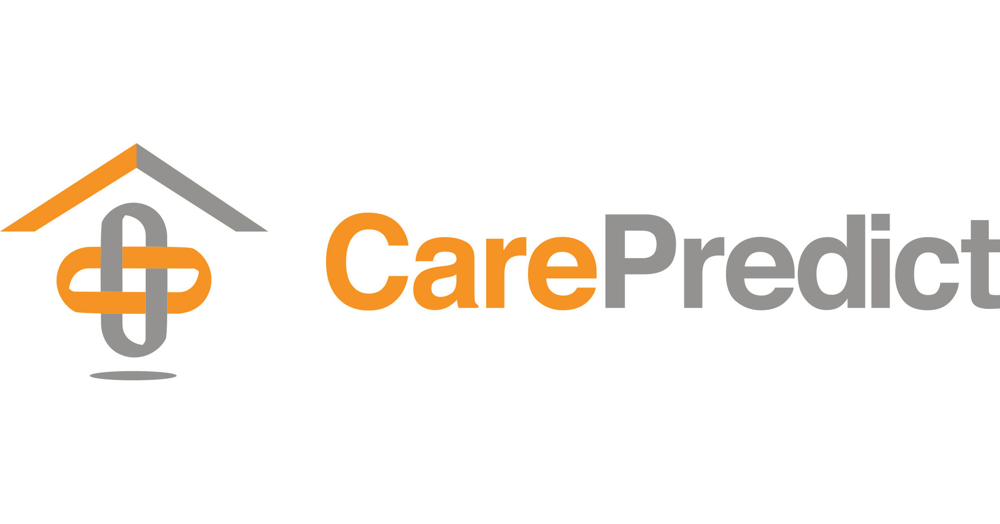

# Final-Report

# Universidad Peruana de Ciencias Aplicadas

## Carrera de Ingeniería de Software

Ciclo: 2025 - 20

Curso: Fundamentos de la Arquitectura de Software  

Sección: 6339

Profesor: Ernesto Ocampo Tello

"Informe de Avance 1"

Startup: DevElevate

Producto: SeniorHub

Grupo: 02

|           Integrantes            |   Código   |
| :------------------------------: | :--------: |
|   Fatima Andrea Asmad Padilla  | U20221b490 |
|  Andrés Fernado Rodriguez Zuluoeta  |u202124213 |
| Fabian Alonso Reyes Trujillano | U202218233|

Agosto 2025

# Registro de Versiones del Informe

| Versión | Fecha             | Autor                                                                                                                                                     | Descripción de modificación                                                                                                                                                                                                                                                                                                                                        |
| ------- | ----------------- | --------------------------------------------------------------------------------------------------------------------------------------------------------- | ------------------------------------------------------------------------------------------------------------------------------------------------------------------------------------------------------------------------------------------------------------------------------------------------------------------------------------------------------------------ |
|  |  | |  |
|  |  | |  |
|  |  | |  |

# Project Report Collaboration Insights

URL Project Report (Github): https://github.com/1ASI0657-6339-Fund-Arq-Soft/Documentation

# Contenido
## Tabla de Contenido
[Student Outcome](#student-outcome)

[Capítulo I: Introducción](/report/chapter1/chapter-1.md)
- [1.1. Startup Profile](/report/chapter1/chapter-1.md#11-startup-profile)
  - [1.1.1. Descripción de la Startup](/report/chapter1/chapter-1.md#111-descripción-de-la-starup)
  - [1.1.2. Perfiles de integrantes del equipo](/report/chapter1/chapter-1.md#112-perfiles-de-integrantes-del-equipo)
- [1.2. Solution Profile](/report/chapter1/chapter-1.md#12-Solution-Profile)
  - [1.2.1. Nombre del producto](/report/chapter1/chapter-1.md#121-nombre-del-producto)
  - [1.2.2. Antecedentes y problemática](/report/chapter1/chapter-1.md#122-antecedentes-y-problemática)
  - [1.2.3. Lean UX Process](/report/chapter1/chapter-1.md#123-lean-ux-process)
    - [1.2.3.1. Lean UX Problem Statements](/report/chapter1/chapter-1.md#1231-lean-ux-problem-statements)
    - [1.2.3.2. Lean UX Assumptions](/report/chapter1/chapter-1.md#1232-lean-ux-assumptions)
    - [1.2.3.3. Lean UX Hypothesis Statements](/report/chapter1/chapter-1.md#1233-lean-uX-hypothesis-statements)
    - [1.2.3.4. Lean UX Canvas](/report/chapter1/chapter-1.md#1234-lean-uX-canvas)
- [1.3. Segmentos objetivo](/report/chapter1/chapter-1.md#13-segmentos-objetivo)

[Capítulo II: Requirements & Analysis](/report/chapter2/chapter-2.md)
- [2.1. Competidores](/report/chapter2/chapter-2.md#21-competidores)
  - [2.1.1. Análisis competitivo](/report/chapter2/chapter-2.md#211-análisis-competitivo)
  - [2.1.2. Estrategias y tácticas frente a competidores](/report/chapter2/chapter-2.md#212-estrategias-y-tácticas-frente-a-competidores)
- [2.2. Entrevistas](/report/chapter2/chapter-2.md#22-entrevistas)
  - [2.2.1. Diseño de entrevistas](/report/chapter2/chapter-2.md#221-diseño-de-entrevistas)
  - [2.2.2. Registro de entrevistas](/report/chapter2/chapter-2.md#222-registro-de-entrevistas)
  - [2.2.3. Análisis de entrevistas](/report/chapter2/chapter-2.md#223-análisis-de-entrevistas)
- [2.3. Needfinding](/report/chapter2/chapter-2.md#23-needfinding)
  - [2.3.1. User Personas](/report/chapter2/chapter-2.md#231-user-personas)
  - [2.3.2. User Task Matrix](/report/chapter2/chapter-2.md#232-user-task-matrix)
  - [2.3.3. User Journey Mapping](/report/chapter2/chapter-2.md#233-user-journey-mapping)
  - [2.3.4. Empathy Mapping](/report/chapter2/chapter-2.md#234-empathy-mapping)
  - [2.3.5. As-is Scenario Mapping](/report/chapter2/chapter-2.md#235-as-is-scenario-mapping)
- [2.4. Ubiquitous Language](/report/chapter2/chapter-2.md#24-ubiquitous-language)

[Capítulo III: Requirements Specification](/report/chapter3/chapter-3.md)
- [3.1. To-Be Scenario Mapping](/report/chapter3/chapter-3.md#31-to-be-scenario-mapping)
- [3.2. User Stories](/report/chapter3/chapter-3.md#32-user-stories)
- [3.3. Impact Mapping](/report/chapter3/chapter-3.md#33-impact-mapping)
- [3.4. Product Backlog](/report/chapter3/chapter-3.md#33-impact-mapping)

[Capítulo IV: Product Architecture Design](/report/chapter4/chapter-4.md)
- [4.1. Desing Concepts, ViewPoints & ER Diagrams](/report/chapter4/chapter-4.md#41-Desing-Concepts-ViewPoints-ER-Diagrams)
  - [4.1.1. Principles Statements](/report/chapter4/chapter-4.md#42-principles-statements)
  - [4.1.2. Approaches Statements Architectural Styles & Patterns](/report/chapter4/chapter-4.md#412-approaches-statements-architectural-styles-patterns)
  - [4.1.3. Context Diagram](/report/chapter4/chapter-4.md#413-context-diagram)
  - [4.1.4. Approach driven ViewPoints Diagrams](/report/chapter4/chapter-4.md#414-approach-driven-viewPoints-diagrams)
  - [4.1.5. Relational/Non Relational Database Diagram ](/report/chapter4/chapter-4.md#415-relational-non-relational-database-diagram )
  - [4.1.6. Design Patterns](/report/chapter4/chapter-4.md#416-design-patterns)
  - [4.1.7. Tactics](/report/chapter4/chapter-4.md#417-tactics)
- [4.2. Architectural Drivers](/report/chapter4/chapter-4.md#42-architectural-drivers)
  - [4.2.1. Design Purpose](/report/chapter4/chapter-4.md#421-design-purpose)
  - [4.2.2. Primary Functionality (Primary User Stories)](/report/chapter4/chapter-4.md#422-primary-functionality)
  - [4.2.3. Quality Attribute Scenarios](/report/chapter4/chapter-4.md#423-quality-attribute-scenarios)
  - [4.2.4. Constraints](/report/chapter4/chapter-4.md#424-constraints)
  - [4.2.5. Architectural Concerns](/report/chapter4/chapter-4.md#425-architectural-concerns)
- [4.3. ADD Iterations](/report/chapter4/chapter-4.md#43-ADD-iterations)
  - [4.3.1. Landing Page Wireframe](/report/chapter4/chapter-4.md#431-landing-page-wireframe)
  - [4.3.2. Landing Page Mock-up](/report/chapter4/chapter-4.md#432-landing-page-mock-up)
- [4.4. Web Applications UX/UI Design](/report/chapter4/chapter-4.md#44-web-applications-uxui-design)
  - [4.4.1. Web Applications Wireframes](/report/chapter4/chapter-4.md#441-web-applications-wireframes)
  - [4.4.2. Web Applications Wireflow Diagrams](/report/chapter4/chapter-4.md#442-web-applications-wireflow-diagrams)
  - [4.4.3. Web Applications Mock-ups](/report/chapter4/chapter-4.md#443-web-applications-mock-ups)
  - [4.4.4. Web Applications User Flow Diagrams](/report/chapter4/chapter-4.md#444-web-applications-user-flow-diagrams)
- [4.5. Web Applications Prototyping](/report/chapter4/chapter-4.md#45-web-applications-prototyping)
- [4.6. Domain-Driven Software Architecture](/report/chapter4/chapter-4.md#46-domain-driven-software-architecture)
  - [4.6.1. Software Architecture Context Diagram](/report/chapter4/chapter-4.md#461-software-architecture-context-diagram)
  - [4.6.2. Software Architecture Container Diagrams](/report/chapter4/chapter-4.md#462-software-architecture-container-diagrams)
  - [4.6.3. Software Architecture Components Diagrams](/report/chapter4/chapter-4.md#463-software-architecture-components-diagrams)
- [4.7. Software Object-Oriented Design](/report/chapter4/chapter-4.md#47-software-object-oriented-design)
  - [4.7.1. Class Diagrams](/report/chapter4/chapter-4.md#471-class-diagrams)
  - [4.7.2. Class Dictionary](/report/chapter4/chapter-4.md#472-class-dictionary)
- [4.8. Database Design](/report/chapter4/chapter-4.md#48-database-design)
  - [4.8.1. Database Diagram](/report/chapter4/chapter-4.md#481-database-diagram)

[Capítulo V: Product Implementation, Validation & Deployment](/report/chapter5/chapter-5.md)
- [5.1. Software Configuration Management](/report/chapter5/chapter-5.md#51-software-configuration-management)
  - [5.1.1. Software Development Environment Configuration](/report/chapter5/chapter-5.md#512-source-code-management)
  - [5.1.2. Source Code Management](/report/chapter5/chapter-5.md#513-source-code-style-guide--conventions)
  - [5.1.3. Source Code Style Guide & Conventions](/report/chapter5/chapter-5.md#513-source-code-style-guide--conventions)
  - [5.1.4. Software Deployment Configuration](/report/chapter5/chapter-5.md#514-software-deployment-configuration)
- [5.2. Landing Page, Services & Applications Implementation](/report/chapter5/chapter-5.md#52-landing-page-services--applications-implementation)
  - [5.2.1. Sprint 1](/report/chapter5/chapter-5.md#521-sprint-1)
    - [5.2.1.1. Sprint Planning 1](/report/chapter5/chapter-5.md#5211-sprint-planning-1)
    - [5.2.1.2. Sprint Backlog 1](/report/chapter5/chapter-5.md#5212-sprint-backlog-1)
    - [5.2.1.3. Development Evidence for Sprint Review](/report/chapter5/chapter-5.md#5213-development-evidence-for-sprint-review)
    - [5.2.1.4. Testing Suite Evidence for Sprint Review](/report/chapter5/chapter-5.md#5214-testing-suite-evidence-for-sprint-review)
    - [5.2.1.5. Execution Evidence for Sprint Review](/report/chapter5/chapter-5.md#5215-execution-evidence-for-sprint-review)
    - [5.2.1.6. Services Documentation Evidence for Sprint Review](/report/chapter5/chapter-5.md#5216-services-documentation-evidence-for-sprint-review)
    - [5.2.1.7. Software Deployment Evidence for Sprint Review](/report/chapter5/chapter-5.md#5217-software-deployment-evidence-for-sprint-review)
    - [5.2.1.8. Team Collaboration Insights during Sprint](/report/chapter5/chapter-5.md#5218-team-collaboration-insights-during-sprint)
  - [5.2.2. Sprint 2](/report/chapter5/chapter-5.md#521-sprint-2)
    - [5.2.2.1. Sprint Planning 2](/report/chapter5/chapter-5.md#5221-sprint-planning-2)
    - [5.2.2.2. Sprint Backlog 2](/report/chapter5/chapter-5.md#5222-sprint-backlog-2)
    - [5.2.2.3. Development Evidence for Sprint Review](/report/chapter5/chapter-5.md#5223-development-evidence-for-sprint-review)
    - [5.2.2.4. Testing Suite Evidence for Sprint Review](/report/chapter5/chapter-5.md#5224-testing-suite-evidence-for-sprint-review)
    - [5.2.2.5. Execution Evidence for Sprint Review](/report/chapter5/chapter-5.md#5225-execution-evidence-for-sprint-review)
    - [5.2.2.6. Services Documentation Evidence for Sprint Review](/report/chapter5/chapter-5.md#5226-services-documentation-evidence-for-sprint-review)
    - [5.2.2.7. Software Deployment Evidence for Sprint Review](/report/chapter5/chapter-5.md#5227-software-deployment-evidence-for-sprint-review)
    - [5.2.2.8. Team Collaboration Insights during Sprint](/report/chapter5/chapter-5.md#5228-team-collaboration-insights-during-sprint)
  - [5.2.3. Sprint 3](/report/chapter5/chapter-5.md#521-sprint-3)
    - [5.2.3.1. Sprint Planning 3](/report/chapter5/chapter-5.md#5231-sprint-planning-3)
    - [5.2.3.2. Sprint Backlog 3](/report/chapter5/chapter-5.md#5232-sprint-backlog-3)
    - [5.2.3.3. Development Evidence for Sprint Review](/report/chapter5/chapter-5.md#5233-development-evidence-for-sprint-review)
    - [5.2.3.4. Testing Suite Evidence for Sprint Review](/report/chapter5/chapter-5.md#5234-testing-suite-evidence-for-sprint-review)
    - [5.2.3.5. Execution Evidence for Sprint Review](/report/chapter5/chapter-5.md#5235-execution-evidence-for-sprint-review)
    - [5.2.3.6. Services Documentation Evidence for Sprint Review](/report/chapter5/chapter-5.md#5236-services-documentation-evidence-for-sprint-review)
    - [5.2.3.7. Software Deployment Evidence for Sprint Review](/report/chapter5/chapter-5.md#5237-software-deployment-evidence-for-sprint-review)
    - [5.2.3.8. Team Collaboration Insights during Sprint](/report/chapter5/chapter-5.md#5238-team-collaboration-insights-during-sprint)
- [5.3. Validation Interviews](/report/chapter5/chapter-5.md#53-validation-interviews)
  - [5.3.1. Diseño de Entrevistas](/report/chapter5/chapter-5.md#531-diseño-de-entrevistas)
  - [5.3.2. Registro de Entrevistas](/report/chapter5/chapter-5.md#532-registro-de-entrevistas)
  - [5.3.3. Evaluaciones según heurísticas](/report/chapter5/chapter-5.md#533-evaluaciones-según-heurísticas)

# Student Outcome

**ABET – EAC - Student Outcome 5**

*Criterio: La capacidad de funcionar efectivamente en un equipo cuyos miembros juntos proporcionan liderazgo, crean un entorno de colaboración e inclusivo, establecen objetivos, planifican tareas y cumplen objetivos.*

En el siguiente cuadro se describe las acciones realizadas y enunciados de conclusiones por parte del grupo, que permiten sustentar el haber alcanzado el logro del ABET – EAC - Student Outcome 5.

| Criterio Específico | Acciones Realizadas | Conclusiones |
|---------------------|---------------------|--------------|
| **Comunica oralmente con efectividad a diferentes rangos de audiencia** | **TB1**  -Fabian Reyes Trujillano:  -Fatima Asmad Padilla:   -Andrés Rodriguez Zuluoeta:  | **TB1**  -Fabian Reyes Trujillano:  -Fatima Asmad Padilla:   -Andrés Rodriguez Zuluoeta: |
| **Comunica por escrito con efectividad a diferentes rangos de audiencia** | **TB1**  -Fabian Reyes Trujillano:  -Eddo Su Caletti:   -Miguel Angel Vidal Castro:  | **TB1**  -Fabian Reyes Trujillano:   -Eddo Su Caletti:   -Miguel Angel Vidal Castro:| **TB1**  -Fabian Reyes Trujillano:  -Eddo Su Caletti:   -Miguel Angel Vidal Castro:  | **TB1**  -Fabian Reyes Trujillano:   -Eddo Su Caletti:   -Miguel Angel Vidal Castro:|

## Capítulo I: Introducción

### 1.1. Startup Profile

#### 1.1.1. Descripción de la Startup

Somos **DevElevate**, una startup fundada por estudiantes apasionados por la innovación social, dedicada a transformar la calidad de vida en los centros geriátricos mediante soluciones tecnológicas centradas en el bienestar de los adultos mayores.

**Misión**

Nuestra misión en DevElevate es empoderar a los adultos mayores y sus redes de apoyo mediante herramientas digitales avanzadas que mejoren la comunicación, el monitoreo de salud y la calidad de vida en entornos geriátricos.

**Visión**

Aspiramos a convertirnos en la plataforma líder en el cuidado de adultos mayores, promoviendo conexiones humanas más profundas y ofreciendo soluciones tecnológicas que impulsen su bienestar integral.

#### 1.1.2. Perfiles de integrantes del equipo

#### **Fatima Andrea Asmad Padilla – Ingeniería de Software – U20221B490**  

Mi perfil se caracteriza por la responsabilidad, disciplina y compromiso en cada tarea que realizo, buscando siempre dar lo mejor de mí en cualquier proyecto o actividad asignada. Actualmente curso el sexto ciclo de la carrera de Ingeniería de Software, lo cual me ha permitido adquirir una base sólida en distintas áreas del desarrollo tecnológico.

---

#### **Andrés Fernado Rodriguez Zuluoeta – Ingeniería de Software – u202124213**  

XXX

---

#### **Fabian Alonso Reyes Trujillano – Ingeniería de Software – U202218233**  

XXX

---
### 1.2. Solution Profile

#### 1.2.1. Nombre del producto

**SeniorHub** es el nombre del producto principal de DevElevate, elegido por su claridad y propósito. **“Senior”** representa a los adultos mayores, el grupo central al que se dirige la solución, mientras que **“Hub”** simboliza un centro de conexión digital donde se integran cuidadores, médicos y familiares para mejorar el monitoreo y la comunicación sobre el bienestar de los residentes en asilos.
Este nombre transmite la esencia del producto: una plataforma que centraliza información crítica, facilita el acceso en tiempo real y fortalece los vínculos humanos en entornos geriátricos, promoviendo cuidado, confianza y acompañamiento.

#### 1.2.2. Antecedentes y problemática

**WHAT**

Existe una falta de transparencia y comunicación efectiva entre los asilos y los familiares sobre el bienestar de los adultos mayores.

**WHY**

La información no fluye de manera clara ni constante, lo que genera preocupación, desconfianza y dificulta el seguimiento del cuidado.

**WHERE**

El problema se presenta en asilos de Lima, donde los canales tradicionales de comunicación son limitados y poco accesibles.

**WHO**

Los principales afectados son:

- Familiares que no pueden acceder fácilmente a información actualizada.
- Personal de cuidado, que enfrenta dificultades para comunicar el estado real de los residentes.

**WHEN**

La falta de información ocurre de forma constante, especialmente en momentos críticos de salud o durante visitas esporádicas.

**HOW**

La información se gestiona de forma manual y fragmentada, lo que impide el acceso en tiempo real y dificulta el seguimiento continuo.

**HOW MUCH**

Este problema afecta a cientos de adultos mayores en Lima y a sus familias, en un contexto nacional de alta vulnerabilidad para la población adulta mayor.

#### 1.2.3. Lean UX Process

#### 1.2.3.1. Lean UX Problem Statements

**Problem Statement 1**
**Usuarios:** Familiares de adultos mayores que residen en asilos.
**Necesidad:** Necesitan mantenerse informados sobre el estado de salud y bienestar de sus seres queridos, pero actualmente no cuentan con acceso a información en tiempo real ni con canales efectivos de comunicación que les brinden tranquilidad y confianza.

**Problem Statement 2**
**Usuarios:** Personal de cuidado en asilos de ancianos.
**Necesidad:** Requieren una forma más eficiente y no intrusiva de registrar, organizar y compartir información sobre la salud y el estado emocional de los residentes, sin que esto interfiera con sus labores cotidianas ni consuma tiempo excesivo.

**Problem Statement 3**
**Usuarios:** Directores o administradores de asilos.
**Necesidad:** Buscan garantizar una atención de calidad y mantener la confianza de las familias, pero carecen de herramientas tecnológicas que les permitan tomar decisiones basadas en datos actualizados y evidencias concretas.

#### 1.2.3.2. Lean UX Assumptions

**¿Quiénes son nuestros usuarios?**

Familiares de adultos mayores que viven en asilos y no pueden acceder fácilmente a información actualizada, y personal de cuidado (enfermeros, cuidadores) que enfrenta dificultades para comunicar el estado real de los residentes.

**¿Dónde encaja nuestro producto en su vida o trabajo?**

Para los familiares, SeniorHub se convierte en una fuente confiable de información sobre el bienestar de sus seres queridos, accesible desde cualquier lugar. Para el personal de cuidado, la plataforma facilita el registro rápido y organizado de datos relevantes sin interrumpir sus rutinas.

**¿Qué problema podría afrontar nuestro producto y cómo podemos resolverlo?**

**Problema:** Los familiares se sienten desconectados por la falta de información clara y constante, mientras que el personal está sobrecargado con registros manuales y comunicación informal.

**Solución:** SeniorHub centraliza la información del residente, permite actualizaciones en tiempo real para los familiares y ofrece herramientas intuitivas para que el personal registre y comparta datos de forma eficiente.

**¿Cuándo y cómo se utiliza?**

SeniorHub se utiliza durante las rutinas de cuidado para registrar observaciones físicas y emocionales, y por los familiares en cualquier momento desde sus dispositivos móviles para revisar el estado de sus seres queridos y comunicarse con el personal.

**¿Qué características son importantes?**

- Registro rápido y sencillo del estado físico y emocional.
- Actualizaciones en tiempo real para los familiares.
- Alertas ante cambios importantes en la salud.
- Canal de comunicación directa entre familia y personal.
- Interfaz accesible y amigable para usuarios no técnicos.

**¿Cómo debe verse y comportarse nuestro producto?**

SeniorHub debe tener un diseño cálido, profesional y fácil de usar. Debe transmitir confianza, mostrar los datos de forma clara y visual, y comportarse de manera fluida y confiable, siempre centrado en mejorar el bienestar del residente y la conexión entre familia y cuidadores.

#### 1.2.3.3. Lean UX Hypothesis Statements

**Creemos que** al brindar acceso rápido y remoto a información confiable sobre el estado de salud y bienestar de los residentes, los familiares se sentirán más tranquilos y conectados con el cuidado que reciben sus seres queridos.

**Sabremos que** hemos tenido éxito cuando más del 70% de los familiares reporten sentirse mejor informados y confiados en encuestas periódicas.

**Sabremos que** esto es verdad porque aumentará la frecuencia de accesos a la plataforma y la duración de las consultas realizadas fuera del horario de visitas.

**Creemos que** al ofrecer herramientas digitales intuitivas para registrar y compartir información sobre los residentes, el personal de cuidado reducirá su carga administrativa y podrá dedicar más tiempo a la atención directa.

**Sabremos que** hemos tenido éxito cuando el personal reporte una disminución significativa en el tiempo dedicado a tareas manuales y un aumento en la satisfacción laboral.

**Sabremos que** esto es verdad porque se observará un incremento en el número de registros clínicos completos, oportunos y consistentes dentro de la plataforma.

#### 1.2.3.4. Lean UX Canvas

### 1.3. Segmentos objetivo

**a) Familiares mayores de 18 años preocupados por el bienestar de sus seres queridos**

**Descripción del segmento:**
Este grupo está compuesto por hijos, nietos y otros parientes adultos de residentes en asilos. Su principal motivación es asegurar que sus seres queridos reciban una atención adecuada, especialmente cuando no pueden estar presentes físicamente. Buscan herramientas que les brinden tranquilidad, acceso a información confiable y una vía de comunicación directa con el personal de cuidado.

**Características demográficas:**
- Edad: Mayores de 18 años.
- Ubicación: Lima Metropolitana, otras regiones del Perú y el extranjero.
- Nivel educativo: Secundaria completa o superior.
- Uso de tecnología: Usuarios activos de smartphones, redes sociales y plataformas digitales.

**Datos de sustento:**
- El 69.7% de los hogares en Lima tienen acceso a Internet (INEI, 2022).
- Por cada adulto mayor, hay al menos dos familiares interesados en su cuidado (MIMP).

**b) Profesionales de la salud y cuidadores en asilos de ancianos**

**Descripción del segmento:**
Incluye enfermeros, técnicos en enfermería, médicos geriatras y cuidadores formales que trabajan directamente con adultos mayores en instituciones geriátricas. Son responsables del registro de información sobre los residentes y de mantener la comunicación con los familiares. Buscan soluciones que les permitan optimizar su tiempo y mejorar la calidad del cuidado sin aumentar su carga laboral.

**Características demográficas:**

- Edad: Entre 25 y 60 años.
- Nivel educativo: Formación técnica o universitaria en salud.
- Ubicación: Asilos públicos y privados en Lima.
- Uso de tecnología: Experiencia con sistemas electrónicos de registro y dispositivos móviles.

**Datos de sustento:**
- Más de 1,300 instituciones de cuidado de adultos mayores en Lima (Minsa).
- El 81% del personal de salud en estos centros reporta necesidad de herramientas digitales (Observatorio de Salud Pública del Perú).

## Capítulo II: Requirements & Analysis

### 2.1. Competidores

1. **CarePredict**

**Origen:** Estados Unidos
**Descripción:**
CarePredict ha desarrollado Tempo, un wearable con inteligencia artificial que monitorea los patrones de actividad de adultos mayores. Detecta cambios en comportamiento que pueden indicar problemas de salud, permitiendo intervenciones tempranas.
**Diferenciador:** Tecnología predictiva basada en IA y sensores portátiles.
**Enfoque:** Prevención y monitoreo continuo en entornos residenciales y asistenciales.

2. **Birdie**

**Origen:** Reino Unido
**Descripción:**
Birdie ofrece una plataforma digital para el cuidado domiciliario de adultos mayores. Permite a los cuidadores registrar visitas, medicación, observaciones y generar reportes accesibles para familiares y profesionales de salud.
**Diferenciador:** Gestión integral del cuidado en el hogar con enfoque colaborativo.
**Enfoque:** Cuidado domiciliario, comunicación y documentación clínica.

3. **GrandPad**

**Origen:** Estados Unidos
**Descripción:**
GrandPad proporciona tablets diseñadas específicamente para adultos mayores, con funciones simplificadas como videollamadas, acceso a fotos, música y correo electrónico. Busca combatir la soledad y facilitar la conexión familiar.
**Diferenciador:** Interfaz ultra accesible para personas mayores con poca experiencia tecnológica.
**Enfoque:** Inclusión digital y conexión emocional.

#### 2.1.1. Análisis competitivo

### **¿Por qué llevar a cabo este análisis?**

Llevar a cabo este análisis permite identificar y comparar las fortalezas, debilidades y propuestas de valor de los principales competidores, con el fin de mejorar la estrategia de **AgeCare**, detectar oportunidades en el mercado y definir una ventaja competitiva clara y sostenible.

---

### Perfil 
| Perfil       | SeniorHub                                                                 | CarePredict                                                                 | Birdie                                                                              | GrandPad                                                                 |
|--------------|-------------------------------------------------------------------------|------------------------------------------------------------------------------|-------------------------------------------------------------------------------------|---------------------------------------------------------------------------|
| Overview     | Plataforma digital para monitoreo físico, emocional y comunicación en asilos. | Sistema de monitoreo inteligente para la salud de adultos mayores basado en wearables y IA. | Plataforma digital para la gestión de cuidado domiciliario, enfocada en agencias y cuidadores. | Tablets simplificadas diseñadas para adultos mayores, centradas en la conexión social. |
| Ventaja Competitiva      | Centralización de datos, comunicación directa con familiares, alertas inteligentes. | Predicción temprana de problemas de salud mediante IA. | Mejora en la calidad del cuidado y comunicación en tiempo real. | Interfaz accesible para adultos mayores con baja alfabetización digital.    |

### Perfil de Marketing
| Perfil de Markteing     | SeniorHub                                                     | CarePredict                                                 | Birdie                                                                 | GrandPad                                                   |
|----------------------|-------------------------------------------------------------|-------------------------------------------------------------|------------------------------------------------------------------------|-------------------------------------------------------------|
| Mercado Objetivo | Asilos privados y familiares de adultos mayores.   | Centros geriátricos y residencias para adultos mayores. | Agencias de cuidado domiciliario y cuidadores independientes. | Familias con adultos mayores que buscan conexión digital.    |
| Estrategias de Marketing    | Alianzas con asilos, demostraciones, redes sociales. | Eventos de salud, marketing institucional, conferencias geriátricas. | Publicidad médica, asociaciones de cuidado, marketing digital.  | Marketing de contenido, redes sociales, ferias de salud. |

### Perfil de Producto 
| Perfil de Producto | SeniorHub                                                                 | CarePredict                                                            | Birdie                                                                 | GrandPad                                           |
|-----------------------|-------------------------------------------------------------------------|------------------------------------------------------------------------|------------------------------------------------------------------------|---------------------------------------------------|
| Productos & Servicios                | Plataforma web y móvil, alertas, historial, comunicación familiar. | Wearable con sensores, app móvil, reportes automáticos.| Software en la nube, app para cuidadores, alertas familiares. | Tablet con apps preinstaladas, soporte técnico 24/7. |
| Precios & Costos           | SaaS por suscripción mensual, escalable por número de residentes. | Suscripción mensual con costos iniciales altos por hardware. | Suscripción por cuidador o agencia, precio medio-alto. | Compra única + suscripción mensual (desde $49/mes). |
| Canales de Distribucion      | Web, móvil (Android/iOS), alianzas con asilos. | Web, app móvil, integración con sistemas médicos.| Web, app móvil para cuidadores y familiares. | Venta directa en web, retail tech, asociaciones. |

### Análisis SWTO 
| Analisis SWTO | SeniorHub                            | CarePredict                              | Birdie                                      | GrandPad                                             |
|------------|------------------------------------|-------------------------------------------|---------------------------------------------|------------------------------------------------------|
|        Fortalezas    | Plataforma integral, interfaz amigable, enfoque en bienestar y conexión familiar. | Tecnología avanzada de IA. Wearables precisos. Detección temprana de emergencias. | Automatización, buen diseño UX, escalabilidad.| Hardware accesible, alta adopción entre adultos mayores. |
|    Debilidades         | Requiere adopción tecnológica por parte de asilos. | Alto costo, dependencia del wearable. | Limitado a cuidado domiciliario, menor enfoque emocional. | Menor foco en salud física, limitada interoperabilidad.|
|     Oportunidades          | Integración con seguros, expansión regional, alianzas con salud pública. | Asociaciones con hospitales, expansión global. | Entrada a mercados latinos, servicios premium. | Crecimiento de población mayor digital, integración con salud. |
|    Amenazas      | Competencia con grandes empresas tech, lenta adopción institucional. | Evolución tecnológica rápida, privacidad de datos. | Nuevas plataformas gratuitas, regulación cambiante. | Reemplazo por smartphones, competencia en hardware. |

#### 2.1.2. Estrategias y tácticas frente a competidores

**Diferenciación por enfoque institucional**

- **Estrategia:** Enfocar SeniorHub exclusivamente en instituciones geriátricas (asilos, residencias y centros de cuidado prolongado), no en domicilios individuales.
- **Táctica:** Desarrollar funcionalidades específicas como: Control de turnos del personal, Historial clínico y emocional por residente, Alertas múltiples para distintos roles (enfermería, médicos, familiares) y Reportes agregados para administradores.

> Esta estrategia **responde a las fortalezas** de Birdie y GrandPad en el cuidado domiciliario, pero especializa SeniorHub en un segmento institucional poco cubierto, donde la personalización y gestión clínica son más críticas.

**Modelo SaaS accesible y escalable**

- **Estrategia:** Ofrecer SeniorHub como una plataforma SaaS sin hardware propietario, con precios accesibles.
- **Táctica:** Diseñar planes escalables según el número de residentes, con opciones básicas (solo monitoreo) y premium (alertas, comunicación, reportes).

> Esta estrategia **aprovecha las debilidades** de CarePredict y GrandPad, cuyos modelos requieren inversión en dispositivos físicos. También mitiga barreras económicas en mercados emergentes como Perú.

**Valor diferencial: bienestar emocional y social**

- **Estrategia:** Incorporar el monitoreo emocional y social como parte central del producto.
- **Táctica:** Incluir módulos de: Actividades grupales y seguimiento de participación, Retroalimentación emocional del residente y Interacción familiar (mensajes, fotos, videollamadas integradas).

> Esta propuesta **capitaliza las debilidades** de CarePredict y Birdie, que se enfocan en datos físicos, y aprovecha la oportunidad de una población mayor más conectada digital y emocionalmente.

**Interoperabilidad como ventaja competitiva**

- **Estrategia:** Diseñar SeniorHub como un sistema abierto y adaptable.
- **Táctica:** Desarrollar una API pública que permita integrar: Historias clínicas electrónicas, CRMs institucionales, Dispositivos IoT (sensores, wearables) y Herramientas de comunicación interna.

> Esta táctica **responde a la amenaza** de la rápida evolución tecnológica y aprovecha la debilidad de plataformas cerradas como Birdie y GrandPad.

**Enfoque en privacidad y cumplimiento normativo**

- **Estrategia:** Incorporar políticas de privacidad desde el diseño (privacy by design).
- **Táctica:** Alinear la plataforma con normativas internacionales como GDPR y HIPAA, y destacar este cumplimiento como valor agregado.

> Esta medida **mitiga amenazas legales y regulatorias**, fortalece la confianza institucional y brinda un diferenciador competitivo en entornos altamente regulados.

### 2.2. Entrevistas

#### 2.2.1. Diseño de entrevistas 

**Preguntas Generales**

1. ¿Cuál es su nombre completo?  
2. ¿Cuántos años tienes?  
3. ¿Cuál es su situación actual? ¿Trabaja, estudia o ambos?  
4. ¿En qué ciudad resides?  

**Segmento 1: Familiares mayores de 18 años preocupados por el bienestar de sus seres queridos**

1. ¿Con qué frecuencia visitas o te comunicas con tu familiar en el asilo?
2. ¿Qué aspectos del cuidado de tu familiar en el asilo te generan mayor preocupación?
3. ¿Cómo te gustaría estar informado sobre el estado y la atención que recibe tu familiar en el asilo?
4. ¿Qué tipo de información consideras más relevante para tomar decisiones informadas sobre el cuidado de tu familiar?
5. ¿Qué importancia le das a la comunicación con el personal del asilo sobre el estado de tu familiar?
6. ¿Cómo crees que una plataforma digital como SeniorHub podría mejorar tu experiencia y tranquilidad en relación con el cuidado de tu familiar?
7. ¿Qué actividades o servicios adicionales te gustaría que se ofrecieran en el asilo para mejorar la calidad de vida de tu familiar?
8. ¿Qué tan importante es para ti participar activamente en decisiones relacionadas con el cuidado de tu familiar en el asilo?
9. ¿Cómo percibes la atención emocional y afectiva que recibe tu familiar por parte del personal del asilo?
10. ¿Qué medidas consideras necesarias para garantizar la privacidad y seguridad de la información proporcionada a través de SeniorHub?
11. ¿Qué beneficios crees que obtendrías de una plataforma como SeniorHub que te permita estar informado sobre la salud física y mental de tu familiar en tiempo real?
12. ¿Qué sugerencias tendrías para mejorar la comunicación y la participación de los familiares en el cuidado de los residentes en el asilo?

**Segmento 2: Profesionales de la salud y cuidadores en asilos de ancianos**

1. ¿Cuáles consideras que son los mayores desafíos en la atención y cuidado de los adultos mayores en el asilo?
2. ¿Cómo utilizas actualmente la tecnología en tu trabajo diario y qué mejoras crees que podrían implementarse?
3. ¿Qué estrategias utilizas para mantener una comunicación efectiva con los familiares de los residentes?
4. ¿Qué cambios o mejoras sugieres para optimizar la gestión de datos y la prestación de atención en el asilo?
5. ¿Cómo crees que la tecnología podría ayudarte a mejorar la calidad de vida de los residentes y tu eficiencia en el trabajo?
6. ¿Qué formación o capacitación adicional consideras necesaria para mejorar la atención y cuidado de los residentes?
7. ¿Cómo evalúas la satisfacción de los familiares con respecto al cuidado y atención que reciben sus seres queridos?
8. ¿Qué medidas tomas para promover un ambiente seguro y acogedor para los residentes?
9. ¿Cómo abordarías los desafíos de la salud mental en los residentes y qué recursos utilizas para brindar apoyo?
10. ¿Cómo gestionas la distribución de tareas y la coordinación del personal para garantizar una atención de calidad?
11. ¿Qué medidas implementarías para garantizar la privacidad y dignidad de los residentes en el asilo?
12. ¿Qué importancia le das a la actualización y seguimiento de las políticas y normativas en el cuidado de los adultos mayores en el asilo?

#### 2.2.2. Registro de entrevistas

#### 2.2.3. Análisis de entrevistas

### 2.3. Needfinding

#### 2.3.1. User Personas

#### 2.3.2. User Task Matrix

#### 2.3.3. User Journey Mapping

#### 2.3.4. Empathy Mapping

#### 2.3.5. As-is Scenario Mapping

### 2.4. Ubiquitous Language

## Capítulo III: Requirements Specification

### 3.1. To-Be Scenario Mapping

### 3.2. User Stories

### 3.3. Impact Mapping

### 3.4. Product Backlog

## [Conclusiones](/report/chapter5/chapter-5.md#conclusiones)

## [Video About-The-Team](/report/chapter5/chapter-5.md#video-about-the-team)

## [Bibliografía](/report/chapter5/chapter-5.md#bibliografía)

## [Anexos](/report/chapter5/chapter-5.md#anexos)
