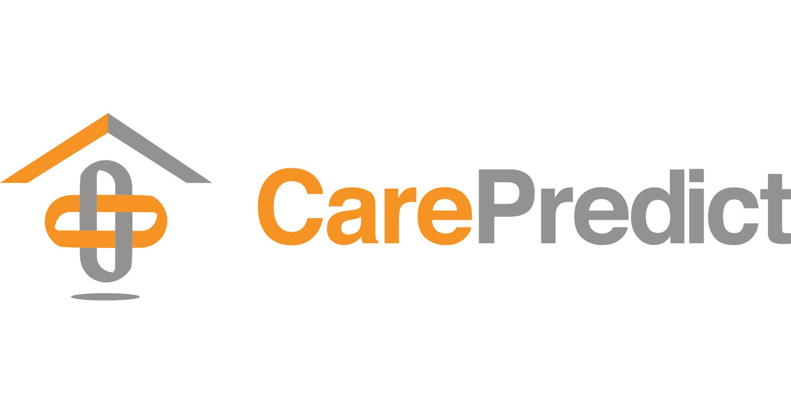

## Capítulo II: Requirements & Analysis

### 2.1. Competidores

1. **CarePredict**

**Origen:** Estados Unidos
**Descripción:**
CarePredict ha desarrollado Tempo, un wearable con inteligencia artificial que monitorea los patrones de actividad de adultos mayores. Detecta cambios en comportamiento que pueden indicar problemas de salud, permitiendo intervenciones tempranas.
**Diferenciador:** Tecnología predictiva basada en IA y sensores portátiles.
**Enfoque:** Prevención y monitoreo continuo en entornos residenciales y asistenciales.

2. **Birdie**

**Origen:** Reino Unido
**Descripción:**
Birdie ofrece una plataforma digital para el cuidado domiciliario de adultos mayores. Permite a los cuidadores registrar visitas, medicación, observaciones y generar reportes accesibles para familiares y profesionales de salud.
**Diferenciador:** Gestión integral del cuidado en el hogar con enfoque colaborativo.
**Enfoque:** Cuidado domiciliario, comunicación y documentación clínica.

3. **GrandPad**

**Origen:** Estados Unidos
**Descripción:**
GrandPad proporciona tablets diseñadas específicamente para adultos mayores, con funciones simplificadas como videollamadas, acceso a fotos, música y correo electrónico. Busca combatir la soledad y facilitar la conexión familiar.
**Diferenciador:** Interfaz ultra accesible para personas mayores con poca experiencia tecnológica.
**Enfoque:** Inclusión digital y conexión emocional.

#### 2.1.1. Análisis competitivo

### **¿Por qué llevar a cabo este análisis?**

Llevar a cabo este análisis permite identificar y comparar las fortalezas, debilidades y propuestas de valor de los principales competidores, con el fin de mejorar la estrategia de **AgeCare**, detectar oportunidades en el mercado y definir una ventaja competitiva clara y sostenible.

---

### Perfil 
| Perfil       | SeniorHub                                                                 | CarePredict                                                                 | Birdie                                                                              | GrandPad                                                                 |
|--------------|-------------------------------------------------------------------------|------------------------------------------------------------------------------|-------------------------------------------------------------------------------------|---------------------------------------------------------------------------|
| Overview     | Plataforma digital para monitoreo físico, emocional y comunicación en asilos. | Sistema de monitoreo inteligente para la salud de adultos mayores basado en wearables y IA. | Plataforma digital para la gestión de cuidado domiciliario, enfocada en agencias y cuidadores. | Tablets simplificadas diseñadas para adultos mayores, centradas en la conexión social. |
| Ventaja Competitiva      | Centralización de datos, comunicación directa con familiares, alertas inteligentes. | Predicción temprana de problemas de salud mediante IA. | Mejora en la calidad del cuidado y comunicación en tiempo real. | Interfaz accesible para adultos mayores con baja alfabetización digital.    |

### Perfil de Marketing
| Perfil de Markteing     | SeniorHub                                                     | CarePredict                                                 | Birdie                                                                 | GrandPad                                                   |
|----------------------|-------------------------------------------------------------|-------------------------------------------------------------|------------------------------------------------------------------------|-------------------------------------------------------------|
| Mercado Objetivo | Asilos privados y familiares de adultos mayores.   | Centros geriátricos y residencias para adultos mayores. | Agencias de cuidado domiciliario y cuidadores independientes. | Familias con adultos mayores que buscan conexión digital.    |
| Estrategias de Marketing    | Alianzas con asilos, demostraciones, redes sociales. | Eventos de salud, marketing institucional, conferencias geriátricas. | Publicidad médica, asociaciones de cuidado, marketing digital.  | Marketing de contenido, redes sociales, ferias de salud. |

### Perfil de Producto 
| Perfil de Producto | SeniorHub                                                                 | CarePredict                                                            | Birdie                                                                 | GrandPad                                           |
|-----------------------|-------------------------------------------------------------------------|------------------------------------------------------------------------|------------------------------------------------------------------------|---------------------------------------------------|
| Productos & Servicios                | Plataforma web y móvil, alertas, historial, comunicación familiar. | Wearable con sensores, app móvil, reportes automáticos.| Software en la nube, app para cuidadores, alertas familiares. | Tablet con apps preinstaladas, soporte técnico 24/7. |
| Precios & Costos           | SaaS por suscripción mensual, escalable por número de residentes. | Suscripción mensual con costos iniciales altos por hardware. | Suscripción por cuidador o agencia, precio medio-alto. | Compra única + suscripción mensual (desde $49/mes). |
| Canales de Distribucion      | Web, móvil (Android/iOS), alianzas con asilos. | Web, app móvil, integración con sistemas médicos.| Web, app móvil para cuidadores y familiares. | Venta directa en web, retail tech, asociaciones. |

### Análisis SWTO 
| Analisis SWTO | SeniorHub                            | CarePredict                              | Birdie                                      | GrandPad                                             |
|------------|------------------------------------|-------------------------------------------|---------------------------------------------|------------------------------------------------------|
|        Fortalezas    | Plataforma integral, interfaz amigable, enfoque en bienestar y conexión familiar. | Tecnología avanzada de IA. Wearables precisos. Detección temprana de emergencias. | Automatización, buen diseño UX, escalabilidad.| Hardware accesible, alta adopción entre adultos mayores. |
|    Debilidades         | Requiere adopción tecnológica por parte de asilos. | Alto costo, dependencia del wearable. | Limitado a cuidado domiciliario, menor enfoque emocional. | Menor foco en salud física, limitada interoperabilidad.|
|     Oportunidades          | Integración con seguros, expansión regional, alianzas con salud pública. | Asociaciones con hospitales, expansión global. | Entrada a mercados latinos, servicios premium. | Crecimiento de población mayor digital, integración con salud. |
|    Amenazas      | Competencia con grandes empresas tech, lenta adopción institucional. | Evolución tecnológica rápida, privacidad de datos. | Nuevas plataformas gratuitas, regulación cambiante. | Reemplazo por smartphones, competencia en hardware. |

#### 2.1.2. Estrategias y tácticas frente a competidores

**Diferenciación por enfoque institucional**

- **Estrategia:** Enfocar SeniorHub exclusivamente en instituciones geriátricas (asilos, residencias y centros de cuidado prolongado), no en domicilios individuales.
- **Táctica:** Desarrollar funcionalidades específicas como: Control de turnos del personal, Historial clínico y emocional por residente, Alertas múltiples para distintos roles (enfermería, médicos, familiares) y Reportes agregados para administradores.

> Esta estrategia **responde a las fortalezas** de Birdie y GrandPad en el cuidado domiciliario, pero especializa SeniorHub en un segmento institucional poco cubierto, donde la personalización y gestión clínica son más críticas.

**Modelo SaaS accesible y escalable**

- **Estrategia:** Ofrecer SeniorHub como una plataforma SaaS sin hardware propietario, con precios accesibles.
- **Táctica:** Diseñar planes escalables según el número de residentes, con opciones básicas (solo monitoreo) y premium (alertas, comunicación, reportes).

> Esta estrategia **aprovecha las debilidades** de CarePredict y GrandPad, cuyos modelos requieren inversión en dispositivos físicos. También mitiga barreras económicas en mercados emergentes como Perú.

**Valor diferencial: bienestar emocional y social**

- **Estrategia:** Incorporar el monitoreo emocional y social como parte central del producto.
- **Táctica:** Incluir módulos de: Actividades grupales y seguimiento de participación, Retroalimentación emocional del residente y Interacción familiar (mensajes, fotos, videollamadas integradas).

> Esta propuesta **capitaliza las debilidades** de CarePredict y Birdie, que se enfocan en datos físicos, y aprovecha la oportunidad de una población mayor más conectada digital y emocionalmente.

**Interoperabilidad como ventaja competitiva**

- **Estrategia:** Diseñar SeniorHub como un sistema abierto y adaptable.
- **Táctica:** Desarrollar una API pública que permita integrar: Historias clínicas electrónicas, CRMs institucionales, Dispositivos IoT (sensores, wearables) y Herramientas de comunicación interna.

> Esta táctica **responde a la amenaza** de la rápida evolución tecnológica y aprovecha la debilidad de plataformas cerradas como Birdie y GrandPad.

**Enfoque en privacidad y cumplimiento normativo**

- **Estrategia:** Incorporar políticas de privacidad desde el diseño (privacy by design).
- **Táctica:** Alinear la plataforma con normativas internacionales como GDPR y HIPAA, y destacar este cumplimiento como valor agregado.

> Esta medida **mitiga amenazas legales y regulatorias**, fortalece la confianza institucional y brinda un diferenciador competitivo en entornos altamente regulados.

### 2.2. Entrevistas

#### 2.2.1. Diseño de entrevistas 

**Preguntas Generales**

1. ¿Cuál es su nombre completo?  
2. ¿Cuántos años tienes?  
3. ¿Cuál es su situación actual? ¿Trabaja, estudia o ambos?  
4. ¿En qué ciudad resides?  

**Segmento 1: Familiares mayores de 18 años preocupados por el bienestar de sus seres queridos**

1. ¿Con qué frecuencia visitas o te comunicas con tu familiar en el asilo?
2. ¿Qué aspectos del cuidado de tu familiar en el asilo te generan mayor preocupación?
3. ¿Cómo te gustaría estar informado sobre el estado y la atención que recibe tu familiar en el asilo?
4. ¿Qué tipo de información consideras más relevante para tomar decisiones informadas sobre el cuidado de tu familiar?
5. ¿Qué importancia le das a la comunicación con el personal del asilo sobre el estado de tu familiar?
6. ¿Cómo crees que una plataforma digital como SeniorHub podría mejorar tu experiencia y tranquilidad en relación con el cuidado de tu familiar?
7. ¿Qué actividades o servicios adicionales te gustaría que se ofrecieran en el asilo para mejorar la calidad de vida de tu familiar?
8. ¿Qué tan importante es para ti participar activamente en decisiones relacionadas con el cuidado de tu familiar en el asilo?
9. ¿Cómo percibes la atención emocional y afectiva que recibe tu familiar por parte del personal del asilo?
10. ¿Qué medidas consideras necesarias para garantizar la privacidad y seguridad de la información proporcionada a través de SeniorHub?
11. ¿Qué beneficios crees que obtendrías de una plataforma como SeniorHub que te permita estar informado sobre la salud física y mental de tu familiar en tiempo real?
12. ¿Qué sugerencias tendrías para mejorar la comunicación y la participación de los familiares en el cuidado de los residentes en el asilo?

**Segmento 2: Profesionales de la salud y cuidadores en asilos de ancianos**

1. ¿Cuáles consideras que son los mayores desafíos en la atención y cuidado de los adultos mayores en el asilo?
2. ¿Cómo utilizas actualmente la tecnología en tu trabajo diario y qué mejoras crees que podrían implementarse?
3. ¿Qué estrategias utilizas para mantener una comunicación efectiva con los familiares de los residentes?
4. ¿Qué cambios o mejoras sugieres para optimizar la gestión de datos y la prestación de atención en el asilo?
5. ¿Cómo crees que la tecnología podría ayudarte a mejorar la calidad de vida de los residentes y tu eficiencia en el trabajo?
6. ¿Qué formación o capacitación adicional consideras necesaria para mejorar la atención y cuidado de los residentes?
7. ¿Cómo evalúas la satisfacción de los familiares con respecto al cuidado y atención que reciben sus seres queridos?
8. ¿Qué medidas tomas para promover un ambiente seguro y acogedor para los residentes?
9. ¿Cómo abordarías los desafíos de la salud mental en los residentes y qué recursos utilizas para brindar apoyo?
10. ¿Cómo gestionas la distribución de tareas y la coordinación del personal para garantizar una atención de calidad?
11. ¿Qué medidas implementarías para garantizar la privacidad y dignidad de los residentes en el asilo?
12. ¿Qué importancia le das a la actualización y seguimiento de las políticas y normativas en el cuidado de los adultos mayores en el asilo?

#### 2.2.2. Registro de entrevistas

| **Entrevista 1** |
|------------------|
| <strong>Nombre:</strong> Erika Balarezo |
| <strong>Edad:</strong> 27 |
| <strong>Procedencia:</strong> Lima |
| <strong>Segmento:</strong> Profesionales de la salud y cuidadores en asilos de ancianos |
| <strong>Resumen:</strong> Erika identifica que el mayor desafío en el cuidado de los adultos mayores es la alta carga laboral, ya que deben atender a muchos residentes y al mismo tiempo registrar todo manualmente. Actualmente usa el celular y un sistema básico para comunicarse con las familias, pero considera que no es suficiente. Para optimizar la gestión de datos sugiere digitalizar los registros y centralizarlos en una plataforma segura. Afirma que la tecnología podría ahorrar tiempo, generar reportes automáticos y aumentar la confianza de los familiares. Reconoce que el personal necesita más capacitación en herramientas digitales. Señala que los familiares suelen estar insatisfechos cuando no reciben información constante, incluso si el residente está bien. Para promover un ambiente seguro organizan actividades sociales, aunque la falta de personal es una limitación. Frente a los retos de la salud mental, realizan terapias grupales, pero carecen de psicólogos especializados. Además, considera que la coordinación del personal se dificultaría menos con un sistema digital de turnos. En cuanto a la privacidad, recalca que los datos de salud deben ser protegidos y no compartidos sin autorización. Finalmente, enfatiza la importancia de actualizar protocolos y capacitarse en temas geriátricos para mantener la calidad de la atención. |
| <strong>Enlace de video:</strong> [https://drive.google.com/file/d/1TbD3kxkDSkMdkKRMgnQFPF93UyTj0lGX/view?usp=sharing](https://drive.google.com/file/d/1TbD3kxkDSkMdkKRMgnQFPF93UyTj0lGX/view?usp=sharing) |
| <strong>Foto del entrevistado:</strong>  |

&nbsp;

| **Entrevista 2** |
|------------------|
| <strong>Nombre:</strong> Christopher Adrián Carlos Urcia Tardío |
| <strong>Edad:</strong> 25 |
| <strong>Procedencia:</strong> Lima |
| <strong>Segmento:</strong> Profesionales de la salud y cuidadores en asilos de ancianos |
| <strong>Resumen:</strong> Christopher señala que uno de los mayores desafíos en el cuidado de adultos mayores es atender sus necesidades individuales, especialmente cuando hay poco personal disponible. Actualmente utilizan computadoras para registrar medicamentos y controles, pero considera que sistemas más ágiles mejorarían la eficiencia y la conexión entre el equipo. Para comunicarse con las familias, recurren a llamadas, mensajes y videollamadas, priorizando la amabilidad y la claridad. Sugiere que un sistema centralizado de datos facilitaría el trabajo y reduciría errores. También cree que la tecnología puede mejorar la calidad de vida de los residentes y su propio desempeño, al reducir el papeleo y ofrecer herramientas para terapias o ejercicios. Destaca la necesidad de más capacitación, especialmente en enfermedades como el Alzheimer y en el uso de tecnología. Evalúan la satisfacción familiar mediante reuniones y encuestas, y toman medidas para mantener un entorno seguro, limpio y acogedor. Además, promueven actividades recreativas para el bienestar mental de los residentes y aseguran la privacidad y el respeto de sus decisiones. Finalmente, remarca la importancia de mantenerse actualizados en normativas y políticas para brindar un servicio de calidad. |
| <strong>Enlace de video:</strong> [https://drive.google.com/file/d/1O6PdCJe6cACyJwkq85c6r39Jqrymv76-/view?usp=sharing](https://drive.google.com/file/d/1O6PdCJe6cACyJwkq85c6r39Jqrymv76-/view?usp=sharing) |
| <strong>Foto del entrevistado:</strong>  |

&nbsp;

| **Entrevista 3** |
|------------------|
| <strong>Nombre:</strong> Mario Stephano Alessandro Barrientos Seminario |
| <strong>Edad:</strong> 19 |
| <strong>Procedencia:</strong> Lima |
| <strong>Segmento:</strong> Profesionales de la salud y cuidadores en asilos de ancianos |
| <strong>Resumen:</strong> Mario Stefano Alesandro Barriento Seminario, de 19 años, trabaja y estudia en Lima. Durante la entrevista, destacó que el principal desafío en el cuidado de adultos mayores en asilos es brindar atención personalizada debido a las distintas necesidades médicas y emocionales de cada residente. Actualmente utiliza la tecnología para llevar registros y controlar la medicación, pero considera que sería ideal contar con un sistema más práctico e integrado para facilitar la comunicación con familiares y el acceso a historiales médicos. Resalta la importancia de la comunicación clara y empática con las familias y sugiere que la implementación de tecnologías como recordatorios, actividades interactivas y monitoreo de salud podría mejorar tanto la calidad de vida de los residentes como la eficiencia del personal. También menciona que capacitaciones en demencia, cuidados paliativos y manejo emocional son fundamentales para optimizar la atención. Para promover un ambiente seguro y acogedor, se enfoca en la prevención de riesgos físicos y el apoyo emocional, respetando siempre la privacidad y dignidad de los residentes. Finalmente, subraya la importancia de mantenerse actualizado en políticas y normativas para garantizar una atención ética, segura y profesional. |
| <strong>Enlace de video:</strong> https://youtu.be/mWJkpLYoQKI |
| <strong>Foto del entrevistado:</strong>  |

&nbsp;

| **Entrevista 4** |
|------------------|
| <strong>Nombre:</strong> Fatima Urbina |
| <strong>Edad:</strong> 25 |
| <strong>Procedencia:</strong> Lima |
| <strong>Segmento:</strong> Familiares mayores de 18 años preocupados por el bienestar de sus seres queridos |
| <strong>Resumen:</strong> Fatima comenta que se comunica con su madre casi todos los días por teléfono, aunque solo puede visitarla una vez por semana. Sus principales preocupaciones son el estado emocional de su madre, que a veces se siente sola, y la correcta administración de sus medicinas. Considera esencial recibir información clara y constante sobre su salud, ánimo y participación en actividades. Afirma que la comunicación directa con el personal del asilo es fundamental para generar confianza. Señala que una plataforma como SeniorHub le daría tranquilidad al permitirle acceder en tiempo real a esta información. Sugiere que los asilos ofrezcan talleres de memoria, actividades sociales y programas de ejercicio adaptados, además de brindar un canal de chat directo con los cuidadores y notificaciones instantáneas en caso de emergencias. También resalta la importancia de participar en las decisiones médicas de su madre y de garantizar la privacidad de los datos a través de accesos seguros. Destaca que el mayor beneficio de una plataforma digital sería la sensación de cercanía y confianza en el cuidado de su familiar, aun cuando no pueda estar presente físicamente. |
| <strong>Enlace de video:</strong> [https://drive.google.com/file/d/10tReOv1-JJ3h2_g6wCFSHyv-75Yu04LO/view?usp=sharing](https://drive.google.com/file/d/10tReOv1-JJ3h2_g6wCFSHyv-75Yu04LO/view?usp=sharing) |
| <strong>Foto del entrevistado:</strong>  |

&nbsp;

| **Entrevista 5** |
|------------------|
| <strong>Nombre:</strong> Stefano Valenzuela |
| <strong>Edad:</strong> 20 |
| <strong>Procedencia:</strong> Lima |
| <strong>Segmento:</strong> Familiares mayores de 18 años preocupados por el bienestar de sus seres queridos |
| <strong>Resumen:</strong> Stefano tiene pensado proximamente internar a su abuelito, por lo cual su opinion es de suma importancia para nosotros. Nos comenta que lo que más valora al momento de tener a algún familiar en un asilo ssería la seguridad, tanto de la información o datos del paciente, como del cuidado con este por parte del personal. Considera que tener un feedback diario o un monitoreo sería la mejor opción para conocer de forma continua la información o actividades diarias del pacioente, también insiste en que la comunicación con los cuidadores debe ser constante para mantener un ambiente activo y agradable entre el usuario y la plataforma. Como funcionalidad extra, nos comenta que un servicio médico personalizado seria un excelente servicio extra para contribuir al buen cuidado de los pacientes del asilo.|
| <strong>Enlace de video:</strong> [https://upcedupe-my.sharepoint.com/:v:/g/personal/u202218233_upc_edu_pe/EXpq9LApKyRNhFuu8xTX6pABjcxrAIABudw8DnDoMtmg2w?nav=eyJyZWZlcnJhbEluZm8iOnsicmVmZXJyYWxBcHAiOiJPbmVEcml2ZUZvckJ1c2luZXNzIiwicmVmZXJyYWxBcHBQbGF0Zm9ybSI6IldlYiIsInJlZmVycmFsTW9kZSI6InZpZXciLCJyZWZlcnJhbFZpZXciOiJNeUZpbGVzTGlua0NvcHkifX0&e=LmTlXL](https://upcedupe-my.sharepoint.com/:v:/g/personal/u202218233_upc_edu_pe/EXpq9LApKyRNhFuu8xTX6pABjcxrAIABudw8DnDoMtmg2w?nav=eyJyZWZlcnJhbEluZm8iOnsicmVmZXJyYWxBcHAiOiJPbmVEcml2ZUZvckJ1c2luZXNzIiwicmVmZXJyYWxBcHBQbGF0Zm9ybSI6IldlYiIsInJlZmVycmFsTW9kZSI6InZpZXciLCJyZWZlcnJhbFZpZXciOiJNeUZpbGVzTGlua0NvcHkifX0&e=LmTlXL) |
| <strong>Foto del entrevistado:</strong>  |

&nbsp;

| **Entrevista 6** |
|------------------|
| <strong>Nombre:</strong> Carlos Angulo Solis |
| <strong>Edad:</strong> 27 |
| <strong>Procedencia:</strong> Lima |
| <strong>Segmento:</strong> Adultos Jóvenes Ocupados (25 - 50 años) |
| <strong>Resumen:</strong> Carlos expresa que su mayor inquietud es la falta de información constante o detallada sobre temas de salud y bienestar, especialmente en relación con sus seres queridos. Le interesa una herramienta que le permita estar informado en tiempo real sobre aspectos físicos y emocionales, idealmente con alertas, reportes periódicos y un historial accesible. También destaca la importancia de la participación activa en decisiones relacionadas al cuidado. Aunque no es usuario regular de apps de salud, señala que le atraería una plataforma que combine bienestar emocional, recomendaciones personalizadas y privacidad de datos. |
| <strong>Enlace de video:</strong> [https://drive.google.com/file/d/1XyHZqSwgCH1QAF2ZZtt9kltcLSW96G-W/view?usp=sharing](https://drive.google.com/file/d/1XyHZqSwgCH1QAF2ZZtt9kltcLSW96G-W/view?usp=sharing) |
| <strong>Foto del entrevistado:</strong>  |

#### 2.2.3. Análisis de entrevistas

**Entrevista 1:**

La entrevista con Erika Balarezo evidencia que uno de los principales problemas en los asilos es la sobrecarga laboral del personal. Ella destaca que deben atender a muchos residentes y, al mismo tiempo, llevar registros manuales, lo cual consume tiempo y reduce la calidad de atención. Aunque utiliza el celular y un sistema básico para comunicarse con las familias, considera que estas herramientas son insuficientes.

Una de sus principales sugerencias es la digitalización de registros médicos y administrativos, lo que permitiría centralizar la información y facilitar el acceso a los cuidadores y familiares. También señala que la tecnología podría ahorrar tiempo, generar reportes automáticos y aumentar la confianza de los familiares, quienes actualmente se sienten insatisfechos cuando no reciben información frecuente sobre sus seres queridos.

Otro punto relevante es la necesidad de capacitación en herramientas digitales, ya que el personal no siempre está familiarizado con estas soluciones. En cuanto al bienestar de los residentes, explica que se realizan actividades sociales y terapias grupales, aunque la falta de personal y de psicólogos especializados limita el impacto de estas iniciativas.

Finalmente, resalta la importancia de implementar un sistema digital de turnos para mejorar la coordinación interna, así como garantizar la privacidad de los datos médicos y la actualización constante de protocolos geriátricos. En conjunto, sus aportes muestran que SeniorHub debe priorizar la digitalización de procesos, la seguridad de la información y herramientas que alivien la carga administrativa.

**Entrevista 2:**

La entrevista con Christopher Adrián Carlos Urcia Tardío pone en evidencia las limitaciones actuales del sistema de atención en asilos, especialmente frente a la escasez de personal y la necesidad de atender múltiples requerimientos individuales. Su testimonio resalta cómo los procesos administrativos, aunque necesarios, consumen tiempo valioso que podría destinarse al cuidado directo de los residentes. Por ello, Christopher sugiere que la implementación de un sistema digital ágil y centralizado permitiría reducir errores, mejorar la eficiencia del equipo y, sobre todo, facilitar la conexión entre el personal y las familias.

Además, subraya la importancia de la comunicación empática y constante, así como el valor que una plataforma tecnológica podría tener para facilitar terapias, monitoreo y actividades recreativas. Reconoce que, si bien se utilizan herramientas como llamadas y mensajes, una solución más estructurada permitiría optimizar la información compartida con los familiares. También hace énfasis en la necesidad de formación continua, tanto en tecnología como en enfermedades neurodegenerativas, lo cual habla de su compromiso con una atención integral y de calidad. Finalmente, sugiere que el respeto a la privacidad, la actualización en normativas y la creación de un ambiente seguro y digno son pilares fundamentales del servicio que brindan, elementos que una app como VibeFit podría reforzar significativamente.

**Entrevista 3:**

La entrevista a Mario Stefano Alesandro Barriento Seminario revela importantes necesidades y oportunidades de mejora en el ámbito del cuidado de adultos mayores. Su experiencia demuestra que la atención personalizada es un desafío constante, especialmente por las múltiples condiciones médicas y emocionales que presentan los residentes. Este enfoque individualizado requiere una gestión organizada y sensible, donde el tiempo y los recursos del personal son factores clave. En ese sentido, Mario señala que la tecnología actualmente tiene un rol limitado, siendo utilizada principalmente para el control de medicación y registros, pero manifiesta la necesidad de sistemas integrados y accesibles que permitan una mejor coordinación entre personal, pacientes y familiares.

Asimismo, enfatiza la importancia de la comunicación empática y continua con los familiares, lo cual no solo mejora la satisfacción, sino que también fortalece la confianza en el equipo de trabajo. Además, reconoce que herramientas tecnológicas sencillas, como recordatorios o actividades digitales, pueden aumentar tanto la calidad de vida de los residentes como la eficiencia del personal, especialmente en tareas repetitivas.

En cuanto al recurso humano, Mario destaca la urgencia de capacitaciones específicas en demencia, cuidados paliativos y manejo emocional, elementos clave para un abordaje profesional y humano. También demuestra conciencia sobre el valor de respetar la intimidad y dignidad de los residentes, proponiendo medidas prácticas para garantizarla. Por último, remarca la necesidad de estar actualizados en las normativas del sector, entendiendo que esto no solo asegura una mejor atención, sino que también protege legalmente al personal y otorga credibilidad a la institución.

Este análisis evidencia una fuerte alineación entre las necesidades reales del personal de salud y las oportunidades que puede ofrecer un sistema tecnológico bien diseñado. La implementación de soluciones digitales enfocadas en gestión, comunicación y personalización del cuidado no solo es deseable, sino necesaria.

**Entrevista 4:**

La entrevista con Fátima Urbina revela que, desde la perspectiva de los familiares, la mayor preocupación radica en la falta de información constante y clara sobre el estado de los adultos mayores. Ella se comunica casi todos los días por teléfono con su madre, pero solo puede visitarla una vez a la semana, lo que le genera ansiedad sobre el cuidado recibido.

Sus principales inquietudes están relacionadas con el estado emocional de su madre —que a veces se siente sola— y con la correcta administración de sus medicamentos. Por esta razón, considera indispensable contar con una plataforma digital que brinde actualizaciones en tiempo real sobre la salud, el ánimo y la participación en actividades de los residentes.

Fátima propone que SeniorHub incluya un chat directo con cuidadores y notificaciones instantáneas, de manera que los familiares puedan sentirse parte activa en el proceso de cuidado. También sugiere que los asilos ofrezcan talleres de memoria, actividades sociales y programas de ejercicio adaptados, como complemento a la atención básica.

Otro aspecto que considera fundamental es la privacidad y seguridad de los datos médicos, a los que solo deberían acceder los familiares autorizados mediante credenciales seguras. Finalmente, recalca que el mayor beneficio de una plataforma como SeniorHub sería reducir la distancia emocional y aumentar la confianza en el servicio del asilo, incluso cuando los familiares no puedan estar presentes físicamente.

**Entrevista 5:**

La entrevista con Stefano revela una perspectiva anticipada pero muy valiosa sobre las expectativas de los familiares al momento de internar a un ser querido en un asilo. Aunque aún no ha iniciado el proceso, Stefano muestra una clara preocupación por la seguridad, tanto en el manejo de los datos personales como en el cuidado físico y emocional del residente. Esta doble dimensión de seguridad indica que los futuros usuarios valoran no solo la protección de la información, sino también la confianza en el equipo humano que brinda atención.

Stefano destaca la importancia de contar con feedback diario y monitoreo continuo, lo que sugiere una necesidad de trazabilidad y transparencia en tiempo real. Además, insiste en que la comunicación constante con los cuidadores es clave para mantener un entorno activo, confiable y emocionalmente saludable. Su interés por un servicio médico personalizado como funcionalidad adicional refuerza la idea de que los familiares buscan soluciones que no solo informen, sino que también enriquezcan la calidad del cuidado. En este sentido, SeniorHub tiene la oportunidad de posicionarse como una plataforma integral que combine tecnología, sensibilidad humana y personalización del servicio.

**Entrevista 6:**

El análisis de la entrevista con Carlos Angulo Solis revela una necesidad latente de soluciones tecnológicas que no solo informen, sino que también empoderen a los usuarios en el cuidado de su salud y la de sus seres queridos. Aunque Carlos no es un usuario habitual de aplicaciones de salud, muestra un interés genuino por herramientas que ofrezcan información clara, en tiempo real y con valor práctico para la toma de decisiones. Este perfil evidencia una oportunidad para atraer a personas que, si bien no están inmersas en el ecosistema digital de bienestar, podrían comprometerse activamente si la solución propuesta responde a sus necesidades de forma intuitiva y útil.

Carlos busca una plataforma que le proporcione reportes periódicos, alertas, y un historial accesible de salud física y emocional, lo que indica la importancia de la trazabilidad y la personalización de datos. También destaca el valor de la participación activa en los cuidados, dejando claro que no basta con observar: se quiere involucrar. Este tipo de usuario espera un sistema que equilibre la tecnología con la sensibilidad humana, sin descuidar aspectos fundamentales como la privacidad de los datos.

En ese sentido, su testimonio sugiere que VibeFit podría posicionarse no solo como una app de monitoreo, sino como una aliada para la gestión proactiva del bienestar familiar, integrando funcionalidades de seguimiento, comunicación con profesionales y espacios para la toma de decisiones compartidas. Su caso refuerza la idea de que una plataforma efectiva debe ser comprensible, empática y flexible, capaz de adaptarse a distintos niveles de experiencia tecnológica y emocional.

### 2.3. Needfinding

La etapa de Needfinding en el desarrollo de SeniorHub busca identificar las necesidades reales, motivaciones y frustraciones de los usuarios clave: familiares de adultos mayores en asilos y el personal de cuidado. A través de entrevistas y observaciones, se recolecta información valiosa que permite validar hipótesis, descubrir oportunidades de mejora y diseñar una solución centrada en el usuario. Este proceso garantiza que la plataforma responda de forma efectiva a los desafíos cotidianos del entorno geriátrico, fortaleciendo la propuesta de valor y el impacto social del producto.

#### 2.3.1. User Personas

A continuación, se presentan los User Personas desarrollados para los dos segmentos clave de SeniorHub. Estos perfiles permiten comprender mejor sus necesidades, comportamientos y expectativas, y sirven como guía para diseñar soluciones centradas en el usuario.

**Familiares preocupados por sus seres queridos**

 

**Profesionales de la salud y cuidadores en asilos**

 

#### 2.3.2. User Task Matrix

En este cuadro, se presentan las tareas realizadas por los dos User Personas:

- José Cruz (Profesional de la salud y cuidadora en un asilo de ancianos).
- Ana Rodríguez (Familiar preocupado por el bienestar de su ser querido en un asilo).

Cada fila muestra una tarea clave y su frecuencia e importancia para cada persona.

| **Tareas**                                                                                  | **José Cruz (Profesional de salud)** |           | **Ana Rodríguez (Familiar)**          |           |
|---------------------------------------------------------------------------------------------|-------------------|------------|-------------------|------------|
|                                                                                             | **Frecuencia**    | **Importancia** | **Frecuencia**    | **Importancia** |
| Registrar información médica de los residentes                                            | Alta              | Alta       | Baja              | Baja       |
| Comunicar el estado físico y emocional de los residentes a los familiares                   | Media             | Alta       | Alta              | Alta       |
| Actualizar el plan de cuidado individual de los residentes                                  | Alta              | Alta       | Baja              | Baja       |
| Responder preguntas o inquietudes de los familiares                                          | Alta              | Alta       | Alta              | Alta       |
| Acceder a historiales médicos de los residentes                                              | Alta              | Alta       | Baja              | Baja       |
| Participar en la toma de decisiones médicas                                                  | Alta              | Alta       | Baja              | Baja       |
| Gestionar la comunicación diaria entre el personal de salud                                 | Alta              | Alta       | Baja              | Baja       |
| Verificar el cumplimiento de la medicación de los residentes                                | Alta              | Alta       | Baja              | Baja       |
| Solicitar informes sobre el estado de los residentes                                        | Baja              | Alta       | Alta              | Alta       |
| Revisar las alertas de salud (por ejemplo, caídas, cambios en la salud)                     | Alta              | Alta       | Baja              | Baja       |
| Establecer contacto con el personal para coordinar visitas o cuidados adicionales           | Baja              | Media      | Alta              | Alta       |
| Monitorear el bienestar emocional de los residentes                                          | Media             | Alta       | Baja              | Baja       |
| Tomar decisiones sobre el cambio de residencia o cuidados adicionales                       | Baja              | Media      | Alta              | Alta       |
| Tener acceso a información sobre actividades recreativas y sociales de los residentes       | Baja              | Baja       | Alta              | Alta       |
| Obtener feedback o recomendaciones del personal del asilo sobre el bienestar de su ser querido | Baja              | Alta       | Alta              | Alta       |

**Explicación de las Tareas con Mayor Frecuencia e Importancia**

**Personal de Cuidado (Ej. José Cruz)**

- Registrar información médica de los residentes: Esta tarea es de alta frecuencia e importancia, ya que José debe documentar constantemente el estado físico y emocional de los residentes para garantizar una atención adecuada y actualizada.
- Actualizar el plan de cuidado individual: Es una tarea crítica que requiere ajustes frecuentes según la evolución de cada residente, lo que implica una alta responsabilidad clínica.
- Responder preguntas o inquietudes de los familiares: José interactúa regularmente con los familiares, quienes buscan claridad y tranquilidad sobre el estado de sus seres queridos, por lo que esta tarea es esencial en su rutina diaria.

**Familiar Responsable (Ej. Ana Rodríguez)**

- Comunicar el estado físico y emocional de los residentes: Ana necesita recibir esta información de forma constante y clara para sentirse conectada y segura respecto al cuidado de su madre.
- Solicitar informes sobre el estado de los residentes: Esta tarea es muy importante para Ana, ya que le permite tomar decisiones informadas y evaluar la calidad del servicio del asilo.
- Establecer contacto con el personal para coordinar visitas o cuidados adicionales: Ana realiza esta tarea con frecuencia para mantenerse involucrada en el proceso de cuidado y asegurar que se atiendan las necesidades específicas de su madre.

**Principales Diferencias**

- Enfoque de la tarea: José se centra en tareas operativas y clínicas, mientras que Ana se enfoca en recibir información y participar en decisiones relacionadas con el bienestar emocional y físico de su familiar.
- Importancia de la toma de decisiones: Para José, las decisiones médicas son parte de su responsabilidad profesional; para Ana, la toma de decisiones está ligada a la confianza y tranquilidad sobre el cuidado recibido.

**Coincidencias**

- Comunicación del estado del residente: Aunque desde roles distintos, ambos consideran esta tarea como altamente importante. José la ejecuta, Ana la necesita.
- Responder preguntas o inquietudes: Es una tarea compartida que refleja la necesidad de una comunicación efectiva y empática entre el personal y los familiares.

#### 2.3.3. User Journey Mapping

En esta sección se describe el recorrido completo de los usuarios clave en la solución SeniorHub, desde el primer contacto con la plataforma hasta el logro de sus objetivos principales. Se detallan las fases del viaje, emociones, pensamientos y acciones, con el fin de identificar oportunidades de mejora en la experiencia. Los mapas están segmentados por tipo de usuario: profesionales de la salud y cuidadores en asilos, así como familiares preocupados por sus seres queridos.

**Profesionales de la salud y cuidadores en asilos**

 

**Familiares preocupados por sus seres queridos**

 

#### 2.3.4. Empathy Mapping

A continuación se presenta el Empathy Mapping de los dos segmentos clave de SeniorHub. Este ejercicio permite comprender de manera profunda lo que piensan, sienten, ven, escuchan y hacen los usuarios, así como sus dolores y motivaciones, para diseñar soluciones que realmente respondan a sus necesidades.

**Profesionales de la salud y cuidadores en asilos**

 

**Familiares preocupados por sus seres queridos**

 

#### 2.3.5. As-is Scenario Mapping

En esta sección se presenta un análisis detallado de la situación actual (AS-IS) para los diferentes usuarios involucrados en el cuidado de los residentes en asilos de ancianos. A través de este mapeo, identificamos los procesos, las interacciones y las emociones clave de los familiares, el personal del asilo y los administradores, proporcionando una visión clara de los puntos críticos y áreas de oportunidad en la gestión de la atención.

Este análisis ha sido realizado y visualizado mediante la herramienta Lucidchart. Se puede acceder al diagrama completo en el siguiente enlace: [https://lucid.app/lucidspark/92b841d0-08ce-4fd3-b87d-7a17b662cafc/edit?viewport_loc=2959%2C-4393%2C7780%2C8866%2C0_0&invitationId=inv_fc4d10a1-d450-4682-93eb-fb2c0d8a6412](https://lucid.app/lucidspark/92b841d0-08ce-4fd3-b87d-7a17b662cafc/edit?viewport_loc=2959%2C-4393%2C7780%2C8866%2C0_0&invitationId=inv_fc4d10a1-d450-4682-93eb-fb2c0d8a6412)

**Profesionales de la salud y cuidadores en asilos**

 

**Familiares preocupados por sus seres queridos**

 

### 2.4. Ubiquitous Language

El Lenguaje Ubicuo de SeniorHub establece un vocabulario común entre desarrolladores, profesionales de la salud y usuarios, asegurando una comunicación clara y coherente durante todo el desarrollo del sistema. Este glosario define los términos clave del dominio y se utiliza de forma consistente en la plataforma, documentación e interacción con los stakeholders.

| Término | Definición|
|---------|-----------|
| Residente (Resident) | Persona adulta mayor que vive en un asilo y es usuaria directa del sistema de atención.|
| Familiar (Family Member) | Pariente o tutor legal del residente que tiene acceso a la información sobre su bienestar a través de la plataforma. |
| Cuidador (Caregiver) | Personal del asilo encargado del cuidado directo del residente, incluyendo tareas físicas, emocionales y sociales.|
| Enfermera (Nurse) | Profesional de salud que realiza evaluaciones médicas y seguimiento clínico del residente. |
| Asilo (Asylum) | Institución donde residen y reciben atención adultos mayores; cliente directo de SeniorHub. |
| Informe Médico (Medical Report) | Documento digital generado por el personal de salud con el historial clínico y reportes actuales del residente. |
| Registro de Actividades Diarias (Daily Activity Log) | Bitácora de las actividades físicas, sociales y recreativas en las que participa un residente cada día. |
| Alerta de Salud (Health Alert) | Notificación automática generada por el sistema ante cambios críticos en el estado del residente. |
| Panel Familiar (Family Dashboard) | Interfaz personalizada donde el familiar puede visualizar el estado del residente, actividades, alertas y mensajes. |
| Bitácora de Cuidado (Care Log) | Registro digital donde el personal documenta observaciones, intervenciones y rutinas de atención. |
| Actividad Recreativa (Recreational Activity) | Evento o dinámica organizada dentro del asilo para promover el bienestar emocional y social del residente. |
| Mensaje Interno (Internal Message) | Comunicación directa entre el personal del asilo y los familiares a través de la plataforma. |

