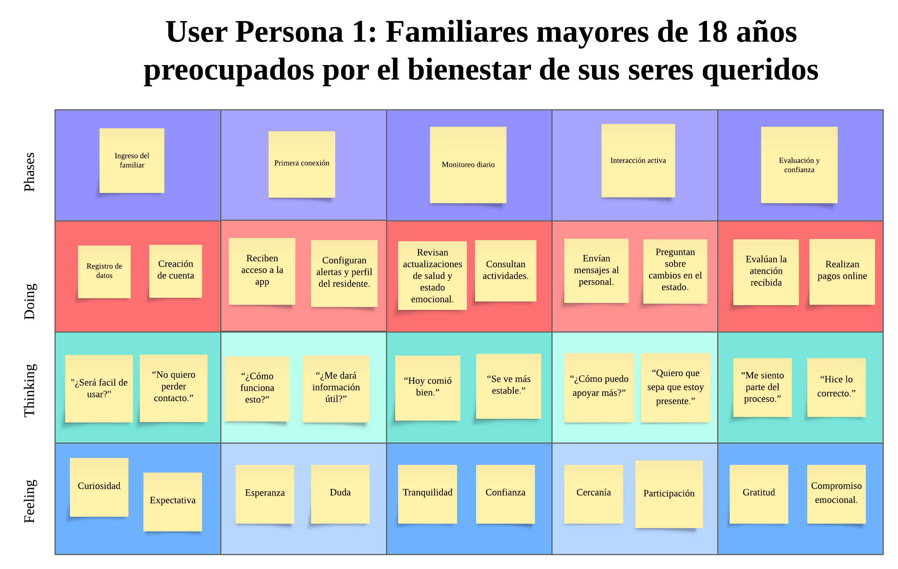
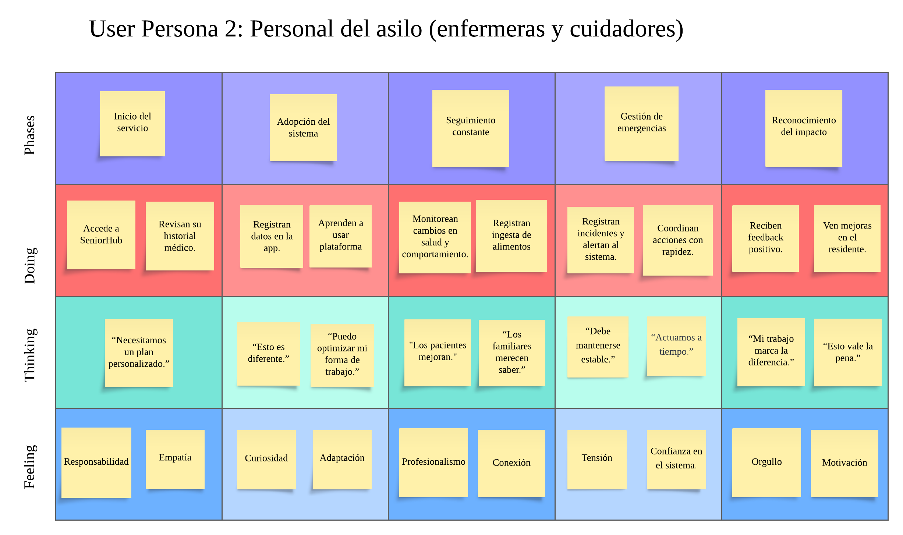
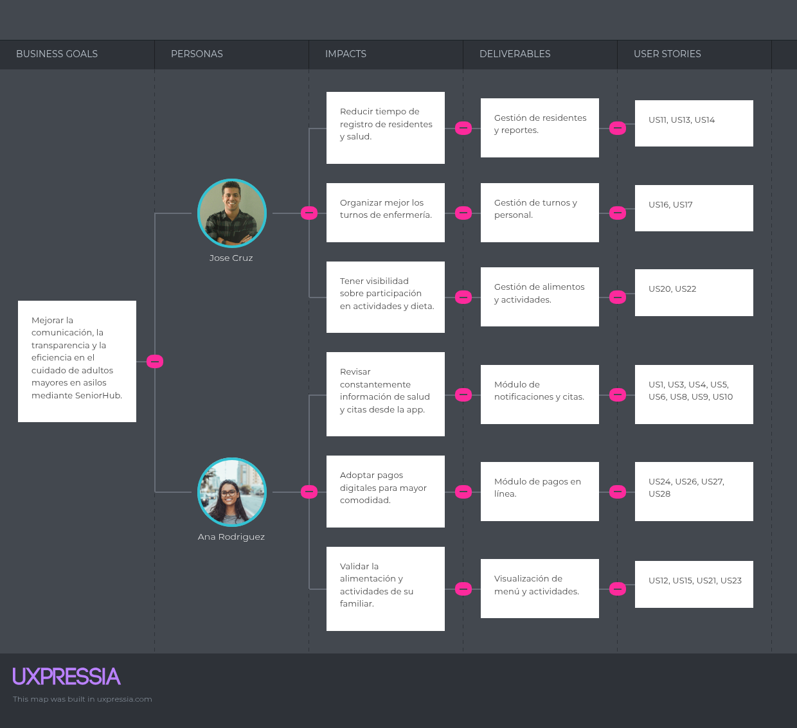

  # Capítulo III: Requirements Specification

## 3.1. To-Be Scenario Mapping.

Segmento 1: Familiares mayores de 18 años preocupados por el bienestar de sus seres queridos

Segmento 2: Profesionales de la salud y cuidadores en asilos de ancianos 

## 3.2. User Stories.
| Epic/Story ID | Título | Descripción | Criterios de Aceptación | Relacionado con (Epic ID) |
|---------------|--------|-------------|--------------------------|----------------------------|
| E1 | Gestión de Notificaciones: Epic que agrupa alertas y recordatorios en tiempo real. | N/A | N/A |
| US1 | Notificación de cambios de salud | Como familiar, quiero recibir notificaciones inmediatas sobre cambios importantes en la salud de mi ser querido, para estar informado en tiempo real. | - La app envía notificación push/email. - Incluye detalle del cambio. - Se registra en historial. | E1 |
| US2 | Recordatorio de medicamentos | Como cuidador, quiero programar recordatorios automáticos de medicamentos, para evitar olvidos. | - Registro de medicación + hora. - Alerta a cuidador y familiar. - Opción de marcar “tomado”. | E1 |
| US3 | Preferencia de canal | Como usuario, quiero elegir recibir notificaciones por app o email, para adaptarlo a mi necesidad. | - Configuración en perfil. - Persistencia de la preferencia. - Se respeta en futuras notificaciones. | E1 |
| US4 | Confirmación de recepción | Como familiar, quiero confirmar si leí la notificación, para dar tranquilidad al cuidador. | - Botón de “Leído”. - Estado visible al cuidador. - Reenvío si no se confirma en 30 min. | E1 |
| US5 | Historial de notificaciones | Como usuario, quiero ver un historial de notificaciones pasadas, para revisar eventos. | - Listado con fecha y tipo. - Orden descendente. - Exportable en PDF. | E1 |
| E2 | Gestión de Citas | Epic para gestionar citas de visitas y consultas. | N/A | N/A |
| US6 | Reserva de cita | Como familiar, quiero reservar una cita desde la app, para coordinar mi visita. | - Calendario con horarios disponibles. - Se bloquea al confirmar. - Notificación al personal. | E2 |
| US7 | Visualización de calendario | Como cuidador, quiero ver citas confirmadas, para organizar mi tiempo. | - Vista diaria/semanal. - Filtro por residente. - Alertas previas. | E2 |
| US8 | Recordatorio de citas | Como familiar, quiero recibir recordatorios de mis citas, para no olvidarlas. | - Notificación 24h y 1h antes. - Incluye detalles de hora y lugar. | E2 |
| US9 | Cancelar/reprogramar | Como familiar, quiero cancelar o mover mi cita, para adaptarme a imprevistos. | - Opción en app. - Se actualiza calendario. - Se notifica al cuidador. | E2 |
| US10 | Lista de espera | Como familiar, quiero unirme a lista de espera, para ocupar espacios libres. | - Botón “unirse a lista”. - Aviso inmediato al liberarse. - Confirmación en un clic. | E2 |
| E3 | Gestión de Adultos Mayores | Epic de manejo de información de residentes. | N/A | N/A |
| US11 | Registro de residente | Como cuidador, quiero registrar datos básicos y de salud de un residente, para tener historial. | - Formulario validado. - Datos guardados en BD. - Confirmación visual. | E3 |
| US12 | Perfil de residente | Como familiar, quiero ver el perfil de mi ser querido, para conocer su estado general. | - Vista con salud, citas y dieta. - Acceso restringido. - Interfaz simple. | E3 |
| US13 | Reporte de estado | Como administrador, quiero generar reportes básicos de salud de los residentes, para evaluar servicios. | - Reporte en PDF. - Filtros por fechas. - Incluye métricas básicas. | E3 |
| US14 | Historial médico simple | Como cuidador, quiero registrar consultas y diagnósticos básicos, para mantener seguimiento. | - Entrada con fecha. - Texto descriptivo. - Solo editable por cuidadores. | E3 |
| US15 | Registro de actividades | Como cuidador, quiero registrar participación en actividades, para monitorear bienestar. | - Lista de actividades. - Estado (participó/no participó). - Visible al familiar. | E3 |
| E4 | Gestión de Enfermeras | Epic para administrar personal de enfermería. | N/A | N/A |
| US16 | Registro de enfermeras | Como administrador, quiero registrar enfermeras, para asignarlas a residentes. | - Formulario validado. - Datos guardados. - Relación con residentes. | E4 |
| US17 | Gestión de turnos | Como enfermera, quiero registrar mis turnos, para organizar mis horarios. | - Calendario editable. - Validación de solapamientos. - Notificación de cambios. | E4 |
| US18 | Asignación de enfermera | Como familiar, quiero saber quién cuida a mi ser querido, para tener confianza. | - Perfil visible. - Datos de contacto básicos. - Solo accesible para familiares. | E4 |
| US19 | Evaluación del cuidado | Como familiar, quiero dejar una valoración simple sobre el servicio de la enfermera, para dar feedback. | - Escala de 1 a 5. - Comentario opcional. - Datos visibles al administrador. | E4 |
| E5 | Gestión de Alimentos | Epic de planes alimenticios y monitoreo. | N/A | N/A |
| US20 | Registro de dieta | Como nutricionista, quiero registrar la dieta semanal de cada residente, para planificar su nutrición. | - Registro semanal. - Notificación de cambios. - Guardado exitoso. | E5 |
| US21 | Visualización de menú | Como familiar, quiero ver el menú semanal, para validar la alimentación. | - Vista clara. - Descargable en PDF. - Datos sincronizados. | E5 |
| US22 | Control de ingesta | Como cuidador, quiero marcar si el residente consumió su comida, para monitorear cumplimiento. | - Botón “consumido/no”. - Historial guardado. - Notificación a nutricionista. | E5 |
| US23 | Preferencias alimenticias | Como familiar, quiero registrar preferencias simples (ej. sin picante), para que se respeten. | - Campo editable. - Se refleja en plan alimenticio. - Notificación a cocina. | E5 |
| E6 | Payment | Epic de pagos y finanzas. | N/A | N/A |
| US24 | Pago en línea | Como familiar, quiero pagar la mensualidad desde la app, para mayor comodidad. | - Métodos: tarjeta y billeteras locales. - Confirmación inmediata. - Seguridad básica. | E6 |
| US25 | Registro de pagos | Como administrador, quiero ver pagos recibidos, para llevar control. | - Listado por fecha. - Estado de pago. - Exportable a Excel. | E6 |
| US26 | Comprobante digital | Como familiar, quiero recibir comprobante de pago, para tener respaldo. | - PDF por correo. - Descargable en app. - Con número único. | E6 |
| US27 | Recordatorio de pago | Como familiar, quiero recibir recordatorios antes del vencimiento, para evitar recargos. | - Notificación 7 y 2 días antes. - Incluye monto y fecha límite. | E6 |
| US28 | Historial de pagos | Como familiar, quiero ver el historial de pagos realizados, para controlar mis gastos. | - Lista por fecha y monto. - Filtro por año. - Exportable en PDF. | E6 |
| E7 | Landing Page | Epic para atraer y registrar usuarios. | N/A | N/A |
| US29 | Información del servicio | Como visitante, quiero ver información clara de SeniorHub, para entender beneficios. | - Sección explicativa. - Texto claro y conciso. - Diseño responsive. | E7 |
| US30 | Formulario de contacto | Como visitante, quiero enviar mis datos de contacto, para recibir más información. | - Validación básica. - Confirmación automática. - Almacenado en BD. | E7 |
| US31 | Testimonios | Como visitante, quiero leer experiencias de otros usuarios, para confiar en la plataforma. | - 3 testimonios visibles. - Nombre y foto con permiso. - Texto corto. | E7 |
| US32 | Call to Action | Como visitante, quiero ver botones claros de registro, para iniciar fácilmente. | - Botón en header/footer. - Redirección a registro o descarga. | E7 |
| US33 | Optimización SEO | Como equipo de marketing, quiero que la landing esté optimizada, para atraer más visitas. | - Metatags configurados. - Keywords básicas. - Buen puntaje Lighthouse. | E7 |

**Epic 01: Gestión de Notificaciones**

| **Story ID** | **Título**                          |
|--------------|--------------------------------------|
| US-01        | Notificación de cambios de salud     |
| US-02        | Recordatorio de medicamentos         |
| US-03        | Preferencia de canal                 |
| US-04        | Confirmación de recepción            |
| US-05        | Historial de notificaciones          |

**Epic 02: Gestión de citas** 

| **Story ID** | **Título**               |
|--------------|---------------------------|
| US-06        | Reserva de cita           |
| US-07        | Visualización de calendario|
| US-08        | Recordatorio de citas     |
| US-09        | Cancelar/reprogramar cita |
| US-10        | Lista de espera           |

**Epic 03: Gestion de adultos mayores**
| **Story ID** | **Título**                 |
|--------------|-----------------------------|
| US-11        | Registro de residente       |
| US-12        | Perfil de residente         |
| US-13        | Reporte de estado           |
| US-14        | Historial médico simple     |
| US-15        | Registro de actividades     |

**Epic 04: Gestiion de personal medico**

| **Story ID** | **Título**                |
|--------------|----------------------------|
| US-16        | Registro de enfermeras     |
| US-17        | Gestión de turnos          |
| US-18        | Asignación de enfermera    |
| US-19        | Evaluación del cuidado     |

**Epic 05: Gestión alimentaria del paciente**
| **Story ID** | **Título**                   |
|--------------|-------------------------------|
| US-20        | Registro de dieta             |
| US-21        | Visualización de menú         |
| US-22        | Control de ingesta            |
| US-23        | Preferencias alimenticias     |

**Epic 06: Payment**
| **Story ID** | **Título**             |
|--------------|-------------------------|
| US-24        | Pago en línea           |
| US-25        | Registro de pagos       |
| US-26        | Comprobante digital     |
| US-27        | Recordatorio de pago    |
| US-28        | Historial de pagos      |

**Epic 06: Landing Page**

| **Story ID** | **Título**                |
|--------------|----------------------------|
| US-29        | Información del servicio   |
| US-30        | Formulario de contacto     |
| US-31        | Testimonios                |
| US-32        | Call to Action             |
| US-33        | Optimización SEO           |

## 3.3. Impact Mapping.

Segmento 1: Familiares mayores de 18 años preocupados por el bienestar de sus seres queridos

Segmento 2: Profesionales de la salud y cuidadores en asilos de ancianos 

## 3.4. Product Backlog.

| # Orden | User Story Id | Título                                   | Descripción                                                                                          | Story Points (1 / 2 / 3 / 5 / 8) |
|---------|---------------|------------------------------------------|------------------------------------------------------------------------------------------------------|----------------------------------|
| 1       | US-01         | Notificación de cambios de salud         | Como familiar, quiero recibir notificaciones inmediatas sobre cambios importantes en la salud de mi ser querido. | 3 |
| 2       | US-02         | Recordatorio de medicamentos             | Como cuidador, quiero programar recordatorios automáticos de medicamentos, para evitar olvidos.      | 3 |
| 3       | US-03         | Preferencia de canal                     | Como usuario, quiero elegir recibir notificaciones por app o email, para adaptarlo a mi necesidad.   | 2 |
| 4       | US-04         | Confirmación de recepción                | Como familiar, quiero confirmar si leí la notificación, para dar tranquilidad al cuidador.            | 2 |
| 5       | US-05         | Historial de notificaciones              | Como usuario, quiero ver un historial de notificaciones pasadas, para revisar eventos.                | 3 |
| 6       | US-06         | Reserva de cita                          | Como familiar, quiero reservar una cita desde la app, para coordinar mi visita.                       | 5 |
| 7       | US-07         | Visualización de calendario              | Como cuidador, quiero ver citas confirmadas, para organizar mi tiempo.                                | 3 |
| 8       | US-08         | Recordatorio de citas                    | Como familiar, quiero recibir recordatorios de mis citas, para no olvidarlas.                         | 2 |
| 9       | US-09         | Cancelar/reprogramar cita                | Como familiar, quiero cancelar o mover mi cita, para adaptarme a imprevistos.                         | 3 |
| 10      | US-10         | Lista de espera                          | Como familiar, quiero unirme a lista de espera, para ocupar espacios libres.                          | 5 |
| 11      | US-11         | Registro de residente                    | Como cuidador, quiero registrar datos básicos y de salud de un residente, para tener historial.       | 3 |
| 12      | US-12         | Perfil de residente                      | Como familiar, quiero ver el perfil de mi ser querido, para conocer su estado general.                 | 3 |
| 13      | US-13         | Reporte de estado                        | Como administrador, quiero generar reportes básicos de salud de los residentes, para evaluar servicios. | 5 |
| 14      | US-14         | Historial médico simple                  | Como cuidador, quiero registrar consultas y diagnósticos básicos, para mantener seguimiento.           | 3 |
| 15      | US-15         | Registro de actividades                  | Como cuidador, quiero registrar participación en actividades, para monitorear bienestar.               | 2 |
| 16      | US-16         | Registro de enfermeras                   | Como administrador, quiero registrar enfermeras, para asignarlas a residentes.                         | 3 |
| 17      | US-17         | Gestión de turnos                        | Como enfermera, quiero registrar mis turnos, para organizar mis horarios.                              | 5 |
| 18      | US-18         | Asignación de enfermera                  | Como familiar, quiero saber quién cuida a mi ser querido, para tener confianza.                        | 2 |
| 19      | US-19         | Evaluación del cuidado                   | Como familiar, quiero dejar una valoración simple sobre el servicio de la enfermera, para dar feedback. | 2 |
| 20      | US-20         | Registro de dieta                        | Como nutricionista, quiero registrar la dieta semanal de cada residente, para planificar su nutrición. | 3 |
| 21      | US-21         | Visualización de menú                    | Como familiar, quiero ver el menú semanal, para validar la alimentación.                               | 2 |
| 22      | US-22         | Control de ingesta                       | Como cuidador, quiero marcar si el residente consumió su comida, para monitorear cumplimiento.          | 3 |
| 23      | US-23         | Preferencias alimenticias                | Como familiar, quiero registrar preferencias simples (ej. sin picante), para que se respeten.          | 2 |
| 24      | US-24         | Pago en línea                            | Como familiar, quiero pagar la mensualidad desde la app, para mayor comodidad.                         | 5 |
| 25      | US-25         | Registro de pagos                        | Como administrador, quiero ver pagos recibidos, para llevar control.                                   | 3 |
| 26      | US-26         | Comprobante digital                      | Como familiar, quiero recibir comprobante de pago, para tener respaldo.                                | 2 |
| 27      | US-27         | Recordatorio de pago                     | Como familiar, quiero recibir recordatorios antes del vencimiento, para evitar recargos.               | 2 |
| 28      | US-28         | Historial de pagos                       | Como familiar, quiero ver el historial de pagos realizados, para controlar mis gastos.                 | 3 |
| 29      | US-29         | Información del servicio                 | Como visitante, quiero ver información clara de SeniorHub, para entender beneficios.                   | 2 |
| 30      | US-30         | Formulario de contacto                   | Como visitante, quiero enviar mis datos de contacto, para recibir más información.                     | 2 |
| 31      | US-31         | Testimonios                              | Como visitante, quiero leer experiencias de otros usuarios, para confiar en la plataforma.              | 2 |
| 32      | US-32         | Call to Action                           | Como visitante, quiero ver botones claros de registro, para iniciar fácilmente.                        | 1 |
| 33      | US-33         | Optimización SEO                         | Como equipo de marketing, quiero que la landing esté optimizada, para atraer más visitas.              | 3 |

## 3.5 Alcance del Proyecto

El proyecto SeniorHub tiene como finalidad mejorar la comunicación y la gestión del cuidado de adultos mayores en asilos, ofreciendo a familiares y cuidadores una plataforma digital confiable, segura y de fácil uso.

### 3.5.1. Justificación

En la actualidad, los familiares manifiestan preocupación por la falta de información en tiempo real sobre la salud y el bienestar emocional de sus seres queridos. A su vez, los cuidadores enfrentan sobrecarga laboral debido a la necesidad de atender a muchos residentes y registrar manualmente sus datos. SeniorHub busca responder a estas problemáticas con una solución tecnológica que optimice la gestión del cuidado y brinde tranquilidad a los familiares.

### 3.5.2. Cobertura del sistema

El sistema abarcará las siguientes funcionalidades principales, implementadas bajo una arquitectura de microservicios:

1. **Gestión de Notificaciones**: envío de alertas en tiempo real sobre cambios de salud, recordatorios de medicación y citas.
2. **Gestión de Citas**: reserva, cancelación y recordatorios de visitas médicas o familiares.
3. **Gestión de Adultos Mayores**: registro, historial médico simple y actividades diarias.
4. **Gestión de Enfermeras**: asignación de personal, turnos y evaluación del servicio.
5. **Gestión de Alimentos**: planificación de dietas, control de ingesta y registro de preferencias.
6. **Pagos (Payment)**: registro, historial y confirmación de pagos en línea.

**Fuera del alcance**: integración con sistemas externos de salud pública, gestión avanzada de historias clínicas completas, inteligencia artificial para predicción de riesgos médicos y soporte telefónico directo.

### 3.5.3. Requerimientos de negocio

Los principales requerimientos que debe cumplir el sistema son:

- Proveer información confiable y en tiempo real sobre la salud y actividades de los adultos mayores.
- Reducir la carga administrativa de los cuidadores mediante la digitalización de registros.
- Facilitar la comunicación efectiva entre familiares y personal del asilo.
- Garantizar la seguridad y privacidad de los datos médicos y financieros.
- Brindar una experiencia de uso intuitiva y accesible para usuarios con distintos niveles de alfabetización digital.
- Generar confianza y transparencia mediante reportes, notificaciones y trazabilidad de las acciones.

## 3.4. Métricas de alcance

Para medir el impacto y verificar que el proyecto cumple con su objetivo, se establecen las siguientes métricas de alcance:

| ID | Métrica | Valor Esperado | Relacionado con |
|----|---------|----------------|-----------------|
| M1 | Notificaciones enviadas en tiempo real | Retraso máximo de 5 segundos en la entrega | Gestión de Notificaciones |
| M2 | Escalabilidad inicial | Soportar al menos 100 residentes activos y 200 familiares conectados | Gestión de Adultos Mayores, Gestión de Citas |
| M3 | Disponibilidad del sistema | 90% de disponibilidad mensual | Todos los microservicios |
| M4 | Precisión de registros | ≥ 95% de éxito en guardado de información de residentes y citas | Gestión de Adultos Mayores, Gestión de Citas |
| M5 | Experiencia de usuario | El 80% de los usuarios debe completar tareas básicas (ej. reservar cita, ver perfil) en menos de 3 minutos | Gestión de Citas, Perfil de Residentes |
| M6 | Transacciones de pago | Confirmación en menos de 10 segundos para el 95% de pagos procesados | Payment |
| M7 | Seguridad de acceso | 100% de los usuarios deben autenticarse antes de acceder a datos sensibles | Todos los microservicios |
