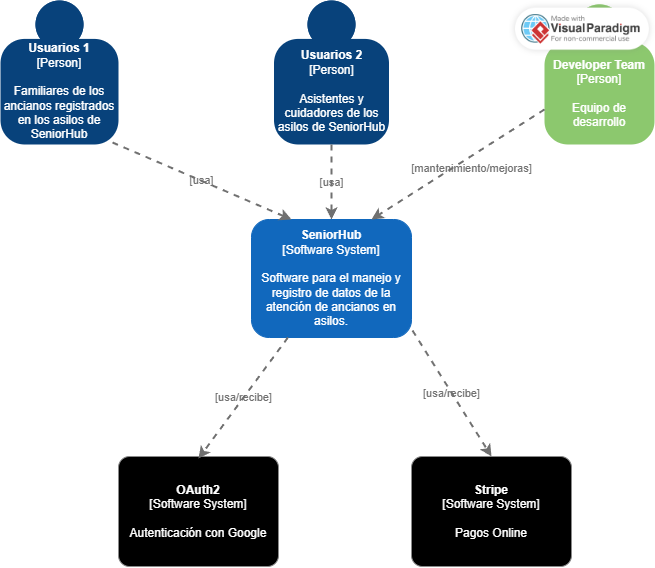
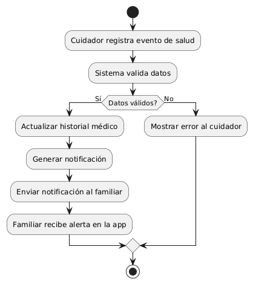
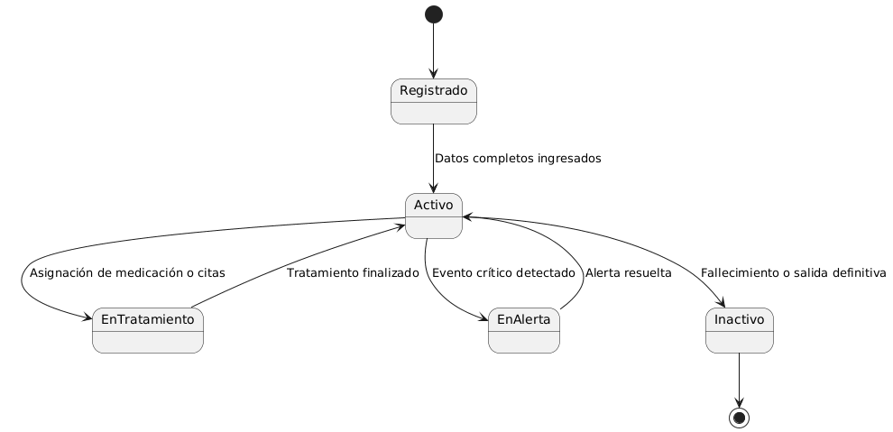
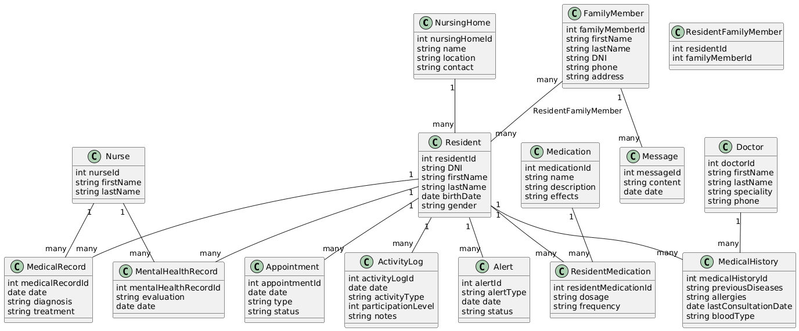
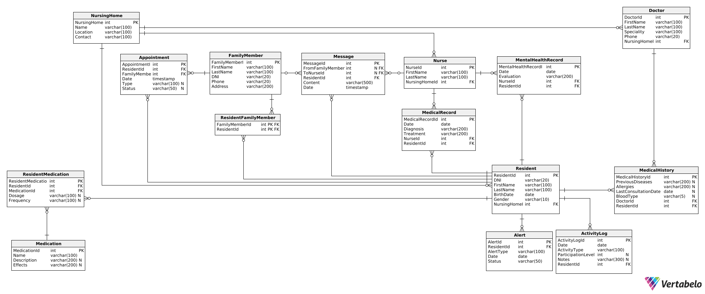
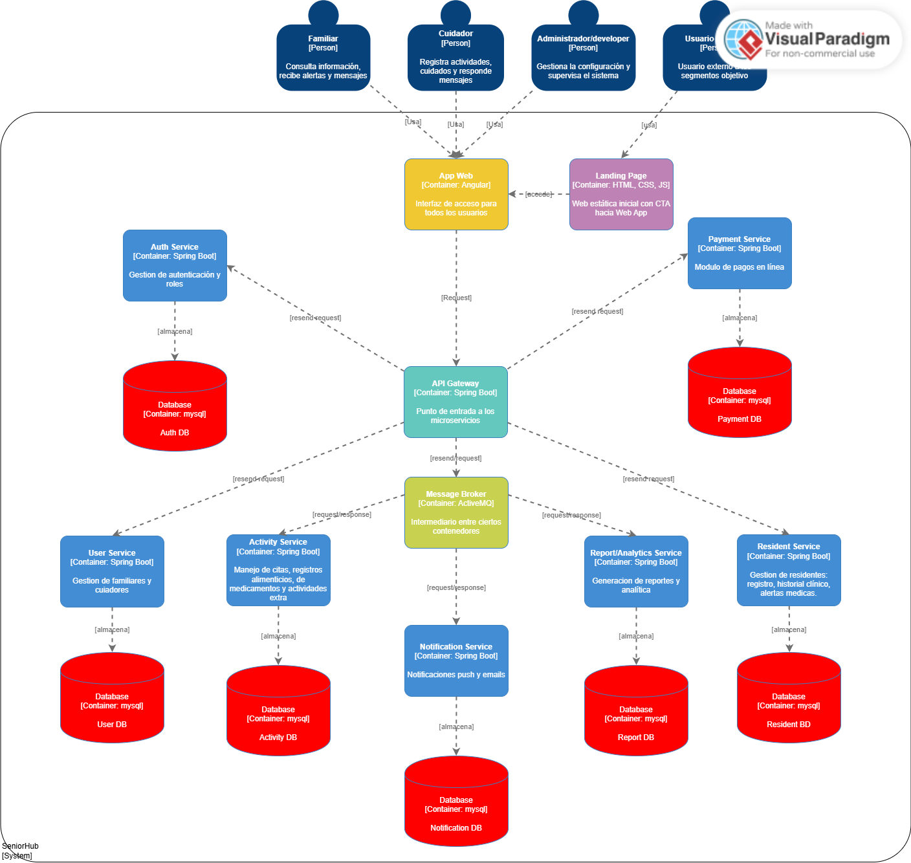
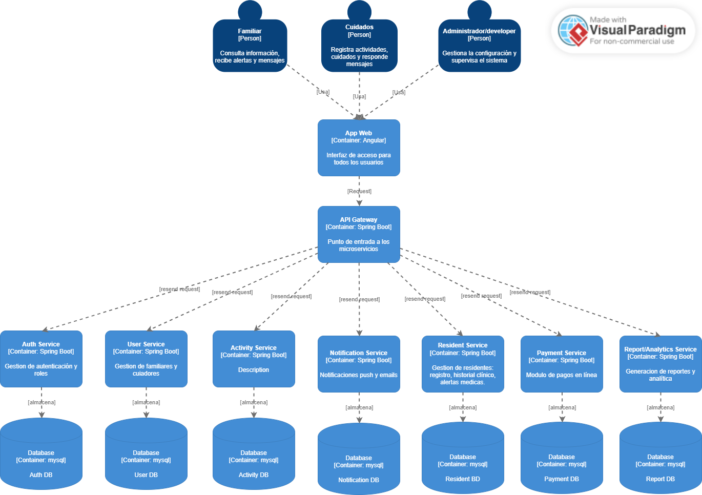
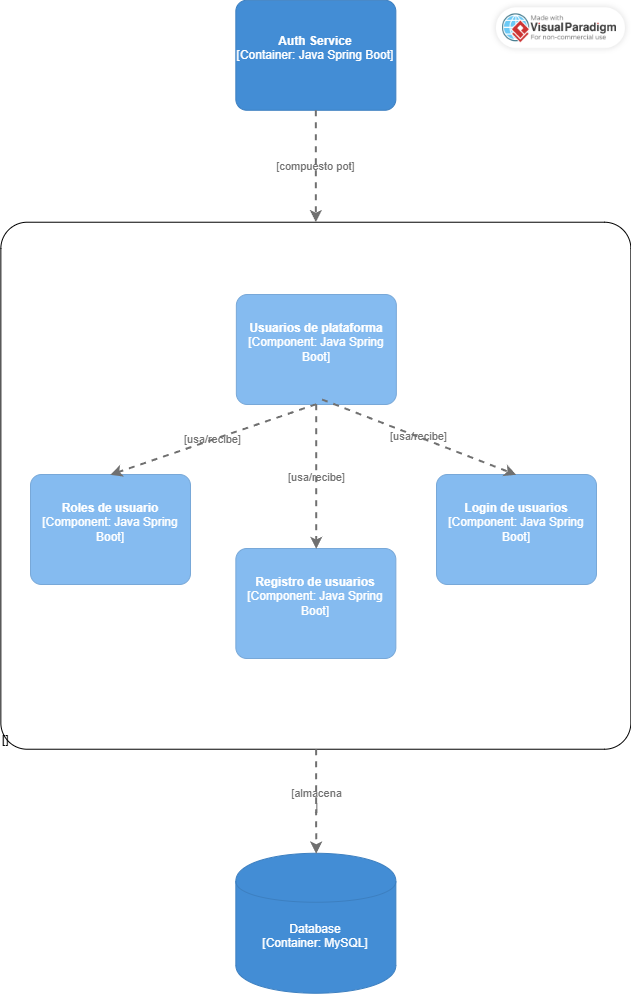
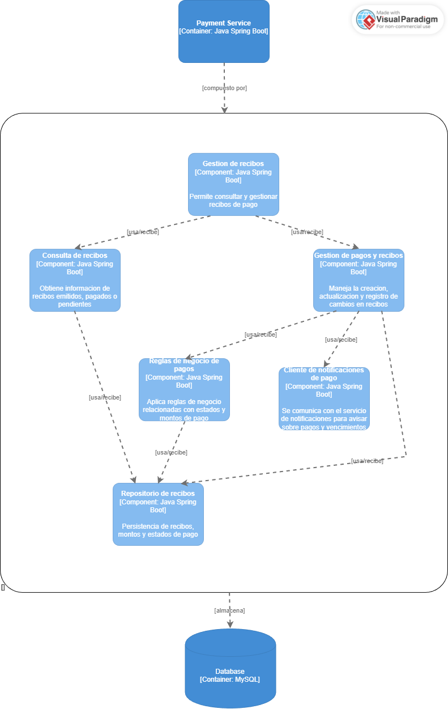
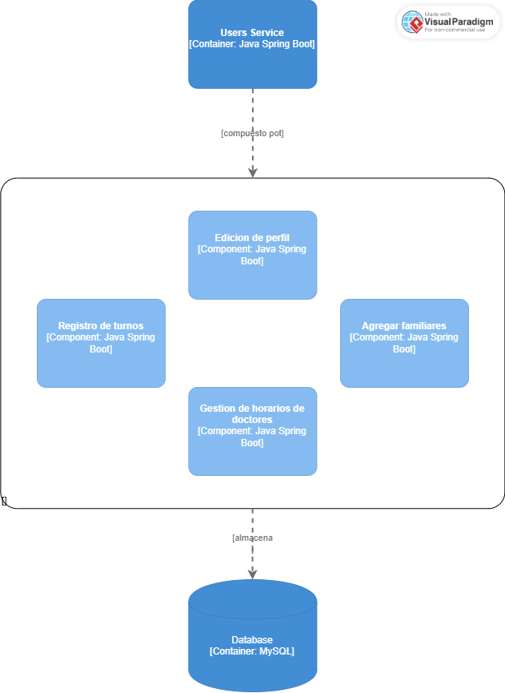

## Capítulo IV: Product Architecture Design

### 4.1	Desing Concepts, ViewPoints & ER Diagrams

#### 4.1.1	Principles Statements

Para el desarrollo del proyecto SeniorHub, aplicaremos los principios SOLID, fundamentales en la programación orientada a objetos y en el diseño de software modular. Esto garantizará que nuestro sistema sea escalable, mantenible y fácil de extender, asegurando una correcta gestión de los residentes, el personal médico y los familiares.

Los principios que guiarán nuestro diseño son:

**S - Single Responsibility Principle (SRP):**

Cada clase y módulo del sistema debe cumplir con una única responsabilidad. Por ejemplo, la clase encargada de gestionar notificaciones solo debe ocuparse de crear, enviar y almacenar notificaciones, sin involucrarse en la lógica de usuarios o reportes.

**O - Open/Closed Principle (OCP):**

El sistema debe estar abierto a la extensión de nuevas funcionalidades (por ejemplo, la incorporación de un nuevo tipo de reporte o la integración con un servicio externo de mensajería), pero cerrado a modificaciones que afecten la estabilidad del código existente.

**L - Liskov Substitution Principle (LSP):**

Las entidades hijas deben poder sustituir a sus entidades padre sin alterar el comportamiento esperado. En SeniorHub, por ejemplo, un “Usuario Familiar” debería comportarse correctamente en cualquier lugar donde se use un “Usuario”, sin romper la lógica del sistema.

**I - Interface Segregation Principle (ISP):**

Las interfaces deben ser específicas y no forzar a las clases a implementar métodos que no necesitan. Por ejemplo, una interfaz INotificationService puede dividirse en subinterfaces como ISendNotification y IArchiveNotification, evitando que un módulo que solo envía notificaciones deba implementar funciones de archivado.

**D - Dependency Inversion Principle (DIP):**

Los módulos de alto nivel (como el gestor de reportes médicos) no deben depender directamente de los módulos de bajo nivel (como la base de datos). Ambos deben depender de abstracciones (interfaces o servicios). Esto permitirá cambiar la tecnología de persistencia (por ejemplo, de SQL a NoSQL) sin alterar la lógica de negocio.

#### 4.1.2	Approaches Statements Architectural Styles & Patterns

**Approaches Statements**

Para el desarrollo del proyecto SeniorHub, adoptaremos el enfoque de Domain-Driven Design (DDD), el cual promueve la estrecha colaboración entre expertos del dominio de atención geriátrica, familiares de los residentes y el equipo de desarrollo de software. Este enfoque permitirá construir un sistema modular, flexible y alineado con las necesidades reales de gestión del cuidado de adultos mayores.

Las principales ventajas de aplicar DDD en SeniorHub son:

**Diseño enfocado en el dominio:** DDD nos proporciona una forma estructurada de modelar el dominio del cuidado de adultos mayores, permitiendo reflejar con precisión los procesos clínicos, administrativos y familiares en el software.

**Lenguaje Ubicuo:** Promueve un vocabulario compartido entre cuidadores, médicos, familiares y desarrolladores, lo cual reduce ambigüedades y facilita la comunicación de los requerimientos de negocio.

**Bounded Contexts:** La identificación de contextos delimitados (por ejemplo: Gestión del Bienestar del Residente, Interacción Familiar, Gestión de Personal Médico, Reportes y Analítica) nos permitirá aislar la complejidad de cada área y mantener independencia entre sus componentes.

**Patrones de diseño propios:** DDD nos ofrece patrones como Aggregates, Entities, Value Objects y Domain Services, que serán fundamentales para modelar procesos críticos como el registro de tratamientos, la comunicación con familiares y la generación de reportes médicos.

**Architectural Styles & Patterns**

La arquitectura de SeniorHub se fundamentará en una combinación de arquitectura limpia y microservicios. Este enfoque, alineado con los principios de DDD, permitirá garantizar la escalabilidad, el mantenimiento y la flexibilidad del sistema.

**Arquitectura limpia (Clean Architecture):** Se organizará el sistema en capas bien definidas (dominio, aplicación, infraestructura y presentación), asegurando la independencia del dominio respecto a frameworks y tecnologías externas.

**Microservicios:** Cada bounded context podrá evolucionar como un microservicio independiente, facilitando la escalabilidad y el despliegue modular. Se contempla implementar microservicios para funcionalidades críticas como:

- Gestión de notificaciones y alertas (recordatorios de medicamentos, alertas médicas).

- Módulo de reportes y analítica (generación de indicadores de salud y calidad de vida).

- Interacción familiar (mensajes, videollamadas y actualizaciones del residente).

- Autenticación y seguridad (gestión de roles para médicos, cuidadores y familiares).

**Patrones de diseño:** Se aplicarán patrones como Repository, CQRS (Command Query Responsibility Segregation) para separar la lectura y escritura de datos, y Event-Driven Architecture para manejar eventos relevantes (ej. “residente dado de alta”, “medicación programada”, “alerta enviada a familiar”).

#### 4.1.3	 Context Diagram

#### 4.1.4	Approach driven ViewPoints Diagrams
##### Activity Diagram
Se presenta el diagrama de actividades cuando un se registra un altercado o algun evento de salud con el anciano y se notifica al familiar a cargo.

##### State Diagram   
Se muestra el diagrama de estado que representa los estados posibles de un residente dentro del hogar geriátrico y cómo estos cambian en función de eventos.

##### Class Diagram

#### 4.1.5	Relational/Non Relational Database Diagram 

El modelo relacional propuesto organiza la información en entidades principales como Residente, Familiar, Enfermera, Médico y Hogar de Cuidado, garantizando la integridad de los datos mediante claves primarias y foráneas. Además, se incluyen tablas específicas para gestionar historiales médicos, registros de salud mental, medicamentos y actividades. El modelo también contempla funcionalidades clave como la comunicación entre familiares y cuidadores, la gestión de alertas de salud y la programación de citas, lo que permite una administración estructurada y consistente de la información.

#### 4.1.6	Design Patterns

En el desarrollo del sistema SeniorHub, se emplearán diferentes patrones de diseño con el fin de asegurar la mantenibilidad, escalabilidad y flexibilidad de la aplicación. Estos patrones se agrupan en tres categorías principales: creacionales, estructurales y de comportamiento.

**Patrones Creacionales**

**Factory Pattern:** Este patrón permitirá la creación de objetos de usuario (como Residente, Familiar, Médico o Cuidador) sin necesidad de especificar explícitamente la clase concreta. Gracias a este enfoque, podremos manejar distintos tipos de usuarios en el sistema con mayor flexibilidad, facilitando la extensión a futuros roles sin alterar la lógica central.

**Patrones Estructurales**

**Bridge Pattern:** Se aplicará en la gestión del bienestar del residente, donde los cuidados incluyen múltiples dimensiones (medicación, alimentación, terapias y actividades). Este patrón permitirá separar la abstracción (por ejemplo, un plan de cuidado) de su implementación concreta (ej. medicamentos, dietas, actividades físicas), proporcionando independencia y mejorando la extensibilidad.

**Facade Pattern:** SeniorHub integrará distintos módulos y microservicios (notificaciones, reportes, autenticación, interacción familiar). El patrón Facade nos permitirá ofrecer una interfaz unificada y simplificada hacia los usuarios y al frontend, ocultando la complejidad interna de los subsistemas.

**Patrones de Comportamiento**

**Observer Pattern:** Será utilizado en el sistema de notificaciones y alertas. Cuando ocurra un evento importante (ej. “residente tomó su medicación”, “se generó un nuevo reporte médico” o “se activó una alerta de emergencia”), todos los familiares y cuidadores suscritos recibirán actualizaciones automáticas en tiempo real.

**Strategy Pattern:** Se empleará en la generación de reportes y analítica, donde existen diferentes estrategias de presentación (resumen estadístico, gráficos de evolución, informes clínicos). Esto permitirá cambiar dinámicamente la forma en que se generan y visualizan los reportes sin modificar la lógica principal.

#### 4.1.7	Tactics

A continuación, se presentan las tácticas relacionadas al desempeño y calidad del sistema SeniorHub:

**Disponibilidad**

- Implementación de balanceo de carga para distribuir el tráfico entre los servidores, asegurando que los usuarios puedan acceder al sistema sin interrupciones.
- Uso de monitorización en tiempo real y alertas tempranas para identificar fallos en los microservicios de notificaciones, reportes o autenticación.
- Diseño de infraestructura tolerante a fallos para que, en caso de caída de un servicio, otro pueda asumir su operación.

**Fiabilidad**

- Ejecución de pruebas exhaustivas (unitarias, integrales y de aceptación) para garantizar la calidad del software.
- Implementación de copias de seguridad periódicas y redundancia de datos para proteger la información crítica de residentes y familiares.
- Incorporación de logs detallados y auditorías para el seguimiento de eventos importantes (alertas médicas, accesos de usuarios, modificaciones en reportes).

**Modificabilidad**

- Aplicación del enfoque Domain-Driven Design (DDD), permitiendo la modularidad y evolución independiente de cada bounded context.
- Uso de refactoring continuo y pruebas automatizadas para mantener el código limpio, fácil de mantener y extender.
- Adopción de principios SOLID y arquitectura limpia para desacoplar las dependencias tecnológicas del dominio.

**Usabilidad**

- Realización de pruebas de usabilidad con familiares, médicos y adultos mayores para asegurar que la interfaz sea intuitiva y accesible.
- Incorporación de retroalimentación continua de usuarios para mejorar la experiencia y adaptar la aplicación a las necesidades reales.
- Inclusión de interfaces accesibles (tipografías claras, contraste adecuado, compatibilidad con lectores de pantalla).

**Seguridad**

- Implementación de autenticación y autorización basada en roles (familiar, residente, médico, cuidador).
- Uso de cifrado de datos sensibles tanto en tránsito (TLS/HTTPS) como en reposo (en bases de datos).
- Ejecución de auditorías de seguridad y actualizaciones periódicas para prevenir vulnerabilidades.
- Aplicación de mecanismos de doble factor de autenticación (2FA) para el acceso de perfiles médicos y administrativos.

### 4.2	Architectural Drivers

#### 4.2.1	Design Purpose

El propósito de diseño de SeniorHub es desarrollar una plataforma web y móvil que facilite la gestión integral del cuidado de adultos mayores en residencias geriátricas y centros especializados. El sistema tiene como objetivo principal ofrecer a médicos, cuidadores y familiares una herramienta centralizada para monitorear, registrar y coordinar el bienestar físico, emocional y social de los residentes.

Asimismo, SeniorHub busca proporcionar a los familiares un canal confiable y accesible para mantenerse informados en tiempo real sobre la salud y actividades de sus seres queridos, fortaleciendo así la confianza y la comunicación con el centro de cuidado.

Desde el punto de vista del personal médico y administrativo, la aplicación permitirá gestionar tratamientos, historiales clínicos, citas médicas y reportes analíticos, optimizando la toma de decisiones y mejorando la calidad del servicio.

En términos de diseño, el sistema está orientado a garantizar:

- Escalabilidad, para adaptarse al crecimiento de la institución y la incorporación de nuevos módulos.
- Usabilidad, mediante interfaces intuitivas y accesibles tanto para profesionales como para familiares.
- Seguridad, protegiendo los datos sensibles de salud con mecanismos de autenticación, autorización y cifrado.
- Interoperabilidad, permitiendo la integración con otros sistemas médicos o de gestión administrativa en el futuro.

Con este enfoque, SeniorHub no solo será un sistema de gestión, sino también un medio de conexión entre los residentes y su entorno familiar y médico, mejorando la experiencia de cuidado de manera integral.

#### 4.2.2	Primary Functionality (Primary User Stories)

| ID |	Título |	Historia de usuario |
|----|---------|----------------------|
| E1-US1 |	Notificación de cambios de salud	| Como familiar quiero recibir notificaciones inmediatas sobre cambios importantes en la salud de mi ser querido, para estar informado en tiempo real.|
| E1-US2 |	Recordatorio de medicamentos	| Como cuidador quiero programar recordatorios automáticos de medicamentos, para evitar olvidos.|
| E2-US6 |	Reserva de cita	| Como familiar quiero reservar una cita desde la app, para coordinar mi visita.|
| E2-US9 |	Cancelar/reprogramar cita |	Como familiar quiero cancelar o mover mi cita, para adaptarme a imprevistos.|
| E3-US11 |	Registro de residente |	Como cuidador quiero registrar datos básicos y de salud de un residente, para tener historial.|
| E3-US12 |	Perfil de residente	| Como familiar quiero ver el perfil de mi ser querido, para conocer su estado general.|
| E3-US14 |	Historial médico simple	| Como cuidador quiero registrar consultas y diagnósticos básicos, para mantener seguimiento.|
| E4-US16 |	Registro de enfermeras	| Como administrador quiero registrar enfermeras, para asignarlas a residentes.|
| E4-US18 |	Asignación de enfermera	| Como familiar quiero saber quién cuida a mi ser querido, para tener confianza.|
| E5-US20 |	Registro de dieta	| Como nutricionista quiero registrar la dieta semanal de cada residente, para planificar su nutrición.|
| E5-US22 |	Control de ingesta	| Como cuidador quiero marcar si el residente consumió su comida, para monitorear cumplimiento.|
| E6-US24 |	Pago en línea	| Como familiar quiero pagar la mensualidad desde la app, para mayor comodidad.|
| E6-US26 |	Comprobante digital	| Como familiar quiero recibir comprobante de pago, para tener respaldo.|
| E7-US29 |	Información del servicio	| Como visitante quiero ver información clara de SeniorHub, para entender beneficios.|
| E7-US30 |	Formulario de contacto	| Como visitante quiero enviar mis datos de contacto, para recibir más información.|
| E7-US32 |	Call to Action	| Como visitante quiero ver botones claros de registro, para iniciar fácilmente.|
| E8-US34 |	Capacidad de usuarios	| Como arquitecto de software quiero que la plataforma soporte hasta 50,000 usuarios potenciales y 7,500 concurrentes, para asegurar escalabilidad y disponibilidad.|
| E8-US37 |	Almacenamiento escalable	| Como administrador de sistemas quiero que el sistema tenga 10 TB de almacenamiento con configuración RAID, para proteger los datos y permitir crecimiento.|

#### 4.2.3	Quality Attribute Scenarios

| ID |	Atributo de Calidad |	Escenario |	Origen |	Estímulo |	Artefacto |	Métrica |	US Asociadas |
|----|----------------------|-----------|--------|-----------|------------|---------|--------------|
| QA-01 |	Usabilidad |	El familiar debe poder reservar una cita en menos de 5 minutos, sin necesitar capacitación previa. |	Usuario familiar |	Reserva de cita |	Calendario de citas |	Tiempo en minutos ≤ 5	| US6, US7, US9 |
| QA-02 |	Rendimiento |	La aplicación debe enviar una notificación de cambio de salud en menos de 3 segundos desde que se registra el evento. |	Sistema |	Cambio de estado de salud |	Componente de notificaciones |	Tiempo en segundos ≤ 3 |	US1, US4 |
| QA-03 |	Seguridad |	Los historiales médicos solo pueden ser accedidos por cuidadores y familiares autorizados, tras autenticación exitosa en máximo 3 intentos.	| Usuario cuidador/familiar |	Solicitud de acceso	| Módulo de seguridad	| Nº de intentos ≤ 3 |	US11, US12, US14 |
| QA-04 |	Fiabilidad |	Los reportes generados deben almacenarse y estar disponibles al 100% después de crearse. |	Sistema |	Generación de reportes |	Componente de reportes |	% de reportes guardados con éxito = 100%	| US13, US25 |
| QA-05 |	Disponibilidad |	La aplicación debe estar disponible las 24 horas del día, los 7 días de la semana. |	Usuario final	| Ingreso a la aplicación |	Sistema |	Disponibilidad 24/7	| US1 a US38 |
| QA-06 |	Escalabilidad |	La aplicación debe soportar al menos 7,500 usuarios concurrentes sin degradación del rendimiento. |	Sistema	| Conexiones simultáneas |	Infraestructura backend	| Nº usuarios concurrentes ≥ 7,500 |	US34, US38 |
| QA-07 |	Modificabilidad |	Los desarrolladores deben poder agregar nuevas funcionalidades modificando máximo 5 clases. |	Desarrolladores	| Agregar una funcionalidad |	Backend Spring Boot	| Nº de clases modificadas ≤ 5 |	US20, US27 |
| QA-08 |	Capacidad de Prueba (Testabilidad) |	El 95% de las funcionalidades críticas debe aprobar las pruebas automatizadas. | 	Desarrolladores |	Ejecución de pruebas |	Sistema	| % de pruebas satisfactorias ≥ 95%	| US1–US28 |
| QA-09 |	Seguridad de datos |	Los archivos personales de postulantes y familiares deben almacenarse cifrados en la BD y no pueden ser compartidos con terceros. |	Sistema	 | Subida de documentos |	Módulo de almacenamiento |	Cifrado AES-256 aplicado en 100% de archivos |	US11, US12 |
| QA-10 |	Mantenibilidad |	El sistema debe recibir actualizaciones de mejoras/corrección de errores al menos 1 vez al mes.	| Desarrolladores	| Despliegue de mejoras |	Sistema |	Nº de releases mensuales ≥ 1	| US4, US24, US32 |

#### 4.2.4	Constraints

| ID |	Constraints |
|----|--------------|
| CON-1 |	La aplicación debe ser accesible desde navegadores modernos como Chrome, Firefox, Opera y Microsoft Edge, así como ofrecer compatibilidad móvil mediante diseño responsivo.|
| CON-2 |	El backend debe desarrollarse en Spring Boot, siguiendo principios de arquitectura limpia y DDD.|
| CON-3 |	El estilo arquitectónico a utilizar es microservicios, delimitados por bounded contexts.|
| CON-4 |	El proyecto debe desarrollarse en un periodo de 15 semanas, respetando el cronograma del curso.|
| CON-5 |	La base de datos principal será MySQL, con soporte para futuras integraciones con otros motores.|
| CON-6 |	Se aplicará el enfoque de Attribute-Driven Design (ADD) para guiar las decisiones arquitectónicas en base a los atributos de calidad priorizados.|
| CON-7 |	El sistema debe cumplir con las regulaciones de protección de datos sensibles en el sector salud, garantizando confidencialidad e integridad.|
| CON-8 |	El frontend debe desarrollarse en Angular, asegurando modularidad y mantenibilidad.|

#### 4.2.5	Architectural Concerns

| ID | Architectural Concerns |
|----|------------------------|
| ARC-1 |	Se debe garantizar la seguridad y privacidad de los datos médicos y personales de los residentes, cumpliendo con normas de protección de datos. Ninguna información sensible podrá ser accesible por usuarios no autorizados.|
| ARC-2 |	La aplicación debe soportar el acceso de al menos 1000 usuarios concurrentes (familiares, médicos y cuidadores), con la posibilidad de escalar progresivamente a medida que la institución crezca.|
| ARC-3 |	La aplicación debe permitir el lanzamiento de actualizaciones periódicas, incorporando nuevas funcionalidades y corrigiendo errores, sin interrumpir el servicio principal.|
| ARC-4 |	SeniorHub debe estar disponible 24/7, considerando que las alertas médicas y las actualizaciones familiares son críticas y no pueden depender de horarios específicos.|
| ARC-5 |	El desarrollo aprovechará las competencias del equipo en Spring Boot, Angular y MySQL, con la posibilidad de escalar a tecnologías adicionales según la evolución del proyecto.|
| ARC-6 |	La aplicación se desarrollará bajo una arquitectura de microservicios, con una correcta separación de bounded contexts (gestión de bienestar, interacción familiar, notificaciones, reportes, gestión médica).|
| ARC-7 |	Se debe considerar la accesibilidad en la interfaz, garantizando que adultos mayores y familiares con baja alfabetización digital puedan interactuar de forma sencilla.|

### 4.3	ADD Iterations

#### 4.3.1	Iteration N° 1

#### 4.3.1.1	Architectural Design Backlog 1

En la primera iteración, el Architectural Design Backlog incluye tareas centradas en el desarrollo de las características fundamentales de nuestro proyecto SeniorHub:
- Autenticación (Login y registro)
- Gestión de residentes (registro, historial clínico, alertas).
- Gestión de usuarios (familiares, cuidadores, médicos, administradores).
- Módulo de notificaciones y alertas en tiempo real.
- Módulo de reportes y analítica.
- Módulo de pagos en línea.

#### 4.3.1.2	Establish Iteration Goal by Selecting Drivers
El objetivo de esta iteración es entregar el sistema SeniorHub como producto completo, priorizando los atributos de calidad definidos en capítulos previos:

- Disponibilidad (24/7 para alertas críticas).
- Seguridad (protección de datos sensibles, autenticación basada en roles, cifrado).
- Escalabilidad (soporte a 7,500 usuarios concurrentes).
- Usabilidad (interfaces intuitivas para familiares y médicos).
- Fiabilidad (registro de eventos y reportes 100% disponibles).
#### 4.3.1.3	Choose One or More Elements of the System to Refine
**Elemento elegido**: Gestión de residentes
Este módulo es el núcleo del sistema SeniorHub, ya que concentra la información crítica de los adultos mayores en el asilo: datos personales, historiales médicos, actividades, citas y alertas. Refinar este componente asegura que toda la plataforma esté organizada en torno a la atención del residente, permitiendo a familiares, cuidadores y médicos acceder a información confiable y actualizada en tiempo real.
#### 4.3.1.4	Choose One or More Design Concepts That Satisfy the Selected Drivers
- Disponibilidad 24/7

    - Balanceo de carga y redundancia en los microservicios críticos (notificaciones y pagos).

    - Monitorización en tiempo real de la salud del sistema, con alertas automáticas para garantizar atención inmediata a incidentes.

- Seguridad

    - Spring Security OAuth para autenticación y control de accesos basados en roles.

- Escalabilidad

    - Arquitectura de microservicios, permitiendo que cada módulo (notificaciones, pagos, reportes) pueda escalar de forma independiente.

    - Uso de infraestructura en la nube, habilitando el escalado automático en picos de carga (familiares concurrentes consultando alertas).

- Usabilidad

    - Diseño centrado en el usuario (UCD), con interfaces simples y accesibles para familiares con baja alfabetización digital.

    - Pruebas de usabilidad periódicas con usuarios reales (familiares, cuidadores y médicos) para validar la facilidad de uso.

- Fiabilidad

    - CQRS (Command Query Responsibility Segregation) en el módulo de reportes, asegurando separación entre lectura y escritura.

    - Auditoría y registro de eventos médicos para garantizar trazabilidad y disponibilidad del 100% de los reportes generados.
#### 4.3.1.5	Instantiate Architectural Elements, Allocate Responsibilities, and Define Interfaces
- Componentes de Aplicación

    - Módulo de gestión de residentes: administra historiales médicos, actividades y alertas.

    - Módulo de notificaciones: genera y envía notificaciones en tiempo real a familiares y cuidadores.

    - Módulo de pagos: gestiona las transacciones y emite comprobantes digitales.

    - Módulo de reportes: consolida información clínica y genera estadísticas.

    -  Responsabilidad: ejecutar la lógica de negocio del sistema.
    -  Interfaces: APIs REST internas para comunicación entre microservicios.

- Clientes

    - Aplicación web (Angular) accesible desde navegadores modernos.

    - Aplicación móvil (PWA o app híbrida) para familiares y cuidadores.

     - Responsabilidad: proveer una interfaz amigable e intuitiva a los usuarios finales.
     - Interfaces: consumo de APIs REST expuestas por el backend.

- Seguridad y Control de Acceso

    - Spring Security con OAuth 2.0 para autenticación y autorización.

    - Autenticación de dos factores (2FA) para médicos y administradores.

    - Cifrado TLS/AES-256 en tránsito y reposo.

    -  Responsabilidad: garantizar confidencialidad, integridad y acceso controlado a los datos.
     - Interfaces: middleware de seguridad en las llamadas a las APIs.

- Servidores

    - Servidor de aplicaciones (Spring Boot – Microservicios): gestiona la lógica de negocio.

    - Servidor web (NGINX o Apache): sirve el frontend Angular.

    - Servidor de base de datos (MySQL y MongoDB): gestiona datos estructurados y logs de auditoría.

     - Responsabilidad: proveer servicios centrales a la - aplicación y usuarios.
     Interfaces: HTTP/HTTPS para acceso a aplicaciones y BD.

- Interfaces

    - APIs RESTful: para comunicación entre frontend y backend.

    - Interfaces de integración: con servicios externos (pasarela de pagos, mensajería push).

     - Responsabilidad: definir cómo los componentes interactúan entre sí.

- Servicios

    - Servicio de notificaciones (alertas, recordatorios).

    - Servicio de pagos en línea (integrado con pasarela externa).

    - Servicio de reportes y analítica.

     - Responsabilidad: ofrecer funcionalidades independientes y reutilizables.
     - Interfaces: endpoints documentados (Swagger/OpenAPI).

- Componentes de Infraestructura

    - Contenedores Docker para despliegue de microservicios.

    - Balanceador de carga para alta disponibilidad.

    - Red segura (VPN + Firewall) para proteger la comunicación interna.

     - Responsabilidad: garantizar la ejecución estable y segura de la aplicación.

- Base de Datos

    - MySQL: almacenamiento de información estructurada (usuarios, residentes, pagos, historiales médicos).

    - MongoDB: almacenamiento de logs, auditorías y notificaciones en tiempo real.

     - Responsabilidad: almacenar, organizar y recuperar datos críticos del sistema.
     - Interfaces: acceso mediante repositorios en el backend.
#### 4.3.1.6	Sketch Views (C4 & UML) and Record Design Decisions
- Containers Diagram

<<<<<<< HEAD

=======
 
>>>>>>> f2f5d75c94e5f8dc53f2ed5e87b9f2ea1e15764f

- Components 
    - Auth Component
      
        

    - Payment Component
      
     
    
    - Users Component

    

#### 4.3.1.7 Analysis of Current Design and Review Iteration Goal (Kanban Board)  (Avance 2)

El Kanban Board implementado en SeniorHub constituye una herramienta visual esencial para la gestión ágil del flujo de trabajo, enfocada en el análisis del diseño actual del sistema y la revisión de los objetivos de iteración dentro del ciclo de desarrollo del proyecto. Este tablero se emplea para organizar, priorizar y dar seguimiento a las actividades del equipo de desarrollo, ofreciendo una visión clara del progreso y del estado actual de cada tarea.

El tablero se estructura en columnas que representan las diferentes etapas del proceso de desarrollo, como:

- To Do (Por Hacer): donde se registran las tareas planificadas pero aún no iniciadas.
- In Progress (En Proceso): donde se ubican las tareas actualmente en desarrollo o revisión.
- Done (Completado): donde se colocan las tareas que han sido finalizadas y verificadas conforme a los criterios de aceptación establecidos.

Cada tarjeta del tablero representa una actividad o User Story relacionada con el diseño, implementación o mejora del sistema SeniorHub. Estas tarjetas incluyen información relevante como el responsable, prioridad, descripción técnica y criterios de finalización, lo que facilita la trazabilidad y control del avance.

Durante la revisión de iteraciones, el Kanban Board permite analizar el diseño actual del sistema, identificando cuellos de botella, tareas retrasadas o dependencias críticas que puedan afectar el flujo de trabajo. Esta visualización contribuye a la toma de decisiones informadas, fomentando la mejora continua del diseño y de los procesos de desarrollo.

En el contexto del proyecto SeniorHub, el uso del Kanban Board no solo permite gestionar eficientemente las tareas del equipo, sino también alinear los objetivos de iteración con las prioridades del producto, garantizando que cada sprint o ciclo de revisión aporte valor tangible al sistema. Asimismo, el análisis constante del tablero facilita la detección de oportunidades de optimización en la arquitectura, la experiencia de usuario y las funcionalidades clave del sistema.

