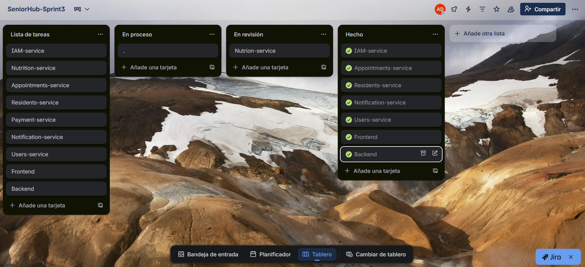

# Capítulo V: Product Implementation, Validation & Deployment
## 5.1 Testing Suites & General Patterns
### 5.1.1 Backend Application Core Testing Suite 
### 5.1.2 Pattern Based Backend Application(s)

El modelo de Backend Application Core Testing Suite representa un componente esencial en la garantía de calidad del software dentro de SeniorHub, pues asegura la confiabilidad y consistencia de las funcionalidades críticas de la aplicación. En lugar de validar manualmente cada módulo de manera aislada, este conjunto de pruebas se ejecuta de forma automatizada, permitiendo detectar fallos rápidamente y garantizando que las nuevas funcionalidades no rompan comportamientos previos.

En nuestro desarrollo, hemos decidido implementar un enfoque híbrido de pruebas que combina:

- Pruebas unitarias con JUnit y Mockito, destinadas a validar el correcto funcionamiento de métodos y clases individuales, asegurando que los cálculos, validaciones y lógicas de negocio cumplan con lo esperado.
- Pruebas de integración con Selenium y Postman, enfocadas en comprobar la interacción entre microservicios clave (Notificaciones, Citas, Pagos, Gestión de Residentes), así como la correcta exposición y consumo de servicios REST.

El Backend Application Core Testing Suite se encarga también de generar reportes de cobertura de pruebas, los cuales evidencian qué porcentaje del código ha sido verificado, permitiendo a nuestro equipo priorizar módulos sensibles como la autenticación, la gestión de usuarios y las transacciones de pago.

Como parte de este proceso, hemos documentado evidencias mediante:

- Capturas de ejecución de los tests automatizados.
- Reportes de cobertura generados en el pipeline de CI/CD.
- Registros de errores y su posterior resolución.

De esta manera, la implementación del Testing Suite no solo respalda la calidad técnica del producto, sino que también fortalece la confianza del cliente en el despliegue continuo de nuevas funcionalidades bajo un entorno seguro y estable.

### 5.1.3 Pattern Based Custom Software Library

En el desarrollo de SeniorHub, se ha diseñado una biblioteca de software personalizada basada en patrones ampliamente adoptados en la industria, con el fin de garantizar modularidad, escalabilidad y facilidad de mantenimiento en el backend. Esta librería integra prácticas y patrones clave, entre los que destacan:

**- Dependency Injection (Inyección de Dependencias):**
  
A través de las capacidades que ofrece Spring Framework, se implementa de manera extensiva la técnica de inversión de control (IoC) mediante anotaciones como @Autowired y @Bean. Esto permite delegar la creación y gestión de objetos al contenedor de Spring, eliminando la necesidad de instanciaciones manuales. El resultado es una arquitectura más desacoplada, flexible y alineada con las buenas prácticas de diseño de software.

**- Entity Field (Patrón de Entidad):**
  
El uso de JPA (Java Persistence API) permite mapear entidades de dominio como objetos persistentes en la base de datos relacional. Las clases anotadas con @Entity representan tablas, mientras que sus atributos corresponden a columnas, garantizando la consistencia entre el modelo de negocio y el modelo de persistencia. Este patrón asegura que el estado de las entidades sea gestionado de forma eficiente, facilitando las operaciones CRUD y el control de transacciones.

**- Foreign Key Mapping (Mapeo de Claves Foráneas):**
  
Se implementa el patrón de relaciones entre entidades mediante anotaciones como @ManyToOne, @OneToMany y @JoinColumn. De esta forma, se establece la navegación y persistencia de asociaciones entre entidades relacionadas, como Usuario → Notificación o Residente → Cita Médica. Este mapeo refuerza la integridad referencial de la base de datos y permite a los desarrolladores trabajar con relaciones de objetos de manera natural dentro del código.

En conjunto, estos patrones constituyen la base de una Custom Software Library reutilizable y adaptable a los distintos microservicios de SeniorHub. Su diseño promueve una arquitectura más robusta, minimizando la duplicación de código y facilitando la evolución del sistema en futuras iteraciones de desarrollo.

### 5.1.4 Framework Pattern Driven Refactoring Report

Este informe documenta el proceso de refactorización de la aplicación SeniorHub, centrado en la aplicación de patrones de diseño y el uso de frameworks que facilitan la transición hacia una arquitectura moderna y escalable.

**Objetivos de la Refactorización**

- Dividir la aplicación inicial en microservicios independientes y escalables.
- Mejorar la modularidad, mantenibilidad y escalabilidad del sistema.
- Reducir la complejidad y el acoplamiento entre los componentes.
- Garantizar la consistencia y robustez mediante la adopción de patrones de diseño y frameworks adecuados.

**Contexto Actual**

La aplicación SeniorHub está diseñada como una plataforma para la gestión del bienestar de los adultos mayores en centros de cuidado, ofreciendo módulos como:

- Gestión de residentes y expedientes médicos.
- Administración de citas y recordatorios.
- Gestión de notificaciones y alertas a familiares.
- Módulo de reportes y analítica para el personal médico y administrativo.

Inicialmente, el sistema fue concebido bajo una estructura monolítica. Sin embargo, para garantizar la escalabilidad futura y una mejor separación de responsabilidades, se ha decidido migrar hacia una arquitectura basada en microservicios.

**Patrones de Diseño Seleccionados**

- Decompose by Subdomain: Descomposición del sistema según los subdominios identificados: Resident Care, Appointment Management, Notifications, User Management, Payments.
- Microservices Architecture Pattern: Implementación de microservicios especializados e independientes, cada uno con su propia lógica de negocio.
- Gateway Pattern: Uso de un punto central de entrada para enrutar solicitudes hacia los microservicios correspondientes.
- API Gateway Pattern: Abstracción de la complejidad de la arquitectura y provisión de una única interfaz para clientes y frontend.

**Frameworks Utilizados**

- Spring Boot: Framework principal para la creación de microservicios, con soporte para inyección de dependencias y rápida configuración.
- Spring Cloud: Para implementar patrones como descubrimiento de servicios, tolerancia a fallos y configuración centralizada.
- Spring Data JPA: Para la gestión de persistencia de datos de manera uniforme en cada microservicio.

**Proceso de Refactorización**

1) Análisis y Descomposición:

- Se identificaron los distintos subdominios del sistema.
- Se definió la granularidad de los microservicios.

2) Implementación de Microservicios:

- Creación de microservicios independientes en Spring Boot.
- Separación de modelos, controladores, servicios y repositorios para cada dominio.

3) Integración y Pruebas:

- Ejecución de pruebas unitarias con JUnit.
- Validación de flujos de integración entre microservicios usando Postman y Selenium.

4) Despliegue y Monitorización (en progreso):

- Contenerización de microservicios mediante Docker.
- Configuración planificada en Kubernetes para la orquestación y escalabilidad.

## 5.2 Software Configuration Management
### 5.2.1 Software Development Environment Configuration

En el desarrollo de SeniorHub, se utilizó un conjunto de herramientas y plataformas que facilitaron la organización, diseño, desarrollo, despliegue y documentación del proyecto, garantizando la colaboración efectiva y la calidad del producto.

**Project Management**

- Trello: Se empleó para la gestión ágil del proyecto, organizando tareas mediante tableros, listas y tarjetas. Permitió hacer seguimiento de los requisitos, historias de usuario y funcionalidades desarrolladas en cada sprint.

**UI/UX Design**

- Figma: Utilizado para la creación de interfaces y prototipos de experiencia de usuario, facilitando la colaboración en tiempo real entre los miembros del equipo.
- Miro: Herramienta de pizarra digital empleada para sesiones de ideación, esquemas de navegación y definición de wireframes de la aplicación.

**Software Development**

- Visual Studio Code (VS Code): Editor de código utilizado principalmente para el desarrollo frontend y la configuración de microservicios secundarios.
- IntelliJ IDEA: IDE utilizado para el desarrollo backend en Java con Spring Boot, proporcionando asistencia de código, refactorización y gestión de dependencias.
- Lenguajes y Frameworks:
  - Java 17 con Spring Boot 3.x para la implementación del backend y microservicios.
  - Node.js 18 y Vue.js para el desarrollo del frontend.
- Base de datos MySQL:
  - Configuración en puerto 3306.
  - Usuario: root.
  - Conexión gestionada a través de Spring Data JPA.
- Contenedores:
  - Uso de Docker y Docker Compose para la contenerización de los microservicios y base de datos, permitiendo replicar entornos de desarrollo y facilitar el despliegue en entornos productivos.

**Software Deployment**

- Vercel: Plataforma utilizada para el despliegue del frontend, brindando un entorno optimizado, integración continua y actualizaciones rápidas de la aplicación web.
- Docker (Backend): Planificado para el despliegue de los microservicios, garantizando portabilidad y escalabilidad.

**Documentation**
  
- GitHub: Repositorio principal donde se gestionó el control de versiones y se almacenó la documentación del proyecto, incluyendo manuales técnicos, guía de instalación y reportes de avance.

**Communication**

- Discord: Utilizado como canal de comunicación principal para coordinación en tiempo real del equipo.
- WhatsApp: Complemento para actualizaciones rápidas y comunicación fuera de reuniones.

### 5.2.2  Source Code Management

Para la gestión del código fuente del proyecto SeniorHub, se utilizó Git como sistema de control de versiones junto con GitHub como plataforma de trabajo colaborativo. Esto permitió mantener un control ordenado de los cambios, integrar de manera continua las funcionalidades desarrolladas y llevar un seguimiento claro de la documentación por capítulos.

Enlace de la organización en GitHub: [https://github.com/1ASI0657-6339-Fund-Arq-Soft](https://github.com/1ASI0657-6339-Fund-Arq-Soft)

A diferencia de un flujo tradicional de ramas como GitFlow, nuestro equipo organizó el trabajo de acuerdo con los capítulos del documento del proyecto, de tal manera que cada capítulo tenía su propia rama y su propia documentación asociada. Esto nos permitió trabajar en paralelo de forma estructurada y facilitar las revisiones de cada sección.

**Estructura de ramas**

- main: Contiene la versión final e integrada del proyecto, incluyendo documentación y código.
- chapter/*: Ramas dedicadas a cada capítulo del documento. Por ejemplo, chapter-III-architecture o chapter-V-implementation. Estas ramas se integran en main una vez completadas y validadas.
- feature/*: Se utilizaron para añadir funcionalidades específicas en el backend o frontend, relacionadas a los microservicios o al soporte del documento.
- fix/*: Usadas para corregir errores encontrados tanto en el código como en la documentación.

**Convenciones de commits**

Para mantener un historial claro y ordenado, se utilizaron commits semánticos, principalmente con los prefijos:

- feat: Para la incorporación de una nueva sección en la documentación (por ejemplo, feat: agregar 5.2.2 Source Code Management) o para nuevas funcionalidades en código.
- fix: Para corregir errores detectados en capítulos, redacción, o fallos en el código (por ejemplo, fix: corregir diagrama de microservicios en 4.1.2).

**Flujo de trabajo**

- Se crea una rama específica para un capítulo o funcionalidad (chapter-IV-design o feature-auth-service).
- Se realizan los commits siguiendo la convención feat/ o fix/, según corresponda.
- Al finalizar, se genera un Pull Request para revisión y comentarios.
- Tras ser aprobado, el capítulo o funcionalidad se integra en la rama main.

Este enfoque permitió mantener la documentación académica y el código en un solo repositorio, alineando el desarrollo de software con el progreso del documento final del proyecto.

### 5.2.3 Source Code Style Guide & Conventions

Nuestra guía de estilo y convenciones para el código fuente es esencial para asegurar la limpieza, coherencia y legibilidad en todos nuestros proyectos de desarrollo. Estas directrices permiten que los equipos colaboren de manera efectiva y que el código resultante sea mantenible a largo plazo.

**Convenciones de nomenclatura**

- Clases → PascalCase (ejemplo: UserService, LoginController).
- Variables y métodos → camelCase (ejemplo: userName, startDate, calculateTotal).
- Paquetes → lowercase.
- Constantes → UPPER_CASE con guiones bajos (ejemplo: MAX_USERS, DEFAULT_TIMEOUT).

**Indentación y espaciado**

- Se utilizan 4 espacios por nivel de indentación (no tabulaciones).
- Se mantiene espaciado consistente, incluyendo un espacio antes y después de los operadores (ejemplo: a + b en lugar de a+b).

**Comentarios y documentación**

- Los comentarios se agregan solo cuando es necesario explicar lógica compleja o dar contexto.
- Se priorizan comentarios claros, concisos y actualizados.
- Documentación adicional se mantiene en archivos por capítulo (docs/) dentro del repositorio.

**Organización del código**

- Funciones y variables se agrupan de manera lógica.
- El código muerto o comentado se elimina para mantener limpieza y eficiencia.
- Los módulos siguen una estructura coherente y alineada a las prácticas de DDD en el proyecto.

**Convenciones de commits**

Se sigue la convención de Gitflow, usando prefijos en cada commit para indicar su propósito:

- feat: nueva característica.
- fix: corrección de error.
- doc: documentación.
- refactor: refactorización sin cambios funcionales.
- test: pruebas unitarias o integrales.

**Herramientas de calidad de código**

- Se aplican herramientas de análisis estático como Checkstyle, SonarLint o ESLint según el lenguaje y contexto del módulo.
- Estas herramientas aseguran el cumplimiento automático de las convenciones y ayudan a identificar problemas potenciales de calidad.

Con estas pautas, garantizamos que nuestro código fuente sea legible, mantenible y consistente, favoreciendo la colaboración y la evolución a largo plazo del proyecto.

### 5.2.4  Software Deployment Configuration

**Landing page:**

Para el despliegue de la landing page utilizaremos el servicio de Vercel (https://vercel.com/). A continuación se presentará el proceso para realizarlo:

1.	Crear o tener una cuenta de Vercel ingresando a su página web oficial (https://vercel.com/). Esta cuenta se puede crear con Github, Gitlab o Bitbucket o con un correo convencional.
   

  	

2.	Una vez con la sesión iniciado, dirigirse a la sección de sitios y seleccionar “Import Git Repositoryt”

**Codigo ya creado:**

3.	Seleccionamos el repositorio y luego nos aparecerá el botón “Deploy Site” al final del formulario.

4.	De esta manera, la página ya estaría deployada en unos instantes. Link de deployment:[https://seniorhub.vercel.app/](https://seniorhub.vercel.app/)

## 5.3 Microservices Implementation
### 5.3.1  Sprint 1

A continuación, se presentará el sprint planning 1 donde se mostrarán las evidencias de planificación para la implementación de SeniorHub.

| Sprint # |	Sprint 1|
|----------|----------|
||Sprint Planning Background|
| Date |	1/10/2025 |
| Time |	15:00 horas (GMT -5) |
| Location |	Modalidad remota por Discord |
| Prepared By |	Fatima Asmad |
| Attendees (to planning meeting) |	Todos los miembros del equipo SeniorHub |
| Sprint n – 0 Review Summary |	El proyecto se desarrollo de manera parcial para esta enttrega , se espera hacer un avance del backend de los microservicios.|
| Sprint n – 1 Retrospective Summary	 | En este presente sprint se tiene como objetivo desarrollar tres microservicios que conecten con APIs externos: -	Servicio para subir archivos blob a la nube -	Servicio para subir imagenes y media a la nube -	API de Stripe para realizar pagos. Asimismo, vamos a conectarlos a la API inicial a través de un API Gateway facilitado por Netflix Eureka y Spring Cloud.|
||Sprint Goal & User Stories|
|Sprint 1 Velocity	|19 |
|Sum of Story Points|	14|

#### 5.2.1.1     Sprint Backlog 1

Se presenta el sprint backlog, donde hemos utilizado Trello para visualizar el progreso de las tareas.
Link de Trello: [https://trello.com/invite/b/68e547015b3e5338979e9169/ATTIb0ff9795cc89dcfecc531e9f16c08c02644A6A9F/tf1asi0657202520](https://trello.com/invite/b/68e547015b3e5338979e9169/ATTIb0ff9795cc89dcfecc531e9f16c08c02644A6A9F/tf1asi0657202520)

| User Story |	Work Item / Task |	Id	| Title	| Description |	Estimation (Hours)|	Assigned To |	Status|
|-|-|-|-|-|-|-|-|
|US-29| Información del servicio	|	T1	|Diseño de estructura base del Landing Page	|Crear el esqueleto de la página incluyendo header, footer y secciones principales.	|6	|equipo SeniorHub |	Done |
| | |		T2	|Maquetado de contenido informativo	| Redactar y estructurar la información de los servicios ofrecidos en el landing page.|	5	| equipo SeniorHub |	Done|
|	|	|T3	| Implementación del diseño responsivo	|Adaptar el sitio para visualización correcta en diferentes dispositivos usando HTML, CSS y Bootstrap. |	6	| equipo SeniorHub |	In Process|
|	|	|T4	| Publicación en GitHub|	Subir la primera versión funcional del Landing Page al repositorio oficial.|	3	|equipo SeniorHub |	To Review|

| User Story |	Work Item / Task |	Id	| Title	| Description |	Estimation (Hours)|	Assigned To |	Status|
|-|-|-|-|-|-|-|-|
|US-30 | Formulario de contacto	|	T1|	Diseño del formulario de contacto |	Crear el formulario con los campos nombre, correo y mensaje.	|4	|equipo SeniorHub|	Done|
|	|	|T2	|Implementar validaciones básicas|	Validar formato de email y campos obligatorios antes del envío.|	3	|equipo SeniorHub|	Done|
| |	|	T3	|Conexión con endpoint simulado	| Implementar envío del formulario hacia un servicio simulado o endpoint temporal.|	5	|equipo SeniorHub	|In Process|
| |	|	T4	|Mensaje de confirmación visual|	Mostrar mensaje “mensaje enviado con éxito” tras enviar el formulario.|	2|	equipo SeniorHub|	Done|
| |	|	T5|	Pruebas funcionales del formulario	|Verificar el correcto envío, validaciones y visualización.|	3	|equipo SeniorHub	|To Review|
    
| User Story |	Work Item / Task |	Id	| Title	| Description |	Estimation (Hours)|	Assigned To |	Status|
|-|-|-|-|-|-|-|-|
| US-32| Call to Action (CTA)	|	T1	|Definición de mensajes CTA	|Crear textos estratégicos para los botones principales (“Contáctanos”, “Conoce más”).|	3	|equipo SeniorHub|	Done|
| | |	T2	|Diseño y ubicación de botones CTA	|Implementar los botones y su posición dentro del landing page.|	3|	equipo SeniorHub |	In Process|
| |	|	T3	|Implementación de anclajes y redirecciones	Configurar redirecciones internas a secciones específicas.|	3|	equipo SeniorHub |	To Review|
|	| |	T4|	Estilos visuales interactivos	| Añadir efectos hover y colores llamativos.|	2	|equipo SeniorHub|	Done |
| |	|	T5|	Prueba de consistencia general	|Verificar que los CTA sean funcionales y coherentes con el diseño.|	2|	equipo SeniorHub |	To Review|

| User Story |	Work Item / Task |	Id	| Title	| Description |	Estimation (Hours)|	Assigned To |	Status|
|-|-|-|-|-|-|-|-|
| US-A01| Implementación de autenticación y roles (Auth Service)	|	T1	|Configurar proyecto base Auth-Service|	Crear proyecto Spring Boot con estructura base y dependencias.|	5|	equipo SeniorHub|	Done|
| |	|	T2|	Implementar autenticación con JWT|	Configurar seguridad y generación de tokens JWT.|	6	|equipo SeniorHub|	In Process|
| |	|	T3|	Crear entidades User, Role y Permission|	Diseñar modelos y relaciones JPA.|	5|	equipo SeniorHub|	Done|
| |	|	T4|	Definir endpoints principales	|Implementar /login, /register y /validate-token.|	6|	equipo SeniorHub| In Process|
| |	|	T5|	Probar autenticación y protección de endpoints|	Validar correcto flujo de autenticación.|	4	|equipo SeniorHub|	To Review|
| |	|	T6	|Documentar configuración de seguridad|	Redactar documentación técnica y README.	|3	|equipo SeniorHub|	Done|

| User Story |	Work Item / Task |	Id	| Title	| Description |	Estimation (Hours)|	Assigned To |	Status|
|-|-|-|-|-|-|-|-|
|US-A02| CRUD de usuarios (User Service)|		T1	|Crear proyecto User-Service|	Generar proyecto Spring Boot para el servicio de usuarios.|	4	|equipo SeniorHub|	Done|
| |	|	T2|	Implementar entidad User y repositorio	|Crear modelo y repositorio JPA.|	3	|equipo SeniorHub|	Done|
|	| |	T3 |	Desarrollar endpoints CRUD|	Implementar GET, POST, PUT, DELETE con validaciones.|	6|	equipo SeniorHub|	In Process|
| |	|	T4|	Conectar con Auth-Service	|Integrar validación JWT con el microservicio de autenticación.|	5|	equipo SeniorHub|	To Review|
| |		|T5|	Documentar endpoints en Swagger|	Añadir especificaciones de API.	|3|equipo SeniorHub|	To Review|

#### 5.2.1.2     Development Evidence for Sprint Review

Durante este Sprint se implementaron y documentaron avances significativos en los distintos componentes de la solución SeniorHub – Vitalia. El equipo trabajó en tres frentes principales: Web Services (Backend – Microservicios IAM y Users), Web Application (Landing Page) y la configuración general del proyecto. Todas las implementaciones fueron versionadas en GitHub y se muestran los commits relevantes del Sprint.

**Resumen de los avances del Sprint**

**Web Services (Backend – IAM Service y Users Service)**

Se crearon los dos microservicios centrales del sistema:

- IAM-service: responsable de la gestión de autenticación, inicio de sesión y administración inicial de credenciales.
- Users-service: encargado de la gestión de usuarios internos y externos.

Para ambos servicios se realizó:

- La inicialización completa de cada proyecto.
- Configuración base del repositorio y estructura del microservicio.
- Preparación para la futura integración mediante API Gateway.

**Web Application (Landing Page)**

Se avanzó de manera importante en la capa de presentación:

- Implementación completa inicial de la landing page.
- Reestructuración del código para mejorar legibilidad, mantenibilidad y escalabilidad.
- Integración del branch develop hacia main.
- Ajustes visuales coherentes con la identidad del proyecto Vitalia.

**Evidencias de Desarrollo (Commits del Sprint)**

**Web Services (Backend)**

IAM Service — [1ASI0657-6339-Fund-Arq-Soft / IAM-service](https://github.com/1ASI0657-6339-Fund-Arq-Soft/IAM-service)

| Repository|	Branch|	Commit ID|	Commit Message|	Commit Body|	Date|
|-----------|-------|----------|----------------|------------|------|
|IAM-service|	main|	148da5f	|chore: initial commit|	Initial commit|	05/10/2025|
|IAM-service|	main|	189f61e	|chore: initial commit|	Initial commit|	05/10/2025|

Users Service — [1ASI0657-6339-Fund-Arq-Soft / users-service](https://github.com/1ASI0657-6339-Fund-Arq-Soft/users-service)

|Repository|	Branch|	Commit ID|	Commit Message|	Commit Body|	Date|
|----------|--------|----------|----------------|------------|------|
|users-service|	main	|af1d8e5|	chore: initial commit	|Initial commit	|06/10/2025|

Landing Page — [1ASI0657-6339-Fund-Arq-Soft / landing-page](https://github.com/1ASI0657-6339-Fund-Arq-Soft/landing-page)

|Repository|	Branch|	Commit ID|	Commit Message	|Commit Body|	Date|
|----------|--------|----------|------------------|-----------|-----|
|landing-page|	main|	449ec42	|initial: first commit & full landing page |impl	Implementación completa inicial de la landing page|	08/10/2025|
|landing-page	|main|	c4c3774|	Merge branch 'develop'|	Integración de los cambios del branch develop|	08/10/2025|
|landing-page|	main|	cf97290|	Refactor code structure for improved readability and maintainability|	Reestructuración del código para mejorar mantenibilidad y orden	|08/10/2025|
|landing-page|	main|	8ea0992|	Initial commit|	Initial commit|	08/10/2025|

#### 5.2.1.3     Testing Suite Evidence for Sprint Review
#### 5.2.1.4     Execution Evidence for Sprint Review

En esta sección de presentan los endpoints desarrollados en el presente sprint y se adjuntan capturas:

#### 5.2.1.5     Microservices Documentation Evidence for Sprint Review

Durante este Sprint se completó el primer conjunto de endpoints funcionales del sistema SeniorHub – Vitalia, correspondientes a los microservicios IAM-service (autenticación y roles) y Users-service (gestión de doctores y familiares). Toda la documentación de los servicios fue generada y validada mediante Swagger OpenAPI 3, habilitada en cada microservicio para su consulta durante el desarrollo y la integración.

Estos servicios constituyen la base para la autenticación de usuarios, la administración de roles y la gestión de los recursos principales del ecosistema Vitalia. A continuación, se presenta la evidencia de la documentación generada para los servicios REST expuestos en este sprint.

**Resumen General de los Microservicios**

|Microservicio|	URL Base|	Versión|	Descripción|
|-------------|---------|--------|-------------|
|IAM-service|	http://localhost:8080/api/v1|	v1.0.0|	Gestión de autenticación, inicio de sesión y administración de roles.|
|Users-service|	http://localhost:8083/api/v1|	v1.0.0|	Operaciones relacionadas a doctores y familiares.|

A continuación se presentan los endpoints trabajados durante el Sprint, con su descripción técnica, ejemplo de uso y la explicación del response, siguiendo el formato del modelo de ejemplo proporcionado.

**1. IAM-SERVICE — Authentication Endpoints**

**1.1. POST /api/v1/authentication/sign-up**

|Campo	|Descripción|
|-------|-----------|
|Acciones Implementadas|	Registro de nuevos usuarios|
|Sintaxis de Llamada|	/api/v1/authentication/sign-up|
|Método|	POST|
|Parámetros|	Body JSON (email, password, firstName, lastName, roleId)|
|Ejemplo de Body|	{ "email": "user@example.com", "password": "123456", "firstName": "Ana", "lastName": "Soto", "roleId": 1 }|
|Explicación del Response|	Devuelve un objeto con la información del usuario creado junto con su ID asignado.|

**1.2. POST /api/v1/authentication/sign-in**

|Campo|	Descripción|
|-------|-----------|
|Acciones Implementadas|	Inicio de sesión y generación de token|
|Sintaxis de Llamada|	/api/v1/authentication/sign-in|
|Método|	POST|
|Parámetros|	Body JSON (email, password)|
|Ejemplo de Llamada|	POST http://localhost:8080/api/v1/authentication/sign-in|
|Explicación del Response|	Retorna un token JWT y los datos básicos del usuario autenticado.|

**2. IAM-SERVICE — Roles Endpoints**

**2.1. GET /api/v1/roles**

|Campo|	Descripción|
|-------|-----------|
|Acciones Implementadas|	Obtención de todos los roles del sistema|
|Sintaxis de Llamada|	/api/v1/roles|
|Método|	GET|
|Parámetros|	No requiere|
|Ejemplo de Llamada	|GET http://localhost:8080/api/v1/roles|
|Explicación del Response|	Devuelve un listado JSON con los roles registrados en el microservicio IAM.|

**3. USERS-SERVICE — Doctors Endpoints**

**3.1. GET /api/v1/doctors**

|Campo|	Descripción|
|-------|-----------|
|Acciones Implementadas|	Obtener la lista de doctores|
|Sintaxis de Llamada|	/api/v1/doctors|
|Método|	GET|
|Parámetros|	Ninguno|
|Ejemplo de Llamada	|GET http://localhost:8083/api/v1/doctors|
|Explicación del Response|	Devuelve un arreglo JSON con todos los doctores registrados y sus datos relevantes.|

**3.2. GET /api/v1/doctors/{id}**

|Campo|	Descripción|
|-------|-----------|
|Acciones Implementadas|	Obtener un doctor por su ID|
|Sintaxis de Llamada|	/api/v1/doctors/{id}|
|Método|	GET|
|Parámetros	|id (path param, numérico)|
|Ejemplo de Llamada|	GET http://localhost:8083/api/v1/doctors/1|
|Explicación del Response|	Devuelve la información detallada del doctor especificado.|

**3.3. POST /api/v1/doctors**
   
|Campo|	Descripción|
|-----|------------|
|Acciones Implementadas	|Crear un nuevo doctor|
|Sintaxis de Llamada|	/api/v1/doctors|
|Método|	POST|
|Parámetros|	Body JSON con datos del doctor|
|Ejemplo de Body|	{ "firstName":"Luis", "lastName":"Pérez", "specialty":"Geriatría" }|
|Explicación del Response	|Retorna el nuevo doctor creado con su ID generado.|

**3.4. PUT /api/v1/doctors/{id}**
   
|Campo|	Descripción|
|-----|------------|
|Acciones Implementadas	|Actualización de doctor existente|
|Sintaxis de Llamada|	/api/v1/doctors/{id}|
|Método	|PUT|
|Parámetros	|Path param: id + Body JSON|
|Ejemplo	|PUT http://localhost:8083/api/v1/doctors/3|
|Explicación del Response	|Confirma la actualización y devuelve el recurso modificado.|

**4. USERS-SERVICE — Family Members Endpoints**
   
**4.1. GET /api/v1/family-members**
   
|Campo	|Descripción|
|-------|-----------|
|Acciones Implementadas|	Obtener todos los familiares|
|Sintaxis de Llamada|	/api/v1/family-members|
|Método	|GET|
|Parámetros|	Ninguno|
|Ejemplo de Llamada|	GET http://localhost:8083/api/v1/family-members|
|Explicación del Response	|Retorna un arreglo JSON con todos los miembros registrados.|

**4.2. POST /api/v1/family-members**

|Campo	|Descripción|
|-------|-----------|
|Acciones Implementadas|	Crear un familiar|
|Sintaxis de Llamada|	/api/v1/family-members|
|Método|	POST|
|Parámetros|	Body JSON|
|Ejemplo de Body|	{ "fullName": "Carla Rivas", "relation": "Hija", "doctorId": 2 }|
|Explicación del Response	|Devuelve el familiar creado junto con su ID generado.|

**4.3. GET /api/v1/family-members/{id}**

|Campo|	Descripción|
|-----|------------|
|Acciones Implementadas	|Obtener un familiar por ID|
|Sintaxis de Llamada	|/api/v1/family-members/{id}|
|Método	|GET|
|Parámetros|	id (path param)|
|Ejemplo de Llamada	|GET http://localhost:8083/api/v1/family-members/1|
|Explicación del Response	|Devuelve los datos completos del familiar.|

#### 5.2.1.6     Software Deployment Evidence for Sprint Review

Aqui se evidencia que el landing page esta desplegado de manera correcta. Link de deployment:[https://seniorhub.vercel.app/](https://seniorhub.vercel.app/)

#### 5.2.1.7     Team Collaboration Insights during Sprint

A continuación se presentan los insights de colaboración en los repositorios de Github:
Link de organización Github: [https://github.com/1ASI0657-6339-Fund-Arq-Soft](https://github.com/1ASI0657-6339-Fund-Arq-Soft)

Documentation. [https://github.com/1ASI0657-6339-Fund-Arq-Soft/Documentation](https://github.com/1ASI0657-6339-Fund-Arq-Soft/Documentation)

Landing Page: [https://github.com/1ASI0657-6339-Fund-Arq-Soft/landing-page](https://github.com/1ASI0657-6339-Fund-Arq-Soft/landing-page)

#### 5.2.1.8     Kanban Board --> TP1

El tablero Kanban es una herramienta visual que permite gestionar y monitorear el flujo de trabajo del equipo durante el desarrollo del Sprint 1 del proyecto SeniorHub. Su propósito es asegurar que las tareas se encuentren organizadas y priorizadas, facilitando el seguimiento del progreso de cada historia de usuario desde su planificación hasta su implementación final.

El tablero se estructuró en cuatro columnas principales:

- To Do (Por hacer): Tareas planificadas pendientes de iniciar.
- In Progress (En progreso): Tareas que se encuentran actualmente en desarrollo.
- Review (En revisión): Tareas terminadas que están siendo verificadas y probadas.
- Done (Hecho): Tareas completadas y validadas por el equipo.

**Evidencia del Tablero Kanban**

Herramienta utilizada: Trello.
Sprint: 1
Objetivo del Sprint: Desarrollar el landing page y los microservicios Auth y User para el backend de SeniorHub.
Duración: 28/09/2025 – 9/10/2025

### 5.2.2	Sprint 2

A continuación, se presentará el sprint planning 2 donde se mostrarán las evidencias de planificación para la implementación de SeniorHub.

| Sprint # |	Sprint 2|
|----------|----------|
||Sprint Planning Background|
| Date |	20/10/2025 |
| Time |	15:00 horas (GMT -5) |
| Location |	Modalidad remota por Discord |
| Prepared By |	Fatima Asmad |
| Attendees (to planning meeting) |	Todos los miembros del equipo SeniorHub |
| Sprint n – 0 Review Summary |	El proyecto ya tenia avanzado en el anterior sprint 2 microservicios , en esta entrega se espera concluir el backend de los microservicios. |
| Sprint n – 1 Retrospective Summary	 | En este presente sprint se tiene como objetivo desarrollar seis microservicos. Asimismo, vamos a conectarlos a la API inicial a través de un API Gateway facilitado por Netflix Eureka y Spring Cloud.|
||Sprint Goal & User Stories|
|Sprint 1 Velocity	|19 |
|Sum of Story Points|	41 |

#### 5.2.2.1	Sprint Backlog 2

A continuación, se presenta el Sprint Backlog del Sprint 1.
Para la gestión y visualización del avance de tareas, se utilizó el tablero de Trello.
[https://trello.com/invite/b/68e547015b3e5338979e9169/ATTIb0ff9795cc89dcfecc531e9f16c08c02644A6A9F/tf1asi0657202520](https://trello.com/invite/b/68e547015b3e5338979e9169/ATTIb0ff9795cc89dcfecc531e9f16c08c02644A6A9F/tf1asi0657202520)

**US1 — Recordatorio de medicamentos**

|Work Item / Task|	Id|	Title|	Description	|Estimation (Hours)	|Assigned To	Status|
|----------------|----|------|--------------|-------------------|-------------------|
|T1|	N1-T1|	Modelo y entidad |MedicationReminder|	Crear entidad, atributos y relaciones básicas para recordatorios.	|5h|	Equipo Vitalia|	Done|
|T2|	N1-T2|	Endpoint POST para crear recordatorio|	Implementar creación de recordatorios con validación.|	6h	|Equipo Vitalia	|In Process|
|T3|	N1-T3|	Generación automática de notificación	|Implementar evento que dispare notificación al residente y familiar.|	7h|	Equipo Vitalia	|To Review|

**US2 — Confirmación de recepción**

|Work Item / Task|	Id|	Title|	Description	|Estimation (Hours)	|Assigned To	Status|
|----------------|----|------|--------------|-------------------|-------------------|
|T1|N2-T1|Botón de lectura|Implementar acción para marcar notificación como leída.|3h|Equipo Vitalia|Done| 
|T2|N2-T2|Actualización de estado|Cambiar estado de “unread → read”.|2h|Equipo Vitalia|Done| 
|T3|N2-T3|Reenvío automático|Implementar reenvío si no se confirma en 30 minutos.|4h|Equipo Vitalia|In Process|

**US3 — Historial de notificaciones**

|Work Item / Task|	Id|	Title|	Description	|Estimation (Hours)	|Assigned To	Status|
|----------------|----|------|--------------|-------------------|-------------------|
|T1|N3-T1|Listado de notificaciones|Endpoint GET para historial ordenado.|5h|Equipo Vitalia|Done| 
|T2|N3-T2|Exportación PDF|Generar PDF del historial.|6h|Equipo Vitalia|To Review|

**US4 — Reserva de cita**

|Work Item / Task|	Id|	Title|	Description	|Estimation (Hours)	|Assigned To	Status|
|----------------|----|------|--------------|-------------------|-------------------|
|T1|C4-T1|Modelo Cita|Crear entidad y validaciones básicas.|4h|Equipo Vitalia|Done| 
|T2|C4-T2|Reserva desde app|Endpoint para crear cita y bloquear horario.|6h|Equipo Vitalia|In Process| 
|T3|C4-T3|Notificación automática|Cada vez que se crea una cita, enviar notificación al cuidador.|3h|Equipo Vitalia|Done|

**US5 — Visualización de calendario**

|Work Item / Task|	Id|	Title|	Description	|Estimation (Hours)	|Assigned To	Status|
|----------------|----|------|--------------|-------------------|-------------------|
|T1|C5-T1|Vista diaria/semanal|Implementar estructura del calendario.|6h|EquipoVitalia|In Process| 
|T2|C5-T2|Filtro por residente|Endpoint conparámetro dinámico para filtros.|4h|Equipo Vitalia|To Review|

**US6 — Recordatorio de citas**

|Work Item / Task|	Id|	Title|	Description	|Estimation (Hours)	|Assigned To	Status|
|----------------|----|------|--------------|-------------------|-------------------|
|T1|C6-T1|Notificación 24h|Servicio programado para disparar recordatorio.|5h|Equipo Vitalia|Done| 
|T2|C6-T2|Notificación 1h antes|Segundo recordatorio.|3h|Equipo Vitalia|Done|

**US7 — Cancelar/Reprogramar cita**

|Work Item / Task|	Id|	Title|	Description	|Estimation (Hours)	|Assigned To	Status|
|----------------|----|------|--------------|-------------------|-------------------| 
|T1|C7-T1|Cancelar cita|Endpoint DELETE.|4h|Equipo Vitalia|In Process|
|T2|C7-T2|Reprogramar cita|Endpoint PATCH con nuevo horario y reenvío de notificación.|5h|Equipo Vitalia|To Review|

**US9 — Registro de residente**

|Work Item / Task|	Id|	Title|	Description	|Estimation (Hours)	|Assigned To	Status|
|----------------|----|------|--------------|-------------------|-------------------|
|T1|R9-T1|Crear entidadResident|Datos básicos + validaciones.|6h|Equipo Vitalia|Done|
|T2|R9-T2|Registro vía API|Endpoint POST.|5h|Equipo Vitalia|In Process|

**US10 — Perfil de residente**

|Work Item / Task|	Id|	Title|	Description	|Estimation (Hours)	|Assigned To	Status|
|----------------|----|------|--------------|-------------------|-------------------|
|T1|R10-T1|Vista perfil|Estructura JSON con salud, citas y dieta.|6h|Equipo Vitalia|To
Review|

#### 5.2.2.2	Development Evidence for Sprint Review

Durante este Sprint se implementaron y documentaron avances significativos en los distintos componentes de la solución SeniorHub – Vitalia.
El equipo trabajó en cuatro frentes principales correspondientes a la arquitectura basada en microservicios: Nutrition Service, Appointment Service, Payment Service y Notification Service.
Cada microservicio fue implementado, configurado y documentado utilizando Swagger – OpenAPI 3.0, asegurando su preparación para la integración vía API Gateway y Eureka.

**Web Services (Backend – Microservicios Nutrition, Appointment, Payment, Resident y Notification)**

Durante este Sprint se desarrollaron los cuatro microservicios esenciales de SeniorHub:

- Nutrition Service: Gestión de registros alimenticios, historial nutricional y clasificación por fecha, tipo de comida y residente.
- Appointment Service: Administración de citas médicas, consultas y coordinación entre doctores y residentes.
- Payment Service: Gestión de recibos, historial de pagos y consultas financieras asociadas al residente.
- Notification Service: Sistema de envío, archivado y lectura de notificaciones en tiempo real.

Para cada uno de los microservicios se realizó lo siguiente:

- Inicialización completa del proyecto Spring Boot.
- Creación de controladores REST y definición de endpoints funcionales.
- Documentación automática a través de Swagger OpenAPI.
- Configuración base para futura integración mediante API Gateway.
- Validación de cada endpoint mediante pruebas locales.

A continuación se detallan los avances y la evidencia del desarrollo.

**Nutrition Service — 1ASI0657-6339-Fund-Arq-Soft / Nutrition-service**

|Repository|	Branch|	Commit ID|	Commit Message|	Commit Body	|Date|
|----------|--------|----------|----------------|-------------|----|
|nutrition-service|	main|	f05def8|	feat: Implement Food Entry Management|	Implementación del CRUD completo de Food |	16/11/2025|
|nutrition-service|	main|	895e2fa|	Initial commit|	Initial commit|	13/11/2025|

**Appointments Service — 1ASI0657-6339-Fund-Arq-Soft / appointments-service**

|Repository|	Branch|	Commit ID|	Commit Message|	Commit Body	|Date|
|----------|--------|----------|----------------|-------------|----|
|appointments-service|	main|	a4d71ab|	feat: Implement appointment management service with CRUD operations	|Implementación del servicio de citas con CRUD completo|	16/11/2025|
|appointments-service|	main|	efdfa3e|	Initial commit|	Initial commit|	13/11/2025|

**Residents Service — 1ASI0657-6339-Fund-Arq-Soft / residents-services**

|Repository|	Branch|	Commit ID|	Commit Message|	Commit Body	|Date|
|----------|--------|----------|----------------|-------------|----|
|residents-services|	main|	476afb2	|Initial commit: residents-services|	Initial commit	|09/11/2025|

**Payment Service — SeniorHub / payment-service**

|Repository|	Branch|	Commit ID|	Commit Message|	Commit Body	|Date|
|----------|--------|----------|----------------|-------------|----|
|Payment-Service|	main|	68054f2|	initial commit: Payment Service|	Initial commit	|03/11/2025|

**Notification Service — SeniorHub / notification-service**

|Repository|	Branch|	Commit ID|	Commit Message|	Commit Body	|Date|
|----------|--------|----------|----------------|-------------|----|
|Notification-Service|	main|	b7410a1|	initial commit: Notification Service|	Initial commit|	03/11/2025|

#### 5.2.2.3	Testing Suite Evidence for Sprint Review
#### 5.2.2.4	Execution Evidence for Sprint Review

En esta sección de presentan los endpoints desarrollados en el presente sprint y se adjuntan capturas:

**Nutrition Service**

**Appointments Service**

**Residents Service**

**Payment Service**

**Notification Service**

#### 5.2.2.5	Microservices Documentation Evidence for Sprint Review

Durante este Sprint se documentaron y verificaron los endpoints de los microservicios que conforman la arquitectura distribuida de SeniorHub – Vitalia.

La siguiente evidencia demuestra la correcta exposición, organización y funcionamiento de cada API, basadas en Swagger / OpenAPI 3.0.

Los microservicios cubiertos en este Sprint son:

- Residents Service 
- Nutrition Service
- Appointment Service
- Payment Service
- Notification Service

** Residents Microservice API – Documentation Evidence **

- Base URL: http://localhost:8081
- Versión: v1.0.0
- Descripción: Gestión integral del residente, incluyendo historiales médicos, salud mental y medicación.

**Resident Management Endpoints**

|Método|	Endpoint	|Descripción|
|-------|--------|-------------|
|GET	|/api/v1/residents/{residentId}|	Obtener residente por ID|
|DELETE	|/api/v1/residents/{residentId}	|Eliminar residente|
|GET	|/api/v1/residents	Listar todos |los residentes|
|GET	|/api/v1/residents/{residentId}/details|	Obtener detalles completos del residente|
|GET	|/api/v1/residents/searchByDni|	Buscar residente por DNI|
|POST	|/api/v1/residents	|Crear nuevo residente|
|PUT	|/api/v1/residents/{residentId}	|Actualizar datos del residente|

**Medical Histories – Medical History Management**

|Método|	Endpoint	|Descripción|
|-------|--------|-------------|
|GET	|/api/v1/residents/{residentId}/medical-histories	|Listar historiales médicos|
|POST	|/api/v1/residents/{residentId}/medical-histories	|Crear historial médico|

**Mental Health Records – Mental Health Management**

|Método|	Endpoint	|Descripción|
|-------|--------|-------------|
|GET	|/api/v1/residents/{residentId}/mental-health-records	|Listar registros de salud mental|
|POST|	/api/v1/residents/{residentId}/mental-health-records	|Registrar nuevo evento de salud mental|

**Medications – Medication Management**

|Método|	Endpoint	|Descripción|
|-------|--------|-------------|
|GET	|/api/v1/residents/{residentId}/medications	|Listar medicamentos|
|POST	|/api/v1/residents/{residentId}/medications	|Agregar medicamento|
|DELETE	|/api/v1/residents/{residentId}/medications/{medicationId}	|Eliminar medicamento|

**Nutrition Service API – Documentation Evidence**

- Base URL: http://localhost:8086
- Versión: v1.0.0

|Método|	Endpoint	|Descripción|
|-------|--------|-------------|
|GET	|/api/v1/food-entries/{foodEntryId}	|Obtener entrada alimentaria por ID|
|PUT	|/api/v1/food-entries/{foodEntryId}	|Actualizar entrada alimentaria|
|DELETE	|/api/v1/food-entries/{foodEntryId}	|Eliminar entrada|
|GET	|/api/v1/food-entries	|Listar todas las entradas|
|POST	|/api/v1/food-entries	|Crear entrada alimentaria|
|GET	|/api/v1/food-entries/target/{targetId}	|Obtener por target|
|GET	|/api/v1/food-entries/meal/{mealType}	|Filtrar por tipo de comida|
|GET	|/api/v1/food-entries/date/{date}	|Filtrar por fecha|

**Appointment Service API – Documentation Evidence**

- Base URL: http://localhost:8085
- Versión: v1.0.0

|Método|	Endpoint	|Descripción|
|-------|--------|-------------|
|GET|	/api/v1/appointments/{appointmentId}|	Obtener cita por ID|
|PUT|	/api/v1/appointments/{appointmentId}	|Actualizar cita|
|DELETE|	/api/v1/appointments/{appointmentId}|	Eliminar cita|
|GET|	/api/v1/appointments	|Listar citas|
|POST|	/api/v1/appointments|	Crear nueva cita|
|GET	|/api/v1/appointments/searchByResidentId	|Buscar por residente|
|GET	|/api/v1/appointments/searchByDoctorId|	Buscar por doctor|

**Payment Microservice API – Documentation Evidence**

- Base URL: http://localhost:8082
- Versión: v1.0.0

|Método|	Endpoint	|Descripción|
|-------|--------|-------------|
|DELETE	|/api/v1/receipts/{receiptId}|	Eliminar recibo|
|GET	|/api/v1/receipts/{receiptId}	|Obtener recibo|
|GET	|/api/v1/receipts|	Listar recibos|
|GET	|/api/v1/receipts/resident/{residentId}|	Filtrar por residente|
|POST	|/api/v1/receipts|	Crear recibo|
|PUT	|/api/v1/receipts/{receiptId}	|Actualizar recibo|

**Notification Microservice API – Documentation Evidence**

- Base URL: http://localhost:8083
- Versión: v1.0.0

|Método	|Endpoint|	Descripción|
|-------|--------|-------------|
|GET	|/api/v1/notifications	|Listar notificaciones|
|POST|	/api/v1/notifications|	Crear notificación|
|GET	|/api/v1/notifications/notifications/{userId}|	Listar por usuario|
|GET	|/api/v1/notifications/search|	Filtrar por estado|
|POST	|/api/v1/notifications/{id}/mark-as-read	|Marcar como leída|
|POST|	/api/v1/notifications/{id}/archive|	Archivar|
|POST	|/api/v1/notifications/{id}/unarchive	|Desarchivar|
|DELETE|	/api/v1/notifications/{id}|	Eliminar|

#### 5.2.2.6	Software Deployment Evidence for Sprint Review

Durante el Sprint 2 no se realizó ningún despliegue hacia entornos externos. Esto se debió a que las actividades del Sprint estuvieron enfocadas exclusivamente en:

- Documentación y validación de los microservicios (Residents, Nutrition, Appointments, Payments y Notifications).
- Revisión de endpoints expuestos mediante Swagger / OpenAPI.
- Ajustes internos en la arquitectura y preparación de los servicios para futuras integraciones.
- Consolidación del desarrollo backend previo a habilitar pipelines o despliegues formales.

Como consecuencia, todas las implementaciones permanecieron en ambiente local de desarrollo y dentro de sus respectivos repositorios, quedando preparadas para ser integradas a un flujo de CI/CD en el siguiente Sprint.

#### 5.2.2.7	Team Collaboration Insights during Sprint

A continuación se presentan los insights de colaboración en los repositorios de Github:
Link de organización Github: [https://github.com/1ASI0657-6339-Fund-Arq-Soft](https://github.com/1ASI0657-6339-Fund-Arq-Soft)

Documentation. [https://github.com/1ASI0657-6339-Fund-Arq-Soft/Documentation](https://github.com/1ASI0657-6339-Fund-Arq-Soft/Documentation)

Landing Page: [https://github.com/1ASI0657-6339-Fund-Arq-Soft/landing-page](https://github.com/1ASI0657-6339-Fund-Arq-Soft/landing-page)

#### 5.2.2.8	Kanban Board --> (Avance 3)

El tablero Kanban es una herramienta visual utilizada para organizar, priorizar y monitorear el flujo de trabajo del equipo durante el desarrollo del Sprint 2 del proyecto SeniorHub. Gracias a este tablero, fue posible mantener visibilidad sobre el estado actual de cada actividad técnica relacionada con los microservicios desarrollados y asegurar que el progreso del Sprint se alineara con los objetivos establecidos.

El tablero se estructuró en cuatro columnas principales:

- To Do (Por hacer): Tareas planificadas y pendientes de iniciar.
- In Progress (En progreso): Tareas actualmente en desarrollo.
- Review (En revisión): Tareas implementadas que están siendo verificadas o probadas.
- Done (Hecho): Tareas completadas, validadas y listas para integración.

**Evidencia del Tablero Kanban**

Herramienta utilizada: Trello
Sprint: 2
Objetivo del Sprint: Documentar y validar los microservicios Residents, Nutrition, Appointments, Payments y Notifications; asegurar la correcta exposición de endpoints mediante Swagger/OAS3; y avanzar en la integración técnica del backend.
Duración: 2/11/2025 – 16/11/2025

### 5.2.3	Sprint 3

A continuación, se presentará el sprint planning 3 donde se mostrarán las evidencias de planificación para la implementación de SeniorHub.

| Sprint # |	Sprint 3|
|----------|----------|
||Sprint Planning Background|
| Date |	1/11/2025 |
| Time |	15:00 horas (GMT -5) |
| Location |	Modalidad remota por Discord |
| Prepared By |	Fatima Asmad |
| Attendees (to planning meeting) |	Todos los miembros del equipo SeniorHub |
| Sprint n – 0 Review Summary | En este sprint se espera desarrollar el 40% del frontend del proyecto .|
| Sprint n – 1 Retrospective Summary	 | En este presente sprint se tiene como objetivo desarrollar el  40% del frontend del proyecto.|
||Sprint Goal & User Stories|
|Sprint 1 Velocity	|19 |
|Sum of Story Points|	14|

#### 5.2.3.1	Sprint Backlog 3

A continuación, se presenta el Sprint Backlog del Sprint 1.
Para la gestión y visualización del avance de tareas, se utilizó el tablero de Trello.

https://trello.com/invite/b/691a884e7b31705544dd9e36/ATTI4f62995f41ced52a4026c5500a3d3e1f73E98F8E/seniorhub-sprint3 

Historia de usuario: US-01 – Pantalla de Login

| Historia | Elemento de trabajo | ID | Título                                | Descripción                                                                        | Horas | Asignado         | Estado       |
| -------- | ------------------- | -- | ------------------------------------- | ---------------------------------------------------------------------------------- | ----- | ---------------- | ------------ |
| US-01  | Login               | T1 | Maquetado visual del Login            | Crear la interfaz inicial: layout de dos columnas, texto informativo y formulario. | 1     | equipo SeniorHub | Hecho        |
|          |                     | T2 | Implementar conexión con Auth-Service | Consumir `/login`.                                                   | 2     | equipo SeniorHub | Hecho        |
|          |                     | T3 | Manejo de errores                     | Mostrar mensajes ante credenciales inválidas.                                      | 1     | equipo SeniorHub | Hecho        |
|          |                     | T4 | Estilos responsivos                   | Ajustar UI para mobile y desktop.                                                  | 1     | equipo SeniorHub | Hecho        |
|          |                     | T5 | Pruebas funcionales                   | Validar ingreso exitoso por rol (Familiar, Cuidador, Doctor).                      | 2     | equipo SeniorHub | Para revisar |

Historia de usuario: US-02 – Registro de usuarios

| Historia | Elemento de trabajo | ID | Título                        | Descripción                                                    | Horas | Asignado         | Estado       |
| -------- | ------------------- | -- | ----------------------------- | -------------------------------------------------------------- | ----- | ---------------- | ------------ |
| US-02  | Registro            | T1 | UI del formulario de registro | Implementar layout, inputs y diseño general.                   | 2     | equipo SeniorHub | Hecho        |
|          |                     | T2 | Validaciones del formulario   | Confirmación de contraseña, email válido, campos obligatorios. | 1     | equipo SeniorHub | Hecho        |
|          |                     | T3 | Conexión con Auth-Service     | Consumir endpoint `/register`.                                 | 2     | equipo SeniorHub | Hecho        |
|          |                     | T4 | Mensajes de estado            | Mostrar mensajes de éxito y errores del backend.               | 2     | equipo SeniorHub | Hecho        |
|          |                     | T5 | Pruebas funcionales           | Crear cuentas según roles y validarlas.                        | 2     | equipo SeniorHub | Para revisar |

Historia de usuario: US-03 – Dashboard Familiar

| Historia | Elemento de trabajo | ID | Título                    | Descripción                                                               | Horas | Asignado         | Estado       |
| -------- | ------------------- | -- | ------------------------- | ------------------------------------------------------------------------- | ----- | ---------------- | ------------ |
| US-03  | Dashboard Familiar  | T1 | Diseño del dashboard      | Crear el layout con tarjetas informativas (citas, notificaciones, pagos). | 2     | equipo SeniorHub | Hecho        |
|          |                     | T2 | Lista de próximas citas   | Implementar tarjetas con fecha, tipo y profesional.                       | 3     | equipo SeniorHub | Hecho        |
|          |                     | T3 | Información del residente | Conectar UI con datos del residente (nombre, edad, estado).               | 4     | equipo SeniorHub | Hecho        |
|          |                     | T4 | Navegación lateral        | Crear menú lateral con secciones: Dashboard, Notificaciones, Pagos, etc.  | 4     | equipo SeniorHub | Hecho        |
|          |                     | T5 | Pruebas UI/UX             | Validar navegación, responsividad y carga de datos.                       | 2     | equipo SeniorHub | Para revisar |

Historia de usuario: US-04 – Navbar y manejo de sesión

| Historia | Elemento de trabajo | ID | Título             | Descripción                                                | Horas | Asignado         | Estado |
| -------- | ------------------- | -- | ------------------ | ---------------------------------------------------------- | ----- | ---------------- | ------ |
| US-04  | Sesión              | T1 | Implementar Navbar | Agregar nombre del usuario según JWT.                      | 3     | equipo SeniorHub | Hecho  |
|          |                     | T2 | Cerrar sesión      | Vaciar JWT y redirigir al login.                           | 2     | equipo SeniorHub | Hecho  |
|          |                     | T3 | Ruta protegida     | Verificación automática del token al acceder al Dashboard. | 4     | equipo SeniorHub | Hecho  |
|          |                     | T4 | Estilos del Navbar | Aplicar diseño consistente con el sistema.                 | 2     | equipo SeniorHub | Hecho  |

#### 5.2.3.2	Development Evidence for Sprint Review

Durante este Sprint se implementaron y documentaron avances significativos en la capa Frontend de la solución **SeniorHub – AgeCare**.  
El equipo trabajó principalmente en tres frentes: **Autenticación Frontend**, **Módulo de Registro**, y **Dashboard del Usuario (Rol Familiar)**, además de la construcción de componentes reutilizables y la navegación general de la aplicación.  
Todas las implementaciones fueron versionadas en GitHub, y se presentan los commits más relevantes del Sprint.

### **1. Frontend – Autenticación (Login)**

Se completó la implementación del módulo de inicio de sesión:

- Creación de la pantalla de Login con diseño responsivo.
- Integración con el servicio de autenticación (Auth-Service) utilizando JWT.
- Manejo de errores visuales (credenciales inválidas).
- Redirección al Dashboard según el rol del usuario.
- Ajustes visuales finales (tipografía, espaciado, layout).

### **2. Frontend – Registro de Usuarios**

Se implementó la pantalla completa de registro, con:

- Validaciones del formulario: email, contraseña, campos obligatorios.
- Selección de rol (Familiar, Cuidador, Doctor).
- Consumo del endpoint `/register`.
- Mensajes de éxito y errores del backend.
- Diseño responsivo y consistente con la identidad de AgeCare.

### **3. Dashboard para Rol Familiar**

Se desarrolló el 40% del dashboard general del usuario:

- Sección de métricas (próximas citas, notificaciones, pagos pendientes, estado general).
- Componente de próximas citas con fecha, especialidad y profesional.
- Panel de información del residente (edad, estado, último chequeo).
- Layout tipo tarjeta (Cards) con diseño moderno y limpio.

### **4. Navegación general y Manejo de Sesión**

- Implementación del **Navbar** con nombre del usuario autenticado.
- Funcionalidad **Cerrar Sesión**.
- Protección de rutas mediante verificación del token JWT.
- Menú lateral con secciones: Dashboard, Notificaciones, Pagos, Citas Médicas, Perfil del Residente.

Se evidencia con esto que el desarrollo del frontend se completó durante este Sprint, quedando preparado para la integración completa con los microservicios del backend y la experiencia final de usuario.

#### 5.2.3.3	Testing Suite Evidence for Sprint Review
#### 5.2.3.4	Execution Evidence for Sprint Review

#### 5.2.3.5	Microservices Documentation Evidence for Sprint Review

Durante este Sprint se avanzó en la **integración completa del Frontend de AgeCare** con los microservicios ya implementados en sprints previos: **Auth-Service (autenticación y registro)** y **User-Service** (gestión de información de usuarios y residentes).

Toda la documentación oficial de estos servicios fue consultada mediante **Swagger OpenAPI 3**, habilitado en cada microservicio, lo que permitió validar la estructura de los endpoints, sus parámetros y las respuestas esperadas durante la integración del login, registro y dashboard del rol Familiar.

El propósito de este sprint no fue crear nuevos endpoints, sino **consumir y validar los existentes**, garantizando su correcta integración desde el Frontend.  
A continuación, se presenta la evidencia de endpoints utilizados durante el Sprint 3.

## **Resumen General de los Microservicios Integrados**

| Microservicio   | URL Base                       | Versión | Descripción |
|-----------------|--------------------------------|---------|-------------|
| Auth-Service    | http://localhost:8080/api/v1   | v1.0.0  | Autenticación, registro de usuarios y validación de tokens. |
| User-Service    | http://localhost:8083/api/v1   | v1.0.0  | Gestión de usuarios, residentes e información general. |

Estos endpoints fueron esenciales para implementar:

- Pantalla de Login  
- Pantalla de Registro  
- Dashboard Familiar dinámico con información real   
- Obtención de datos del residente y citas próximas  

# **1. AUTH-SERVICE — Authentication Endpoints**

## **1.1. POST /api/v1/auth/login**

| Campo                 | Descripción |
|----------------------|-------------|
| **Acciones Implementadas** | Inicio de sesión, validación de credenciales y generación de token JWT. |
| **Sintaxis de Llamada**    | `/api/v1/auth/login` |
| **Método**                 | POST |
| **Parámetros**             | Body JSON: `{ "email": "", "password": "" }` |
| **Ejemplo de Body**        | `{ "email": "familiar@agecare.com", "password": "123456" }` |
| **Explicación del Response** | Retorna un objeto que incluye: • token JWT • nombre del usuario • rol del usuario |

Integrado directamente con la pantalla de Login para autenticar a los usuarios del sistema.

## **1.2. POST /api/v1/auth/register**

| Campo                 | Descripción |
|----------------------|-------------|
| **Acciones Implementadas** | Registro completo de nuevos usuarios desde la UI. |
| **Sintaxis de Llamada**    | `/api/v1/auth/register` |
| **Método**                 | POST |
| **Parámetros**             | Body JSON con datos del usuario |
| **Ejemplo de Body**        | `{ "fullName": "Ana López", "email": "ana@example.com", "password": "123456", "role": "FAMILIAR" }` |
| **Explicación del Response** | Devuelve el usuario creado con su ID asignado. |

Consumido desde el formulario de Registro para crear cuentas nuevas según el rol.

# **2. AUTH-SERVICE — Token Validation**

## **2.1. GET /api/v1/auth/validate-token**

| Campo                 | Descripción |
|----------------------|-------------|
| **Acciones Implementadas** | Validación del token JWT usado en rutas protegidas. |
| **Sintaxis de Llamada**    | `/api/v1/auth/validate-token` |
| **Método**                 | GET |
| **Parámetros**             | Header: `Authorization: Bearer <token>` |
| **Explicación del Response** | Confirma si el token es válido y retorna los datos del usuario. |

Utilizado para proteger el Dashboard y validar la sesión activa.

# **3. USER-SERVICE — Resident & Dashboard Data Endpoints**

Estos endpoints fueron fundamentales para llenar las tarjetas y paneles del Dashboard Familiar.

## **3.1. GET /api/v1/residents/{id}**

| Campo                 | Descripción |
|----------------------|-------------|
| **Acciones Implementadas** | Obtener información del residente asignado. |
| **Sintaxis de Llamada**    | `/api/v1/residents/{id}` |
| **Método**                 | GET |
| **Parámetros**             | id (path param) |
| **Ejemplo**                | `GET http://localhost:8083/api/v1/residents/1` |
| **Explicación del Response** | Retorna datos como nombre, edad, estado general, y última revisión. |

Población de la sección “Información del Residente” del Dashboard.

## **3.2. GET /api/v1/residents/{id}/appointments**

| Campo                 | Descripción |
|----------------------|-------------|
| **Acciones Implementadas** | Obtención de próximas citas médicas del residente. |
| **Sintaxis de Llamada**    | `/api/v1/residents/{id}/appointments` |
| **Método**                 | GET |
| **Ejemplo de Llamada**     | `GET http://localhost:8083/api/v1/residents/1/appointments` |
| **Explicación del Response** | Devuelve un arreglo JSON con tipo de cita, fecha, hora, y profesional. |

Usado para construir la sección “Próximas Citas” del Dashboard.

## **3.3. GET /api/v1/residents/{id}/notifications**

| Campo                 | Descripción |
|----------------------|-------------|
| **Acciones Implementadas** | Obtener notificaciones recientes. |
| **Sintaxis de Llamada**    | `/api/v1/residents/{id}/notifications` |
| **Método**                 | GET |
| **Ejemplo**                | `GET http://localhost:8083/api/v1/residents/1/notifications` |
| **Explicación del Response** | Lista de notificaciones asociadas al residente. |

Alimentó la tarjeta de “Notificaciones” del Dashboard.

#### 5.2.3.6	Software Deployment Evidence for Sprint Review
#### 5.2.3.7	Team Collaboration Insights during Sprint

####  5.2.3.8	Kanban Board --> (Avance 4)

El tablero Kanban es una herramienta visual utilizada para organizar, priorizar y monitorear el flujo de trabajo del equipo durante el desarrollo del Sprint 3 del proyecto SeniorHub. Gracias a este tablero, fue posible mantener visibilidad sobre el estado actual de cada actividad técnica relacionada con los componentes del frontend y asegurar que el progreso del Sprint se alineara con los objetivos establecidos.

El tablero se estructuró en cuatro columnas principales:

- To Do (Por hacer): Tareas planificadas y pendientes de iniciar.

- In Progress (En progreso): Tareas actualmente en desarrollo.

- Review (En revisión): Tareas implementadas que están siendo verificadas o probadas.

- Done (Hecho): Tareas completadas, validadas y listas para integración.

Evidencia del Tablero Kanban – Frontend

Herramienta utilizada: Trello

Sprint: 3

Objetivo del Sprint: Implementar y validar los módulos y componentes de frontend (Appointments, Payments y Notifications); asegurar la correcta interacción con los endpoints del backend; y garantizar la experiencia de usuario final.

Duración: 2/11/2025 – 16/11/2025

### 5.2.4	Sprint 4

A continuación, se presentará el sprint planning 4 donde se mostrarán las evidencias de planificación para la implementación de SeniorHub.

| Sprint # |	Sprint 4|
|----------|----------|
||Sprint Planning Background|
| Date |	20/11/2025 |
| Time |	19:00 horas (GMT -5) |
| Location |	Modalidad remota por Discord |
| Prepared By |	Fatima Asmad |
| Attendees (to planning meeting) |	Todos los miembros del equipo SeniorHub |
| Sprint n – 0 Review Summary | En este sprint se espera desarrollar el 100% del frontend del proyecto y completar la integración con todos los microservicios.|
| Sprint n – 1 Retrospective Summary	 | En este presente sprint se tiene como objetivo finalizar al 100% el frontend del proyecto y asegurar que todos los microservicios estén correctamente conectados e integrados.|
||Sprint Goal & User Stories|
|Sprint 1 Velocity	|22 |
|Sum of Story Points|	17|

5.2.2.4 Sprint Backlog 4

